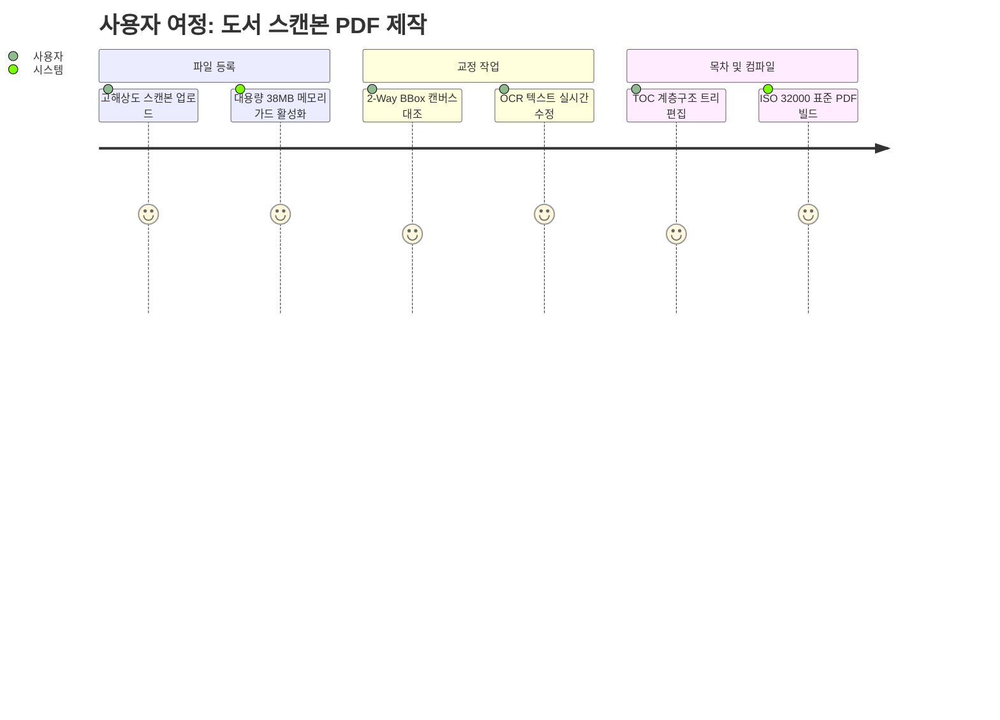

# 06. 기획 (Product & Functional Specs) 요약 가이드

## 📋 폴더 개요
서비스 시나리오, 사용자 스토리, 요구사항 정의서 및 인터페이스 기획안을 수록합니다.

## 📑 하위 문서 목록
| 문서번호 | 파일명 | 문서 제목 | 주요 내용 요약 |
| :--- | :--- | :--- | :--- |
| `06-01` | `06-01_기능_요구사항_명세서.md` | 기능 요구사항 명세서 | 스캔 도서 분할/결합, OCR 영역 수정, 목차 아웃라인 및 주석 기능 요건 |

