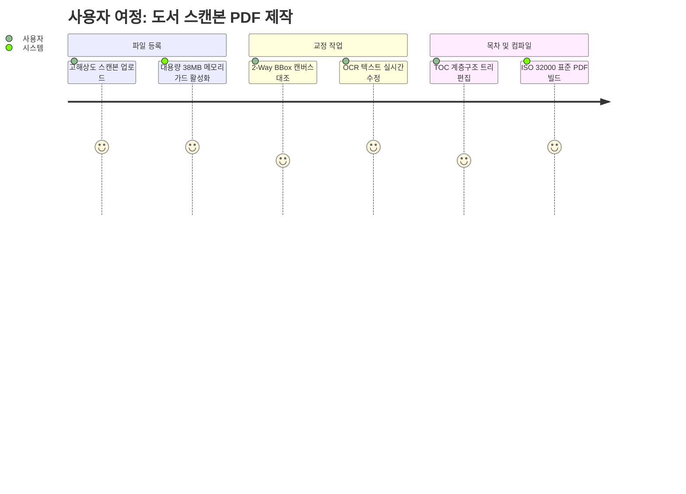

# 06. 기획 (Product & Functional Specs) 요약 가이드

## 📋 폴더 개요
서비스 시나리오, 사용자 스토리, 요구사항 정의서 및 인터페이스 기획안을 수록합니다.

## 📑 하위 문서 목록
| 문서번호 | 파일명 | 문서 제목 | 주요 내용 요약 |
| :--- | :--- | :--- | :--- |
| `06-01` | `06-01_모바일반응형_UIUX_오브젝트_표준기획서.md` | 모바일 반응형 UI/UX 및 표준 오브젝트 기획서 | 모바일 8대 뷰 사용자 여정, 5대 표준 오브젝트 UI 명세서 및 인터랙션 시나리오 |

