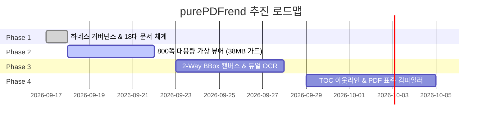

# 07. 로드맵 (Roadmap & Milestones) 요약 가이드

## 📋 폴더 개요
purePDFrend의 분기별 릴리즈 마일스톤, 기능 구현 우선순위 및 장기 발전 계획을 다룹니다.

## 📑 하위 문서 목록
| 문서번호 | 파일명 | 문서 제목 | 주요 내용 요약 |
| :--- | :--- | :--- | :--- |
| `07-01` | `07-01_릴리즈_로드맵_및_추진계획.md` | 릴리즈 로드맵 및 추진계획 | Phase 1(하네스&문서체계) -> Phase 2(가상화 뷰어) -> Phase 3(OCR 교정기) -> Phase 4(PDF 컴파일러) |

