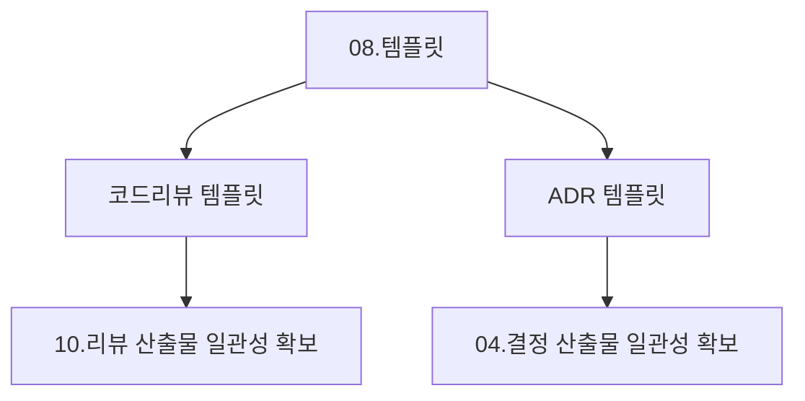

# 08. 템플릿 (Templates & Boilerplates) 요약 가이드

## 📋 폴더 개요
표준화된 산출물 작성을 위한 마크다운 템플릿(코드리뷰, 아키텍처 결정 기록(ADR), 버그 리포트, 기획서 템플릿)을 제공합니다.

## 📑 하위 문서 목록
| 문서번호 | 파일명 | 문서 제목 | 주요 내용 요약 |
| :--- | :--- | :--- | :--- |
| `08-01` | `08-01_코드리뷰_표준_템플릿.md` | 코드리뷰 표준 템플릿 | 10대 헤더, 보완턴 6단계 체크리스트 및 결과표 양식 |
| `08-02` | `08-02_아키텍처결정기록_ADR_템플릿.md` | ADR 표준 템플릿 | 상태, 배경, 대안비교, 결정결과, 파급효과 기록 양식 |

  
  
<em>[그림] 08. 템플릿 (Templates & Boilerplates) 요약 가이드 - 아키텍처 및 상태 흐름도 다이어그램 1</em>

