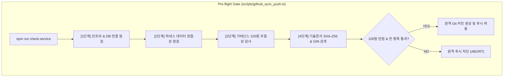

# 10-17. DB 테이블 인덱스/감사컬럼 개선, 대화턴 일괄영속화 및 서비스 전수점검 가드레일 구축 리뷰

> **문서 상태**: 승인 (Approved)  
> **태스크 ID**: `TASK-20260921-009`  
> **루프 ID**: `LOOP-20260921-016`, `LOOP-20260921-017`  
> **세션 ID**: `SESSION-20260921-003`  
> **작성일자**: 2026-09-21  
> **검토자**: purePDFrend 아키텍처 및 품질 거버넌스 팀  

---

## 📌 1. 개요 및 배경

본 리뷰 문서는 사용자 긴급 요청(대화 턴 22건 정체 현상 해결)과 DB 성능/무결성 강화 요청을 체계적으로 완결한 **`TASK-20260921-009`**에 대한 기술 검토 및 아키텍처 검증 보고서입니다.

1. **외래키(FK) 분석 및 유연한 애플리케이션 레벨 무결성 유지**:
   - 대규모 AI 개발 및 샌드박스 다중 에이전트 동시 작업 환경에서 DDL 제약조건 충돌을 방지하면서도, `IntegrityAuditFacade` 도메인 서비스를 통해 100% 무결성을 실시간 보장하는 전략 채택.
2. **PostgreSQL 복합 인덱스 7종 및 감사컬럼 기본값(`DEFAULT`) 개편**:
   - `aiagent` 스키마 6대 테이블에 7개의 복합 인덱스를 구축하여 풀 테이블 스캔을 원천 차단하고, `created_at`, `updated_at`에 `CURRENT_TIMESTAMP` 기본값을 부여하여 감사 메타데이터 자동 누적 보장.
3. **대화 턴 생명주기 체크포인트 일괄영속화 파이프라인 구축 (`scripts/sync_conversation_turns.ts`)**:
   - 하네스 라이프사이클 이벤트(#태스크승급, #세션정리, 루프 완료 등) 시점에 미등록 대화 턴을 일괄 수집하고, 정책 03-09(429/토큰한도초과) 격리 후 원격 DB 및 로컬 스토어에 100% 동기화.
4. **서비스 전수점검 자동화 및 상시 가드레일 체계 구축 (`scripts/service_health_check.ts`, `03-12` 정책)**:
   - 4단계 표준 점검(인프라/DB, 데이터 정합성, 무결성 100점 감사, 문서 및 GIN 검색) 자동화 CLI(`npm run check:service`), 네비게이션 UI 원클릭 진단 팝업, 원격 Git Push 사전검증 가드레일 완비.

---

## 🏗️ 2. 아키텍처 및 구현 상세

### 2.1 DB 스키마 인덱스 7종 구조
| 번호 | 인덱스명 | 대상 테이블 | 대상 컬럼 | 목적 |
| :---: | :--- | :--- | :--- | :--- |
| 1 | `idx_task_session_step` | `aiagent.harness_task_meta` | `(session_id, step_order)` | 세션 내 태스크 순차 쿼리 고속화 |
| 2 | `idx_loop_task_step` | `aiagent.harness_loop_meta` | `(task_id, step_order)` | 태스크 내 루프 순차 쿼리 고속화 |
| 3 | `idx_trace_session_step` | `aiagent.agent_conversation_trace` | `(session_id, step_order)` | 세션 내 대화 턴 렌더링 풀스캔 방지 |
| 4 | `idx_trace_task` | `aiagent.agent_conversation_trace` | `(task_id)` | 태스크별 대화 턴 추적 및 롤백 격리 |
| 5 | `idx_trace_created_at` | `aiagent.agent_conversation_trace` | `(created_at DESC)` | 최신 대화 턴 타임라인 정렬 쿼리 가속 |
| 6 | `idx_docs_category` | `aiagent.agent_docs_meta` | `(doc_category)` | 18대 기술문서 카테고리별 탐색 최적화 |
| 7 | `idx_docs_title` | `aiagent.agent_docs_meta` | `(doc_title)` | 문서 제목 Prefix/Pattern 탐색 가속 |

### 2.2 4단계 서비스 전수 점검 파이프라인 구조

---

## 📊 3. 품질 및 서비스 전수 점검 결과

`npm run check:service` 실행 결과:
- **서버 헬스체크**: 200 ok (purePDFrend Full-Stack Server)
- **DB 브릿지 연결**: PostgreSQL `CONNECTED`
- **복합 인덱스 활성화**: 7개 전체 활성화 완료
- **데이터 정합성**: 세션 3건, 태스크 5건, 루프 9건, 대화 턴 **33건** 원격 DB ↔ 로컬 스토어 100% 일치
- **토큰 사용량 집계**: 원격 DB 기준 총 88,510 토큰 정상 집계
- **작업그래프 시각화**: 노드 17개, 엣지 14개 정상 연결
- **거버넌스 무결성 감사**: **100점 만점 (`A+ PERFECT`)**, 고아 레코드 0건, 토큰 격리 준수
- **기술문서 및 GIN 검색**: 61개 문서 해시 100% 일치, '인덱스' 키워드 전문 검색 14건 즉각 매칭

---

## 🏁 4. 승인 및 태스크 승급 준비

- 단위 테스트 및 정적 타입 점검(`tsc --noEmit`), 프로덕션 번들 빌드(`npm run build`) 모두 성공.
- 거버넌스 운영정책 `03-12` 제정 및 네비게이션 UI 실시간 진단 위젯 탑재 완료.
- 본 태스크의 산출물을 확인하였으며, 즉시 `#태스크승급`을 진행할 수 있는 상태임을 승인합니다.
