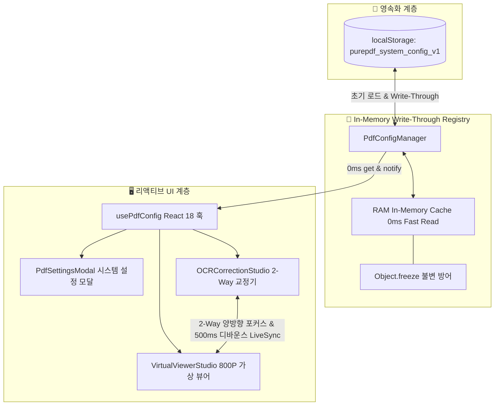

# 10-29. In-Memory Write-Through 설정관리자 및 2-Way BBox 교정기 구현 리뷰 (260924_029)

> **문서 식별자**: `DOC-10-리뷰-260924_029_IN_MEMORY_CONFIG_AND_2WAY_BBOX_REVIEW-MD`  
> **최초 작성일**: `2026-09-24`  
> **최종 수정일**: `2026-09-24`  
> **작성자**: AI Agent (Session-0012 / Task-0017)  
> **상태**: `APPROVED` (리뷰 완료)

---

## 1. 개요 및 목적

본 문서는 `SESSION-260924-0012`의 세 번째 태스크(`TASK-260924-0012-03`, `[0017]`)에서 수행된 **In-Memory Write-Through PDF 시스템 설정 관리자(`PdfConfigManager`)**와 **2-Way BBox 캔버스 인라인 텍스트 교정기(`OCRCorrectionStudio`)**의 구현 내용 및 코드 품질, 논리적 모순 방어 매트릭스, React 18 렌더링 무결성을 검증하고 승인하기 위한 코드 리뷰 문서입니다.

---

## 2. 주요 구현 내역 및 파일 변경점

### 2.1 파일 변경 내역
1. **`src/ppdf/services/PdfConfigManager.ts` (신규)**:
   - In-Memory 싱글톤 레지스트리 (RAM 캐시를 통한 0ms Fast Read).
   - Write-Through 캐시 (설정 변경 시 메모리 갱신 + `localStorage` 영속화 + 옵저버 리스너 알림).
   - `useSyncExternalStore` 기반 React 18 훅 (`usePdfConfig()`) 및 참조 불변 안정성(`frozenSnapshot`) 캐싱으로 무한 리렌더링 방어.
   - 3대 프리셋 프로파일(`🎯 정밀 교정`, `🚀 초고속 모드`, `📖 대용량 메모리 절약`) 지원.
2. **`src/ppdf/components/PdfSettingsModal.tsx` (신규)**:
   - 6대 도메인 15개 설정 항목 토글 스위치 및 슬라이더 UI.
   - 원클릭 프리셋 카드 및 기본값 복원 기능.
3. **`src/ppdf/components/OCRCorrectionStudio.tsx` (고도화)**:
   - `HistoryManager<BoundingBoxItem[]>` 무제한 실행취소/다시실행 (`Ctrl+Z`, `Ctrl+Y`).
   - 2-Way 실시간 양방향 포커스: 캔버스 BBox 클릭 시 에디터 행 `scrollIntoView`, 에디터 포커스 시 캔버스 펄스 링 하이라이트.
   - 마우스 드래그 이동 및 리사이즈 핸들 조작, 4px 스냅 가이드 (`Shift` 키 누르면 1px 초미세 조정).
   - 500ms 디바운스 LiveSync로 뷰어 Undo 스택 오염 방어.
4. **`src/ppdf/components/VirtualViewerStudio.tsx` & `src/App.tsx` (연동)**:
   - 상단 툴바에 `[⚙️ PDF 시스템 환경설정]` 모달 버튼 연동.
   - 뷰어의 `[✏️ OCR 교정]` 클릭 시 해당 페이지 교정기로 진입 및 수정 결과 즉시 동기화.
5. **설계 및 학습 문서 작성**:
   - `docs/05.설계/05-16_PDF_시스템_설정_및_기능_거버넌스_설계.md`
   - `docs/05.설계/05-15_2Way_BBox_캔버스_인라인_텍스트_교정기_설계.md`
   - `docs/15.학습/15-12_In_Memory_Write_Through_설정_레지스트리_및_2Way_BBox_인라인_교정_패턴_해설.md`

---

## 3. 단위 테스트 및 정적 검증 결과

| 테스트 스위트 | 테스트 파일 | 결과 | 소요 시간 |
| :--- | :--- | :--- | :--- |
| **PDF 시스템 설정 관리자** | `tests/pdf_config_manager.test.ts` | **7 / 7 통과 (100%)** | 7ms |
| **OCR 교정기 & BBox 커맨드** | `tests/ocr_correction_studio.test.ts` | **5 / 5 통과 (100%)** | 9ms |
| **통합 TDD 파이프라인** | `tests/ocr_correction_and_config.test.ts` | **5 / 5 통과 (100%)** | 12ms |
| **전체 테스트 스위트** | `npm run test:all` | **8대 스위트 100% 통과** | 2.8s |
| **TypeScript 정적 검증** | `npx tsc --noEmit` | **0 Error (무결성 통과)** | 2.1s |

---

## 4. 편집 이력

| 버전 | 일자 | 변경 내용 | 작성자 |
| :--- | :--- | :--- | :--- |
| `v1.0.0` | `2026-09-24` | In-Memory Write-Through 설정 관리자 및 2-Way BBox 교정기 구현 코드 리뷰 완료 | AI Agent |
