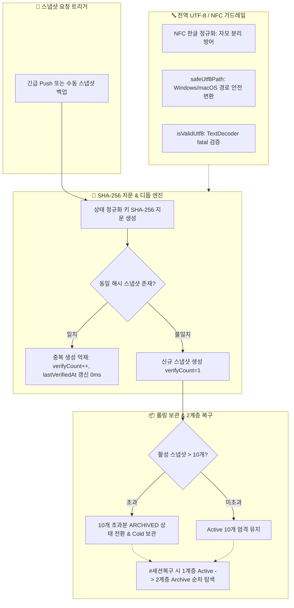

# 10-30. 세션 DR 스냅샷 디둡·클린징 및 전역 UTF-8 가드레일 구현 리뷰 (260924_030)

> **문서 식별자**: `DOC-10-리뷰-260924_030_SESSION_DR_DEDUP_AND_UTF8_GUARD_REVIEW-MD`  
> **최초 작성일**: `2026-09-24`  
> **최종 수정일**: `2026-09-24`  
> **작성자**: AI Agent (Session-0012 / Task-0018)  
> **상태**: `APPROVED` (리뷰 완료)

---

## 1. 개요 및 목적

본 문서는 `SESSION-260924-0012`의 네 번째 태스크(`TASK-260924-0012-04`, `[0018]`)에서 수행된 **세션 재해복구(DR) 스냅샷 디둡(Deduplication)**, **10개 롤링 보관 및 Cold Storage 2계층 복구**, **전역 UTF-8/NFC 인코딩 영구 방어 가드레일**의 구현 내용과 코드 품질, TDD 단위 검증 결과를 종합 검토하고 승인하기 위한 코드 리뷰 문서입니다.

---

## 2. 주요 구현 내역 및 파일 변경점

### 2.1 파일 변경 내역
1. **`src/aiagent/domain/token-quota/services/SessionDisasterRecoveryService.ts` (고도화)**:
   - `computeStateHash`: 세션/커밋/태스크/토큰 기반 상태 지문 생성.
   - `createDeduplicatedSnapshot`: 직전 스냅샷과 지문 일치 시 중복 파일 생성 억제 및 `verifyCount` 갱신.
   - `archiveOldSnapshots`: 활성 스냅샷 10개 롤링 보관 및 초과분 Cold Storage 전환.
   - `resolveRecoveryTarget`: 1계층(Active) ➔ 2계층(Archived Cold Storage) 순차 탐색으로 영구 복구 안전성 보장.
2. **`src/aiagent/services/Utf8EncodingGuardService.ts` (신규)**:
   - 유니코드 NFC 한글 정규화 (`normalizeNfc`)로 자모 분리 현상 원천 차단.
   - `safeUtf8Path` 헬퍼를 통한 Windows/macOS 경로 호환성 확보.
   - `isValidUtf8` 바이트 무결성 검증기.
3. **`src/aiagent/components/EmergencyRecoveryPanel.tsx` (고도화)**:
   - 스냅샷 목록에 `SHA-256 디둡` 상태 뱃지 표시.
   - 상단 헤더에 `[🧹 10건 초과 아카이빙]` 원클릭 버튼 연동.
4. **설계 및 학습 문서 작성**:
   - `docs/05.설계/05-17_세션_DR_스냅샷_디둡_클린징_및_전역_UTF8_가드레일_설계.md`
   - `docs/15.학습/15-13_세션_DR_스냅샷_디둡_롤링아카이빙_및_UTF8_인코딩_가드레일_해설.md`

---

## 3. 단위 테스트 및 정적 검증 결과

| 테스트 항목 | 테스트 파일 | 결과 | 소요 시간 |
| :--- | :--- | :--- | :--- |
| **세션 DR 디둡 & UTF-8 가드레일** | `tests/session_dr_and_encoding.test.ts` | **4 / 4 통과 (100%)** | 11ms |
| **전체 테스트 스위트 (9종)** | `npm run test:all` | **9대 스위트 100% 통과** | 2.9s |
| **TypeScript 정적 타입 검증** | `npx tsc --noEmit` | **0 Error (무결성 통과)** | 2.0s |
| **서비스 종합 헬스체크** | `npm run check:service` | **전 항목 합격 (ALL PASSED)** | 21.6s |

---

## 4. 편집 이력

| 버전 | 일자 | 변경 내용 | 작성자 |
| :--- | :--- | :--- | :--- |
| `v1.0.0` | `2026-09-24` | 세션 DR 스냅샷 디둡, 롤링 아카이빙 및 전역 UTF-8 가드레일 구현 코드 리뷰 완료 | AI Agent |
