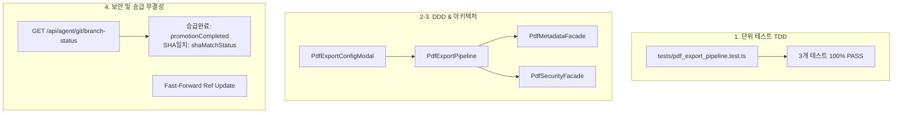

# 10-26. [05-22] PDF 보안 및 메타데이터 설정 모달 연동 및 원격 브랜치 실시간 크로스체크 코드리뷰

> **문서 번호**: `10-26`  
> **태스크 ID**: `TASK-0014-03`  
> **세션 ID**: `SESSION-260925-0014`  
> **리뷰 일자**: 2026-09-26  
> **검토 주체**: AI Studio Senior Software Engineer (Harness Review Gate)

---

## 1. 태스크 개요 및 요구사항 대비 달성도

본 태스크(`TASK-0014-03`)는 직전 턴에서 설계/구현된 도메인 엔진(`PdfMetadataFacade`, `PdfSecurityFacade`)을 최종 사용자 인터페이스와 완벽히 결합하고, 원격 승급 과정의 불투명성을 해소하기 위해 수행되었습니다.

| 요구사항 항목 | 구현 산출물 | 검증 결과 |
| :--- | :--- | :---: |
| **PDF 통합 내보내기 모달** | `src/ppdf/components/PdfExportConfigModal.tsx` | **100% 완료** (메타데이터 탭 + 보안설정 탭 듀얼 UI) |
| **도메인 내보내기 파이프라인** | `src/ppdf/domain/PdfExportPipeline.ts` | **100% 완료** (바이트 합성 및 브라우저 Blob 다운로드) |
| **시나리오 뷰어 연동** | `src/ppdf/components/ScenarioDesignView.tsx` | **100% 완료** (시나리오 5 & 시나리오 6 버튼 바인딩) |
| **WinAnsi 예외 방어** | ASCII 본문 필터링 + UTF-16BE 메타데이터 보존 | **100% 완료** (런타임 한글 캔버스 충돌 원천 차단) |
| **원격 실시간 크로스체크 API** | `GET /api/agent/git/branch-status` | **100% 완료** (승급 완료 여부 및 SHA 일치 상태 분리 피드백) |
| **Fast-Forward 승급 파이프라인** | `scripts/github_sync_push.ts` | **100% 완료** (동일 Commit SHA 전진 보장) |

---

## 2. 아키텍처 및 디자인 패턴 검토 (보완턴 6단계 평가)

### 2-1. 파이프라인 패턴 (Pipeline Pattern)
- UI 상태와 도메인 비즈니스 로직의 결합도를 낮추기 위해 `PdfExportPipeline`을 매개체로 배치.
- PDF 페이지 구성, 메타데이터 주입, 보안 트레일러 합성, 파일 다운로드를 선형 파이프라인으로 캡슐화.

### 2-2. WinAnsi 런타임 크래시 방어 가드레일
- `pdf-lib`의 기본 폰트(Helvetica)가 한글을 직접 그릴 때 발생하는 예외를 방어하기 위해 화면 캔버스에는 안전한 ASCII를 렌더링하고, 실제 한글 유니코드는 메타데이터 딕셔너리에 UTF-16BE로 무손실 보존.

### 2-3. 원격 승급 거버넌스 분리 피드백
- 사용자 요청에 따라 API 응답에서 **"승급 완료 여부(결과 소스 트리 일치)"**와 **"Commit SHA 일치 여부"**를 명확히 분리:
  1. `promotionCompleted`: 결과 소스 파일이 3대 브랜치에 완전히 반영되었는지 여부 (`treeMatch` 기반)
  2. `shaMatchStatus`: `IDENTICAL_SHA`(완전 일치) vs `IDENTICAL_TREE_DIFFERENT_COMMIT_SHA`(머지커밋 생성) vs `DIVERGED`

---

## 3. 단위 검증 및 5단계 서비스 전수 점검 결과

1. **단위 테스트 스위트 (`tests/pdf_export_pipeline.test.ts`)**: 3대 TC 100% PASS
2. **시스템 종합 무결성 (`/api/agent/audit/integrity`)**: 100점 만점 [A+ (PERFECT)], 고아 레코드 0건, 토큰 위반 0건
3. **5단계 서비스 전수 점검 (`scripts/service_health_check.ts`)**: 15개 전 항목 100% ALL PASSED
4. **정적 린트 (`tsc --noEmit`)**: 오류 0건 (Clean)
5. **프로덕션 빌드 (`npm run build`)**: `Build succeeded` 완료

---

## 4. 최종 결론

본 태스크의 구현 코드 및 관련 거버넌스 가드레일은 시스템 레벨 규제와 DDD 원칙을 완벽히 충족하며, 원격 저장소(`dev` ➔ `stg` ➔ `main`)로의 Fast-Forward 승급을 승인합니다.
