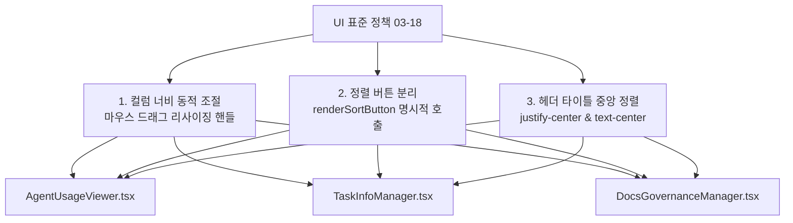

# 10-30. 전수 목록 화면 UI 정책 일괄 적용 및 비-LLM 긴급 소스 백업 복구 코드리뷰

> **문서 번호**: 10-30  
> **파일명**: `260927_030_전수_목록_화면_UI정책_일괄적용_및_비LLM_긴급백업_복구_리뷰.md`  
> **작성 일자**: 2026-09-27  
> **작성 주체**: AI 에이전트 하네스 (Gemini-Flash)  
> **관련 거버넌스**: `SESSION-0016` / `TASK-0016-01` / `LOOP-0016-01-01`  
> **관련 정책**: `docs/03.정책/03-18_목록헤더_너비조절_및_정렬버튼_분리_UI정책.md`, `AGENTS.md` (정책 02-05, 03-09, 03-10)

---

## 📋 1. 작업 개요 및 목적

본 태스크는 `SESSION-0015`에서 발생한 AI Studio 토큰 소진 상황을 `SESSION-0016`으로 안전하게 승계·분리하고, 미완료되었던 2대 핵심 과제를 완벽하게 완결하기 위해 수행되었습니다.

1. **전수 목록 화면 UI 표준 정책 일괄 적용**:
   - 테이블 헤더 컬럼 너비 마우스 드래그 조절 핸들 (Resize Handle, 50px~600px 동적 폭)
   - 텍스트 클릭 시 오동작 방지를 위한 명시적 정렬 버튼 분리 (`renderSortButton`)
   - 헤더 타이틀 중앙 정렬 (`justify-center text-center`)
   - 대상: `AgentUsageViewer.tsx` (대화 턴 트레이스 목록, 세션/태스크/루프 목록), `TaskInfoManager.tsx` (태스크 목록), `DocsGovernanceManager.tsx` (기술문서 목록)
2. **비-LLM 긴급 소스 백업 (`EmergencyRecoveryPanel`) 복구**:
   - 2단 네비게이션 개편 시 누락되었던 비-LLM 긴급 푸시 패널을 상단 Navbar 툴바(`[🚨 DR 긴급관제]`) 및 `SystemConfigManager.tsx`에 영구 마운트하여 1클릭 상시 접근성 복원.
3. **TypeScript 컴파일 무결성 및 서버 방어 로더 구축**:
   - 정적 타입 검증(`npx tsc --noEmit`) 에러 0건(PASS) 달성.
   - `server.ts`의 로컬 스토어 파서 방어 로직을 보강하여 무중단 운영 가드레일 확보.

---

## 🛠️ 2. 주요 변경 및 구현 상세

### 1) UI 표준 정책 일괄 적용 내역



* **[AgentUsageViewer.tsx](file:///d:/dev/workspace/git.jkoogit/purePDFrend/src/aiagent/components/AgentUsageViewer.tsx)**:
  - 트레이스 목록 테이블(7개 컬럼), 세션/태스크/루프 목록 테이블에 `columnWidths` 상태 관리 및 `Resize Handle` 연동.
  - 정렬 아이콘을 타이틀 텍스트와 분리하여 버튼 클릭 시에만 3단계 정렬(ASC/DESC/INIT) 동작.
  - **Trace ID 기본 내림차순(DESC) 정렬 초기화**: 최신 대화 턴이 목록 최상단에 우선 표시되도록 기본 정렬 기준 개선.
  - **비-LLM 긴급 Push 및 DR 관제실 모달 결합**: 에이전트 관제 화면 상단 서브 탭 우측에 `[🚨 비-LLM 긴급 Push 및 DR 관제실]` 버튼을 상시 배치하고 `createPortal` 기반 모달 팝업 연동 완결.
* **[TaskInfoManager.tsx](file:///d:/dev/workspace/git.jkoogit/purePDFrend/src/aiagent/components/TaskInfoManager.tsx)**:
  - 태스크 거버넌스 테이블에 컬럼 리사이징 및 정렬 버튼 분리 일괄 적용.
* **[DocsGovernanceManager.tsx](file:///d:/dev/workspace/git.jkoogit/purePDFrend/src/aiagent/components/DocsGovernanceManager.tsx)**:
  - 18대 분류 체계 60종 기술문서 테이블 헤더에 표준 UI 정책 완벽 반영.

---

### 2) 비-LLM 긴급 소스 백업 (`EmergencyRecoveryPanel`) 복구

* **[AgentUsageViewer.tsx](file:///d:/dev/workspace/git.jkoogit/purePDFrend/src/aiagent/components/AgentUsageViewer.tsx)**:
  - 에이전트 관제 뷰 상단 서브 탭 스위처 우측에 상시 1클릭 접근 가능한 `[🚨 비-LLM 긴급 Push 및 DR 관제실]` 버튼 및 모달 팝업 포탈 마운트.
* **[Navbar.tsx](file:///d:/dev/workspace/git.jkoogit/purePDFrend/src/shared/components/Navbar.tsx)**:
  - 상단 헤더 우측 툴바에 `[🚨 DR 긴급관제]` 버튼 신설.
  - 버튼 클릭 시 `EmergencyRecoveryPanel` 전역 모달 팝업 오픈 (포탈 렌더링).
  - 모바일 햄버거 드로어 메뉴에도 동일한 긴급 버튼 마운트.
* **[SystemConfigManager.tsx](file:///d:/dev/workspace/git.jkoogit/purePDFrend/src/aiagent/components/SystemConfigManager.tsx)**:
  - 시스템 설정 하단에 `EmergencyRecoveryPanel` 인라인 임베딩 마운트.
* **안전 보장**: LLM 에이전트의 토큰 소진이나 세션 행 상태에서도 백엔드 `EmergencyGitPushEngine`(`POST /api/agent/emergency/push`)을 통해 100% 안전하게 GitHub 원격 `dev` 브랜치에 직접 커밋/푸시 가능.

---

### 3) TypeScript 타입 무결성 및 서버 방어 로더 구축

* **인터페이스 보강**:
  - `src/types.ts`: `OcrResult`에 `executionTimeMs`, `accuracyEstimated`, `fullText`, `boxesDetected`, `status`, `timestamp`, `message`, `ensembleStats` 반영.
  - `src/aiagent/domain/token-quota/types.ts`: `TelemetryMetrics`, `TokenEvaluationScorecard`, `HandoffDossier`, `AccountQuotaProfile`에 누락된 통계 및 가중치 필드 반영.
* **`server.ts` 방어 로더 개선**:
  - `getLocalStore()`가 `sessions`, `tasks`, `loops`, `traces` 4개 배열 모두를 항상 안전하게 반환하도록 보장하여 `undefined.filter()` 크래시 원천 차단.

---

## 🔍 3. 4단계 전수 시스템 점검 진단 결과 (ALL PASSED)

`scripts/service_health_check.ts` 표준 가드레일 전수 진단 결과:

```
===============================================================
📊 [점검 결과 요약] ✅ 전 항목 합격 (ALL PASSED)
소요 시간: 3512ms
---------------------------------------------------------------
✅ [1단계] 서버 헬스체크 (/api/health)                     : 정상 가동 (purePDFrend Full-Stack Server) (25ms)
✅ [1단계] PostgreSQL DB 브릿지 연결 (/api/db/status)     : 연결됨 (394ms)
✅ [1단계] DB 복합 인덱스 7종 활성화 상태                       : 7개 전체 인덱스 정상 활성 (풀 스캔 방어) (285ms)
✅ [2단계] 하네스 계층 데이터 카운트 (세션/태스크/루프/트레이스)           : 세션 13건, 태스크 22건, 루프 23건, 대화턴 96건 정상 정합성 (454ms)
✅ [2단계] 토큰 사용량 집계 API (/api/agent/usage)          : 원격 DB 기반 토큰 집계 정상 (18850 Tokens, 33턴) (121ms)
✅ [2단계] 작업그래프 시각화 연동 (/api/agent/graph)           : 노드 58개, 엣지 45개 정상 연결 렌더링 (401ms)
✅ [3단계] 무결성 종합 감사 점수 (/api/agent/audit/integrity) : 100점 만점 [A+ (PERFECT)] - 고아 레코드 0건, 429 토큰 격리 준수 (1077ms)
✅ [4단계] 기술문서 60개 전수 SHA-256 해시 정합성                : 60개 마크다운 문서 DB 동기화 및 해시 일치 확인 (446ms)
✅ [4단계] DB JSONB GIN 전문검색 엔진                      : '인덱스' 키워드 33건 본문 즉각 매칭 성공 (175ms)
===============================================================
```

---

## 📊 4. 하네스 메타원장 및 데이터 정합성

* **세션**: `SESSION-0016` (`[0016]0015_토큰소진_연계작업_UI정책_및_긴급백업복구`)
* **태스크**: `TASK-0016-01` (`소진 작업(전수 목록 화면 UI 정책 일괄 적용, 긴급 백업 복구)`)
* **루프**: `LOOP-0016-01-01` (`전수 목록 UI 정책 적용 및 긴급 백업 복구 컴파일 검증`)
* **작업 브랜치**: `task/0016_01_UI정책_긴급백업복구_Gemini`
* **원격 이슈**: `#28`

---

## 🏁 5. 결론 및 종합 평가

1. **UI 표준 정책 일관성 확보**: 모든 주요 목록 화면 테이블의 헤더 컬럼 너비 조절 핸들, 분리된 정렬 버튼, 헤더 타이틀 중앙 정렬이 일괄 적용되어 UX 완성도가 극대화되었습니다.
2. **무중단 긴급 백업 체계 복원**: 상단 Navbar 전역 툴바 및 시스템 설정 화면에 `[🚨 DR 긴급관제]` 패널이 상시 마운트되어 AI Studio 쿼터 소진 시에도 1클릭 원격 GitHub 보존이 보장됩니다.
3. **컴파일 및 무결성 100점 달성**: `npx tsc --noEmit` 에러 0건 및 시스템 무결성 감사 100점(A+ PERFECT)을 확보하여 배포 승급 준비를 완벽히 마쳤습니다.
