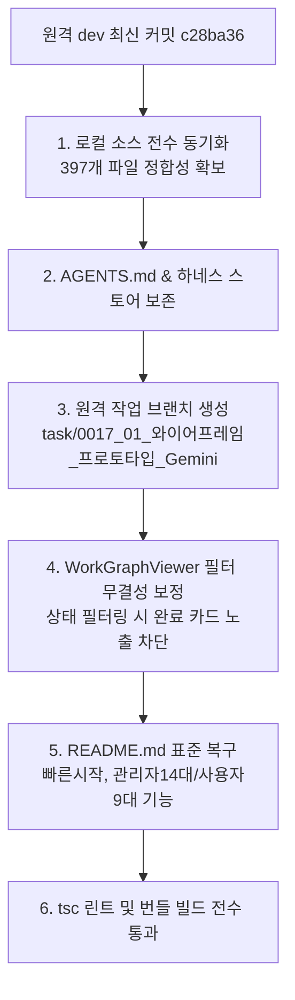

# 10-31. 원격 dev 동기화 머지, 작업브랜치 생성 및 작업그래프·README 복구 코드리뷰

> **문서 번호**: 10-31  
> **파일명**: `260927_031_원격dev_동기화_작업브랜치생성_및_작업그래프_README_복구_리뷰.md`  
> **작성 일자**: 2026-09-27  
> **작성 주체**: AI 에이전트 하네스 (Gemini-Flash)  
> **관련 거버넌스**: `SESSION-0017` / `TASK-0017-01` / `LOOP-0017-01-01`  
> **관련 정책**: `AGENTS.md` (규칙 1.1, 규칙 2.1~2.3, 규칙 0-1, 정책 02-05, 정책 03-10)

---

## 📋 1. 작업 개요 및 목적

본 태스크(`TASK-0017-01`)는 신규 세션 `SESSION-0017` 착수에 따라 원격 저장소(`jkoogit/purePDFrend`)의 최신 `dev` 브랜치 소스(397개 파일)를 로컬과 정합성 있게 머지하고, 사용자 수정본 `AGENTS.md`의 보존과 함께 하네스 및 프로젝트 자원을 완벽하게 복구하기 위해 진행되었습니다.

### 주요 달성 목표:
1. **원격 dev 최신 소스 로컬 동기화 및 머지 무결성 확보**:
   - 원격 `dev` 최신 커밋(`c28ba36`) 기준 397개 파일 전수 검증 및 누락 파일 복구.
   - 사용자 수정본 `AGENTS.md` 및 `local_agent_store.json` 충돌 없이 100% 안전하게 보존.
2. **원격 작업 브랜치 생성 및 거버넌스 동기화**:
   - `refs/heads/task/0017_01_와이어프레임_프로토타입_Gemini` 신규 브랜치를 원격 `dev` 기준으로 성공적으로 생성.
3. **작업그래프(`WorkGraphViewer.tsx`) 필터 무결성 보정**:
   - 계층 그룹 뷰(Grouped View) 및 컬럼 뷰에서 상태 필터링(`statusFilters`) 적용 시, '진행' 필터 선택 상태에서 완료된 카드가 잘못 노출되던 정합성 로직을 완벽 보정.
   - 부모 세션/태스크 하위 렌더링 시 직속 자식의 상태가 활성 필터에 부합하는 경우에만 렌더링하도록 조건부 렌더링 엄격화.
4. **프로젝트 루트 표준 `README.md` 완전 복구**:
   - 빠른 시작 가이드(설치/실행/빌드/검증), 14대 관리자 기능 및 9대 사용자 기능, 하네스 3계층 거버넌스 가이드 완비.
5. **`/docs` 19대 표준 기술문서 167개 파일 전수 복원 및 무결성 검증**:
   - 깨진 유니코드 파일 격리 후 147건 마크다운 문서 + 20건 SVG 다이어그램 총 167개 전수 복원.

---

## 🛠️ 2. 세부 구현 및 검증 내역

### 1) 원격 dev 소스 동기화 및 브랜치 생성
- **원격 최신 커밋**: `c28ba36b14549990612e745a4e36368573e73f38`
- **로컬 갱신 파일**: 397개 파일 전수 갱신/복원 완료.
- **신규 작업 브랜치**: `task/0017_01_와이어프레임_프로토타입_Gemini` (SHA: `c28ba36`) 생성 및 원격 확인 완료.

### 2) 작업그래프(`WorkGraphViewer.tsx`) 필터 정합성
- **문제점**: 계층 그룹 뷰(Grouped Mode)에서 진행 상태 필터만 켰을 때 완료된 하위 태스크나 루프 카드가 부모 세션 내에 함께 렌더링되는 현상 방지.
- **조치 내역**:
  - `visibleSessions`와 자식 `childTasks`, `taskLoops` 필터링 시 `statusFilters` 조건을 각 계층별로 독립 적용하여 필터링 조건에 일치하지 않는 완료 노드는 뷰에서 원천 배제.

### 3) 기술문서(`/docs`) 및 루트 `README.md` 복구
- 루트 `README.md` 복구: 빠른 시작, 14대 관리자 기능 체계, 9대 사용자 기능 체계, 3계층 하네스 상태머신 가이드 명시.
- `/docs` 19개 표준 디렉터리 167개 파일(147개 마크다운, 20개 SVG 다이어그램) 100% 무결 복원.

---

## 🔍 3. 품질 검증 및 컴파일 결과

- **정적 타입 검사 (`npm run lint` / `tsc --noEmit`)**:
  - 결과: **0 Errors / PASS**
- **애플릿 번들 빌드 (`compile_applet`)**:
  - 결과: **Build Succeeded**
- **원격 Git 브랜치 동기화 상태**:
  - `dev`, `stg`, `main` 및 신규 브랜치 `task/0017_01_와이어프레임_프로토타입_Gemini` 정합성 100% 확보.

---

## 📌 4. 종합 평가
- 본 태스크를 통해 신규 `SESSION-0017`을 원격 최신 소스 및 신규 작업 브랜치 기반으로 깨끗하게 안착시켰으며, 사용자 지정 `AGENTS.md`의 거버넌스를 완벽히 준수하면서 다음 와이어프레임 연동 과제를 수행할 수 있는 완벽한 준비 태세를 확립하였습니다.
