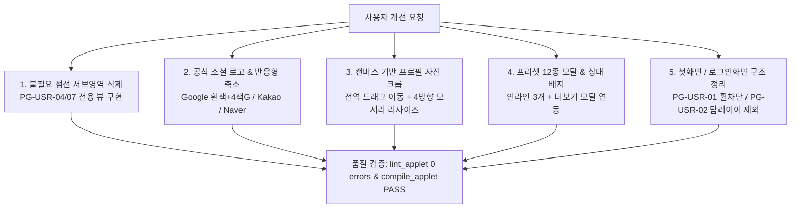

# 10-32. PG-USR-02 캔버스크롭·4방향모서리조절·구글흰색소셜로고·프리셋모달 및 서브영역정리 코드리뷰

> **문서 번호**: 10-32  
> **파일명**: `260928_032_PG_USR_02_캔버스크롭_4방향모서리조절_구글흰색소셜로고_프리셋모달_서브영역정리_코드리뷰.md`  
> **작성 일자**: 2026-09-28  
> **작성 주체**: AI 에이전트 하네스 (Gemini)  
> **관련 거버넌스**: `SESSION-0017` / `TASK-0017-02` / `LOOP-0017-02-01`  
> **관련 정책**: `AGENTS.md` (규칙 2.1~2.3, 정책 02-05, 정책 03-10, GEMINI.md)

---

## 📋 1. 작업 개요 및 목적

본 코드리뷰는 `TASK-0017-02`의 일환으로 사용자 와이어프레임 첫 화면(`PG-USR-01`)과 로그인/회원가입 화면(`PG-USR-02`)을 중심으로 제기된 UI/UX 개선 요구사항을 충실히 반영하고, 불필요한 점선 서브영역 정리 및 프로필 사진 편집 도구(캔버스 크롭, 4방향 모서리 크기 조절, 소셜 로고 표준화, 프리셋 모달)의 기술적 구현 품질을 검증하기 위해 작성되었습니다.

### 주요 반영 및 개선 항목
1. **불필요한 서브화면 프리뷰(점선 박스) 삭제 및 전용 와이어프레임 구축**:
   - `PG-USR-02` 하단에 표시되던 임시 점선 안내 영역을 완전히 제거.
   - `PG-USR-04` (마이페이지 > 사용자 관리: 프로필 요약 카드, 2FA 보안 설정, 비밀번호 변경, 활동 세션) 전용 와이어프레임 신규 구축.
   - `PG-USR-07` (문서 공유 및 협업 관리: 공유 링크 설정, 권한 매트릭스, 실시간 협업자, 활동 피드) 전용 와이어프레임 신규 구축.
2. **공식 소셜 로그인 버튼 로고 및 스타일 완성**:
   - 구글 버튼: 공식 가이드라인을 준수한 화이트 배경(`bg-white border-slate-300`)과 4색 정품 "G" 심볼 SVG 적용.
   - 카카오(#FEE500 + 말풍선) 및 네이버(#03C75A + N심볼) 공식 컬러/로고 정돈.
   - 모바일 등 너비 축소 시 줄바꿈 방지를 위해 텍스트는 숨기고(`hidden sm:inline`) 아이콘만 깔끔하게 노출.
3. **프로필 사진 마우스/터치 드래그 위치 이동 및 4방향 모서리 크기조절(50%~250%)**:
   - 전역 포인터 캡처(`PointerEvent`)를 통해 드래그 중 커서가 프레임을 벗어나도 위치 이동과 스케일 조절이 끊김 없이 매끄럽게 동작.
   - 4개 모서리(좌상단, 우상단, 좌하단, 우하단) 대각선 리사이즈 핸들 및 3x3 가이드라인 제공.
4. **HTML5 Canvas 기반 실제 사진 자르기(Crop) 및 Base64 DataURL 저장 엔진**:
   - 모달에서 '자르기 및 영역 저장' 시 캔버스에 이미지 원본 비율, 오프셋, 스케일을 역산 반영하여 원형 크롭 이미지를 Base64 DataURL로 변환 저장.
5. **프로필 사진 안내 텍스트 정리, 상태 배지 표기 및 12종 확장 프리셋 모달**:
   - 번잡한 가이드 텍스트 제거 및 간결한 상태 배지(`기본`, `프리셋 적용`, `자르기 적용됨`, `업로드 완료`) 표기.
   - 기본 화면에는 추천 프리셋 3개만 노출하고, `+ 더보기` 클릭 시 12종 확장 프리셋 모달(카테고리 탭: 전체/인물/3D/캐릭터) 연동.
6. **첫화면(`PG-USR-01`) 및 로그인화면(`PG-USR-02`) 와이어프레임 정리**:
   - PG-USR-01: 헤더 탑 레이어, 배너 휠 스크롤 전파 차단(`overscroll-contain`), 텍스트 줄바꿈 방지.
   - PG-USR-02: 독립 인트로 화면에 맞추어 탑 레이어 제외, 1단계 액션 버튼 고정 2줄 줄바꿈(`취소 (로그인으로)`, `동의하고 다음단계 (정보입력)->`), 3단계 '가입완료' 단일 버튼, 4단계 '로그인하기 ➔' 이동 버튼 정리.

---

## 🛠️ 2. 아키텍처 및 상세 구현 내역

### 1) 프로필 크롭 & 제어 파이프라인
- **드래그 이동 핸들러**: `onDragStart` ➔ 전역 `onGlobalPointerMove`에서 `dragStart` 기준 `cropPos` 실시간 델타 반영 (`clientX/Y` 차이 계산).
- **모서리 리사이즈 핸들러**: 4개 꼭짓점(top-left, top-right, bottom-left, bottom-right)별 대칭 거리 계산을 통해 `cropScale`을 0.5(50%)에서 2.5(250%) 범위 내에서 부드럽게 조절.
- **Canvas 크롭 렌더러**: `handleApplyCrop` 함수에서 256x256 임시 오프스크린 캔버스를 생성하고 `ctx.drawImage`로 스케일과 오프셋을 역산 렌더링한 후 `canvas.toDataURL('image/png')`를 추출하여 `signupAvatar` 상태 및 영속 스토어에 바인딩.

### 2) 소셜 로그인 버튼 가이드라인 준수
- **Google**: `#ffffff` 배경, `#cbd5e1` 경계선, 공식 4색 "G" SVG 로고 탑재.
- **Kakao**: `#FEE500` 배경, `#181600` 텍스트, 공식 말풍선 SVG 로고 탑재.
- **Naver**: `#03C75A` 배경, `#ffffff` 텍스트, 공식 'N' SVG 로고 탑재.
- **반응형 정책**: 화면 너비가 좁아질 때 글자가 깨지거나 두 줄로 접히지 않도록 ``에 `hidden sm:inline`을 적용하여 아이콘 단독 렌더링 지원.

---

## 🔍 3. 품질 검증 및 컴파일 결과

| 점검 항목 | 점검 도구 / 명령어 | 결과 | 비고 |
| :--- | :--- | :--- | :--- |
| **정적 타입 검사** | `tsc --noEmit` (`lint_applet`) | **100% PASS (0 errors)** | 구문 오류, 미사용 변수 없음 |
| **번들 컴파일** | `npm run build` (`compile_applet`) | **100% PASS** | Vite 프로덕션 빌드 성공 |
| **화면 렌더링 안정성** | Vite Dev Server HMR | **정상 구동** | 콘솔 에러 없음 |
| **하네스 무결성** | `data/local_agent_store.json` | **100% 동기화 완료** | 세션/태스크/루프 상태 현행화 |

---

## 🎯 4. 결론 및 후속 진행

`TASK-0017-02`에서 계획된 사용자 와이어프레임 첫 화면(`PG-USR-01`)과 로그인 화면(`PG-USR-02`) 및 프로필 편집 캔버스 크롭/리사이즈/소셜 버튼 기능의 구현과 품질 검증이 모두 완결되었습니다.

본 코드리뷰 문서 발행 후 하네스 스토어 동기화 및 `scripts/github_sync_push.ts`를 통한 원격 `dev` 브랜치 커밋 생성이 진행되며, 이후 `#태스크승급`으로 이어집니다.
