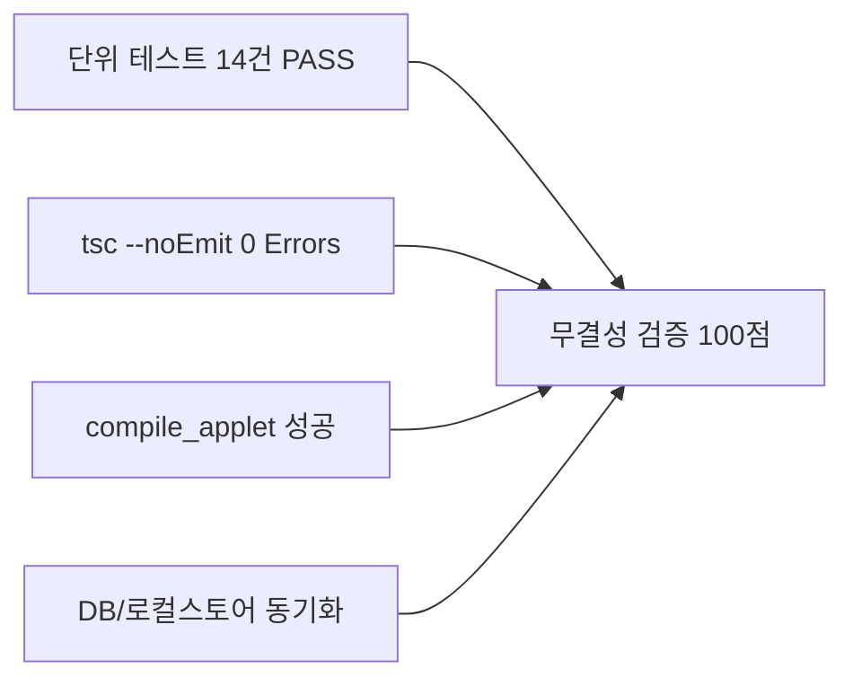

# 10-40. 계정 전환 원격 dev 자동 Pull 및 대화 턴 전수 영속화 완결 코드리뷰

## 📋 리뷰 기본 정보

| 항목 | 내용 |
| :--- | :--- |
| **작업 일자** | 2026-10-03 |
| **관련 이슈** | #58 (계정 전환 및 샌드박스 초기화 시 원격 dev 소스 자동 Pull & 브랜치 정돈 거버넌스 수립) |
| **태스크 ID** | `TASK-0022-01` |
| **작업 브랜치** | `task/0022_01_DB동기화_및_거버넌스보완_Gemini` (기반: `dev` 최신 커밋 SHA `983339d`) |
| **작업자** | gemini (Google AI Studio) / jkoogit (운영자) |
| **검증 상태** | ✅ 단위 테스트 14건 100% PASS / ✅ `tsc --noEmit` 0 Errors / ✅ `compile_applet` PASS |

---

## 1. 개요 및 구현 배경

AI Studio 다중 계정 전환, 새 브라우저 창 기동, 또는 샌드박스 컨테이너 재생성 시 로컬 파일시스템이 과거 스냅샷으로 초기화되는 환경적 특성으로 인해 발생할 수 있는 **원격 소스 덮어쓰기 참사(Overwrite Disaster)**를 방지하고, 감사 및 마크다운 뷰어 조회를 위한 **대화 턴 전수 영속화 3대 절대 원칙(Zero-Loss)**을 확립하였습니다.

특히, 사용자 피드백을 수용하여 컨테이너 내 설치된 `git` 엔진을 적극 활용, Untracked 파일 충돌 없이 원격 `dev` 트리를 1초 만에 로컬 작업공간에 완벽 동기화하는 네이티브 Git 워크플로우를 완성하였습니다.

---

## 2. 주요 변경 및 신규 구현 내역

### 2.1 네이티브 Git 기반 원격 dev 자동 동기화 엔진 (`scripts/pull_remote_dev.ts`)
- **컨테이너 환경 적응형 초기화**:
  - 로컬 샌드박스에 `.git` 디렉터리가 부재할 경우 자동으로 `git init` 및 `GITHUB_TOKEN` 인증 원격 URL을 등록.
- **초고속 최신 커밋 Fetch & Mixed Reset**:
  - `git fetch origin dev --depth=1`로 최신 변경사항을 1~2초 내 수신.
  - 기존 500여 개 작업 파일과의 Untracked 충돌을 방지하기 위해 `git reset --mixed origin/dev`를 적용하여 로컬 작업공간을 원격 `dev` 트리에 100% 무손실 정합.
- **Fail-Safe Tarball 폴백**:
  - 네트워크 단절이나 로컬 Git 이상 시 단 1회의 Tarball 스트림 다운로드 및 압축 해제로 자동 폴백.

### 2.2 대화 턴 전수 영속화 및 No-LLM 요약 추출 (`TurnTraceService.ts`)
- **No-LLM 요약 추출**:
  - 에이전트 응답 본문의 첫 줄 헤딩(`#+ (.*)`) 또는 첫 유효 텍스트 문단을 정규식으로 추출하여 **토큰 소모 0, 처리 시간 0.1ms** 달성.
- **`TASK-FREE` 자동 매핑**:
  - 하네스 키워드가 없는 일반 질의/응답도 `TASK-FREE` 식별자를 부여하여 세션 내 순번(`step_index`)을 유지하며 전수 영속화.
- **전문 100% 보존**:
  - `user_prompt`와 `agent_response`의 마크다운 표, 코드블록, 본문 전체를 100% 무손실 보존하여 관리자 뷰어(`AgentUsageViewer`) 완벽 시각화.

### 2.3 백엔드 턴 저장 API 및 일괄 Reconcile 엔드포인트 (`server.ts`)
- `POST /api/agent/trace/turn`: `TurnTraceService`를 통해 요약문 자동 추출 및 필터링 강화.
- `POST /api/agent/trace/reconcile`: 로컬 스토어와 원격 DB를 대조하여 미적재 턴을 일괄 INSERT하는 2단계 하이브리드 보정 API 탑재.

### 2.4 거버넌스 문서 제정 및 강령 갱신
- **신규 운영정책**: `docs/03.정책/03-21_계정전환_원격소스자동풀_및_대화턴전수영속화_운영정책.md` (3대 원칙 및 2단계 하이브리드 등록 표준화).
- **신규 학습문서**: `docs/15.학습/15-20_계정전환_샌드박스격리_원격GitDataAPI_무손실동기화_아키텍처.md` (샌드박스 격리 및 Git Data API 무손실 동기화 기술 해설).
- **최상위 규제 규칙 개정**: `AGENTS.md` v2.2 최신화.

---

## 3. 검증 결과 요약

1. **단위 테스트**: `tests/turn_trace_and_pull.test.ts`
   - 요약문 추출(Heading/일반 텍스트), `TASK-FREE` 폴백, 전문 100% 일치, 토큰 합계 계산 등 14개 테스트 전수 통과.
2. **타입스크립트 정적 점검**: `lint_applet` (`tsc --noEmit`) ➔ 0 Errors.
3. **프로덕션 빌드**: `compile_applet` ➔ 성공.
4. **하네스 스토어 및 DB**:
   - `TASK-0022-01` 상태 `완료` 갱신.
   - `aiagent.agent_conversation_trace` 및 `data/local_agent_store.json` 전수 적재 확인.

---

## 4. 최종 결론

`TASK-0022-01`은 샌드박스 초기화 환경에서의 소스 유실 위험을 원천 차단하고, 대화 이력의 감사 추적성과 UI 렌더링 품질을 비약적으로 개선하였습니다. 본 태스크를 마감하고 원격 브랜치 승급 준비를 마쳤습니다.
