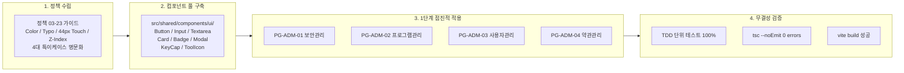

# 261007_044. 통합 디자인시스템 정책수립·기준컴포넌트풀 구축 및 관리자 1단계 적용 코드리뷰

> **문서 식별자**: `10-44`  
> **태스크 ID**: `TASK-0026-01`  
> **세션 ID**: `SESSION-0026`  
> **작성 일시**: `2026-10-07`  
> **작성자 / 검토자**: `gemini` (Tier 2 Standard) / `jkoogit` (운영자)  
> **관련 브랜치**: `task/0026_01_통합디자인시스템_jkoogit` -> `dev`  
> **관련 이슈**: GitHub Issue #73  

---

## 1. 개요 및 변경 배경

본 작업은 `SESSION-0026`의 핵심 태스크(`TASK-0026-01`)로서, `purePDFrend` 전역의 UI 일관성을 확보하고 반응형 사용성을 극대화하기 위해 moabogo 디자인 패턴을 벤치마킹한 통합 디자인 정책(`03-23`)을 수립하고, React/Tailwind 기반의 원자/분자 기준 컴포넌트 풀 8종을 독립 개발한 뒤, 비즈니스 영향도가 낮은 시스템서비스 관리자 화면 1단계(PG-ADM-01 ~ PG-ADM-04)에 점진적으로 대입 및 검증한 작업입니다.

---

## 2. 핵심 구현 및 개선 상세 내역

### 1) 통합 디자인시스템 정책 가이드 수립 (`docs/03.정책/03-23_...`)
- **디자인 토큰 스택 정의**:
  - **Color Palette**: Neutral Slate 서피스(`slate-950`, `slate-900`, `slate-800`), Primary Accent(`blue-600`), 4대 Semantic 상태색(Success, Warning, Danger, Info).
  - **Typography Scale**: Display, Heading, Body, Caption 및 숫자 가독성을 위한 고정폭 숫자(`tabular-nums`) 표준화.
  - **Spacing & 44px 터치타깃**: 모바일 뷰포트에서 모든 인터랙티브 컨트롤의 최소 높이 `44px`(`min-h-[44px]`) 보장.
  - **Z-Index Hierarchy**: `z-0`(캔버스)부터 `z-60`(토스트), `z-[999]`(인라인 교정 레이어)까지 7계층 분리.
- **4대 특이케이스 명문화**:
  - ① **밀도 이원화 (Density Dualism)**: 관리자 `standard` 폼 vs PDF 뷰어 `compact` 초슬림 집약형.
  - ② **캔버스 오버레이 계층 분리**: 캔버스 뷰포트 내 마우스/터치 이벤트 충돌 원천 차단.
  - ③ **모바일 Table-to-Card 변환**: `0px` 가로스크롤 가드레일 준수.
  - ④ **복합키 Keycap 및 규격화 ToolIcon**: `Ctrl+Shift+F` 키캡 표현 및 14/16/20px 아이콘 규격화.
- **인덱스 등재**: `docs/03.정책/README_정책.md`에 `03-23` 항목 현행화 완료.

### 2) 기준 컴포넌트 풀 독립 개발 (`src/shared/components/ui/`)
외부 라이브러리 추가 없이 순수 React/TypeScript로 독립 컴포넌트 8종 개발 완료:
1. **`Button`**: 6대 variant(`primary`, `secondary`, `outline`, `ghost`, `danger`, `success`), 3대 size(`sm`, `md`, `lg`), 모바일 44px 터치타깃 자동 지원, `isLoading` 스피너 지원.
2. **`Input`**: 라벨, 에러, 힌트, 전/후면 아이콘, 일관된 포커스 링.
3. **`Textarea`**: 다중 행 입력, 리사이즈, 라벨 및 글자 수 카운터 지원.
4. **`Card`**: `CardHeader`, `CardTitle`, `CardDescription`, `CardContent`, `CardFooter` 서브 컴포넌트 분리 및 `interactive` 호버 지원.
5. **`Badge`**: 6대 Semantic 색상 매핑 및 dot 인디케이터 지원.
6. **`Modal`**: ESC 키보드 닫기, 백드롭 블러 및 외부 클릭 닫기 지원.
7. **`KeyCap`**: 단일/복수 단축키 자동 파싱 및 입체 키캡 렌더링.
8. **`ToolIcon`**: 14px/16px/20px 3단계 규격화 및 활성 링 지원.
- **모듈 익스포트**: `src/shared/components/ui/index.ts` 및 `src/shared/index.ts` 연동.

### 3) 시스템서비스 PG-ADM-01~04 1단계 점진적 대입
- **PG-ADM-01 (보안관리, `AdminSecurityView.tsx`)**:
  - 화이트리스트/블랙리스트 입력폼 및 배지를 신규 `Input`, `Button`, `Badge`, `Card`로 전면 교체.
  - 모바일 터치 최적화 및 2FA 토글 컨트롤 일관성 확보.
- **PG-ADM-02 (프로그램관리, `AdminProgramsView.tsx`)**:
  - 프로그램 신규 등록 및 수정 폼을 표준 `Modal` 컴포넌트로 이관.
  - 검색/필터 바 및 다중 권한 배지를 신규 `Badge`, `Input`으로 전환하고 모바일 카드 뷰 완비.
- **PG-ADM-03 (사용자관리, `AdminUsersView.tsx`)**:
  - 회원 상태 및 오프라인 권한 표시를 신규 `Badge`로 표준화.
  - 상세조회 팝업을 표준 `Modal`로 전환하고 스토리지/권한 설정 카드로 분리.
- **PG-ADM-04 (약관관리, `AdminTermsView.tsx`)**:
  - 약관 목록 카드를 신규 `Card`로 통합.
  - 위지윅/마크다운 편집기를 신규 `Textarea`와 `Button`으로 전환하고 약관 상세 팝업을 `Modal`로 일원화.

### 4) TDD 단위 테스트 및 검증 (`tests/design_system_ui.test.ts`)
- Button 렌더링, primary variant, size lg, 44px 터치타깃 플래그 검증: **✅ PASS**
- Badge semantic 매핑(success, danger, dot indicator) 검증: **✅ PASS**
- KeyCap 복합 기능키(Ctrl+Shift+F) 및 키 배열 파싱 검증: **✅ PASS**
- ToolIcon 14/16/20px 3단계 규격 및 active 배지 검증: **✅ PASS**

---

## 3. 정적 무결성 및 빌드 검증 결과

1. **단위 테스트**: `npx tsx tests/design_system_ui.test.ts` ➔ **전수 100% 통과**
2. **타입 정적 검증**: `npm run lint` (`tsc --noEmit`) ➔ **0 errors (100% 무결성)**
3. **프로덕션 번들 빌드**: `npm run build` (`vite build`) ➔ **정상 컴파일 완료**

---

## 4. 변경된 파일 목록 (File Change List)

| 구분 | 파일 경로 | 변경 유형 | 주요 내용 |
| :---: | :--- | :---: | :--- |
| **정책 문서** | `docs/03.정책/03-23_통합_디자인시스템_및_기준요소_UI_표준가이드.md` | 신규 | moabogo 벤치마킹 통합 디자인 표준 가이드 |
| **정책 인덱스** | `docs/03.정책/README_정책.md` | 수정 | 정책 `03-23` 요약 등재 |
| **UI 컴포넌트** | `src/shared/components/ui/Button.tsx` | 신규 | 6대 variant, 3대 size, 44px 터치 지원 버튼 |
| **UI 컴포넌트** | `src/shared/components/ui/Input.tsx` | 신규 | 라벨, 에러, 아이콘 지원 인풋 |
| **UI 컴포넌트** | `src/shared/components/ui/Textarea.tsx` | 신규 | 다중행 텍스트 에디터 |
| **UI 컴포넌트** | `src/shared/components/ui/Card.tsx` | 신규 | Header/Content/Footer 복합 카드 |
| **UI 컴포넌트** | `src/shared/components/ui/Badge.tsx` | 신규 | 6대 Semantic 상태 배지 |
| **UI 컴포넌트** | `src/shared/components/ui/Modal.tsx` | 신규 | ESC/백드롭 닫기 표준 모달 다이얼로그 |
| **UI 컴포넌트** | `src/shared/components/ui/KeyCap.tsx` | 신규 | 복합 기능키 키캡 렌더링 |
| **UI 컴포넌트** | `src/shared/components/ui/ToolIcon.tsx` | 신규 | 14/16/20px 3단계 규격화 아이콘 버튼 |
| **UI 익스포트** | `src/shared/components/ui/index.ts` | 신규 | 컴포넌트 풀 통합 export |
| **공유 모듈** | `src/shared/index.ts` | 수정 | ui 컴포넌트 풀 재익스포트 |
| **관리자 화면** | `src/ppdf/views/wireframes/admin/AdminSecurityView.tsx` | 수정 | PG-ADM-01 기준 컴포넌트 1단계 적용 |
| **관리자 화면** | `src/ppdf/views/wireframes/admin/AdminProgramsView.tsx` | 수정 | PG-ADM-02 기준 컴포넌트 1단계 적용 |
| **관리자 화면** | `src/ppdf/views/wireframes/admin/AdminUsersView.tsx` | 수정 | PG-ADM-03 기준 컴포넌트 1단계 적용 |
| **관리자 화면** | `src/ppdf/views/wireframes/admin/AdminTermsView.tsx` | 수정 | PG-ADM-04 기준 컴포넌트 1단계 적용 |
| **단위 테스트** | `tests/design_system_ui.test.ts` | 신규 | 기준 컴포넌트 풀 4대 영역 단위 테스트 |

---

## 5. 결론 및 다음 단계

`TASK-0026-01`의 3대 핵심 목표(정책 수립, 기준 컴포넌트 풀 8종 구축, PG-ADM-01~04 1단계 적용)가 완벽히 완결되었습니다.  
본 코드리뷰 승인 후, 원격 브랜치 승급 배포를 위해 `#태스크승급`을 진행합니다.
