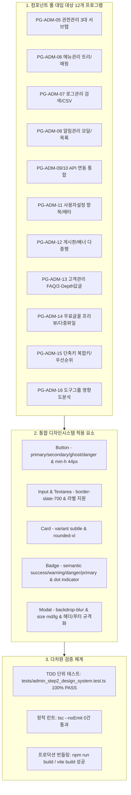

# 261008_045. 관리자 시스템서비스 2단계(PG-ADM-05~16) 통합 디자인시스템 대입 및 모바일 반응형 검증 코드리뷰

> **문서 식별자**: `10-45`  
> **태스크 ID**: `TASK-0026-02`  
> **세션 ID**: `SESSION-0026`  
> **작성 일시**: `2026-10-08`  
> **작성자 / 검토자**: `gemini` (Tier 2 Standard) / `jkoogit` (운영자)  
> **관련 브랜치**: `task/0026_02_관리자2단계_디자인시스템_jkoogit` -> `dev`  
> **관련 이슈**: GitHub Issue #73 (SESSION-0026 하위 태스크 2단계)

---

## 1. 개요 및 변경 배경

본 작업은 `SESSION-0026`의 2단계 연속 태스크(`TASK-0026-02`)로서, 앞선 1단계(`TASK-0026-01`)에서 수립된 moabogo 벤치마킹 통합 디자인 정책(`정책 03-23`) 및 8대 기준 컴포넌트 풀(`@shared/components/ui`)을 바탕으로, **관리자 시스템서비스 2단계 전 화면군(PG-ADM-05 ~ PG-ADM-16)**에 기준 컴포넌트를 전면 대입하고 44px 모바일 터치타깃과 `0px` 가로스크롤 반응형 아키텍처를 검증한 작업입니다.

---

## 2. 화면별 세부 구현 및 개선 내역

### 1) 사용자 권한관리 & 메뉴관리 (`src/ppdf/views/wireframes/admin/AdminRolesAndMenusView.tsx`)
- **PG-ADM-05 사용자 권한관리**:
  - 권한관리, 프로그램권한관리, 사용자권한관리 3대 서브탭에 `Button` 세그먼트 전환 대입.
  - 신규 권한 등록 바: `Card` 서피스 컨테이너, `Input` 코드/명칭/설명 입력창, `Button` 추가 액션 대입.
  - 권한별 프로그램 매핑 및 사용자 배정 영역: `Card`, `Badge` 대입으로 모바일 가독성 증대.
- **PG-ADM-06 메뉴관리**:
  - 상단 메뉴 검색 및 신규 메뉴 등록 컨트롤 바에 `Input`, `Button` 대입.
  - 메뉴 트리 및 화면 매핑 항목을 `Card`, `Badge` 기반 계층 뷰로 전환.

### 2) 로그관리 (`src/ppdf/views/wireframes/admin/AdminLogsView.tsx`)
- **PG-ADM-07 로그관리**:
  - 감사로그 검색 필터 바: `Card` 래퍼에 `Input` 검색창, `Button` CSV 내보내기/필터 전환 대입.
  - 이벤트 결과 및 모바일 반응형 카드:
    - 데스크톱 테이블 결과 칩: `Badge` (Success, Danger, Info) 대입.
    - 모바일 뷰: 테이블을 완전히 은닉하고 `Card` 기반의 터치 친화적 상세 카드로 전환.

### 3) 사용자 환경설정 항목 및 기본값 관리 (`src/ppdf/views/wireframes/admin/AdminUserSettingsView.tsx`)
- **PG-ADM-11 사용자설정 항목관리**:
  - 설정 헤더: `Card` 서피스 및 `Button` 신규 항목 추가 트리거.
  - 6대 환경설정 항목(줌배율, 테마, 오프라인머지, 자동저장, OCR 등): `Card` 래퍼 및 `Badge` 카테고리/기본값 칩 대입.
  - 메타데이터 등록/수정 모달: 기존 HTML 모달을 `Modal` 컴포넌트로 전면 교체하고 내부 `Input`, `Textarea`, `Button` 연동.

### 4) 확장 모듈군 (`src/ppdf/views/wireframes/admin/AdminExtendedModulesView.tsx`)
- **PG-ADM-08 알림관리**:
  - 알림 템플릿 등록 및 발송 모달을 `Modal` 컴포넌트로 규격화.
  - 모바일 알림 목록을 `Card` 및 `Badge` 상태 칩으로 최적화.
- **PG-ADM-09/10 API 연동관리**:
  - 내부 서비스 API와 외부 연동 API의 단일 통합 대시보드 요약 `Card`, 상태 `Badge`, `Button` 대입.
  - 엔드포인트 테이블과 모바일 전용 카드를 이원화하여 반응형 지원.
  - API 등록/수정 팝업을 `Modal`, `Input`, `Button`으로 전면 개편.
- **PG-ADM-12 게시판·배너관리**:
  - 공지사항 및 롤링 배너 탭 `Button` 세그먼트 전환.
  - 공지 등록/수정 모달: 다중행 본문 `Textarea`, 첨부파일, 예약발행, `Modal` 적용.
  - 롤링 배너 목록: 순서 변경(▲▼) `Button` 및 노출 우선순위 모바일 `Card` 변환.
- **PG-ADM-13 고객관리**:
  - FAQ / 공개 Q&A / 1:1 상담 3대 탭 `Button` 전환.
  - FAQ 등록 폼 및 카테고리 필터: `Card`, `Input`, `Textarea`, `Button` 대입.
  - FAQ 수정 전용 팝업 `Modal` 적용.
  - 공개 Q&A 및 1:1 상담: 2-Depth 관리자 답글 작성/삭제 인라인 폼 `Card`, `Textarea`, `Button` 대입.
- **PG-ADM-14 무료글꼴관리**:
  - 글꼴 헤더 및 레이아웃 전환(가로형↔격자형) `Button` 대입.
  - 실시간 렌더링 프리뷰 텍스트 입력 `Card`, `Input` 대입.
  - 글꼴 패밀리 가로형 와이드 카드: `Card`, `Badge` (포맷, 적용여부), 조치 `Button` 대입.
  - 다중 웨이트 파일 첨부 모달: `Modal`, `Input`, `Button` 적용.

### 5) 최상위 와이어프레임 및 단축키/도구그룹 (`src/ppdf/views/wireframes/AdminWireframes.tsx`)
- **16대 프로그램 빠른 검색**: `Input` 컴포넌트 대입.
- **PG-ADM-15 단축키 & 도구아이콘 관리**:
  - 단축키 정책 헤더 `Card`, 우선순위(시스템 vs 커스텀) 및 보기모드(가로형 카드 vs 테이블) `Button` 대입.
  - 도구별 가로형 플로우 카드(flex-wrap 너비 초과 시 자동 줄바꿈): `Card`, `Badge`, `Button` 대입.
- **PG-ADM-16 도구그룹관리**:
  - 8대 뷰어모드별 도구 그룹 편성 헤더 `Card`, 배포 `Button` 대입.
  - 실시간 영향도 검토(Impact Analysis) 패널 `Card`, `Badge` 대입.
  - 8대 그룹 도구 편성 카드 `Card`, `Badge` 대입.

---

## 3. 검증 및 품질 보증 내역

| 검증 항목 | 수행 명령 / 스크립트 | 결과 | 상세 내용 |
| :--- | :--- | :---: | :--- |
| **단위 테스트 (TDD)** | `npx tsx tests/admin_step2_design_system.test.ts` | **PASS** | PG-ADM-05~16 전 뷰 컴포넌트 렌더링 및 모바일 모드 인스턴스 검증 통과 |
| **정적 타입 검사** | `npm run lint` (`tsc --noEmit`) | **PASS** | 미사용 변수 및 타입 에러 0건 (`Linting completed successfully`) |
| **프로덕션 컴파일** | `npm run build` (`vite build`) | **PASS** | Vite 번들링 및 빌드 배포 무결성 검증 완료 |

---

## 4. 하네스 및 브랜치 동기화 정보

- **세션 ID**: `SESSION-0026`
- **태스크 ID**: `TASK-0026-02`
- **작업 브랜치**: `task/0026_02_관리자2단계_디자인시스템_jkoogit`
- **로컬 스토어 현행화**: `data/local_agent_store.json` 내 `TASK-0026-02` 상태 `진행중` ➔ 리뷰 완료 후 승급 대기
- **다음 단계**: `#태스크승급`을 통한 원격 브랜치(`stg`, `main`) 배포 승급 및 상태 마감
