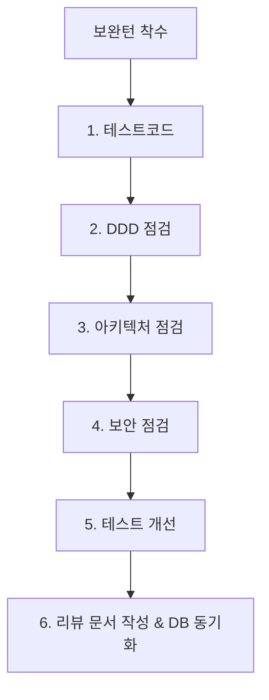

# 10. 리뷰 (Code Reviews & Quality Checks) 요약 가이드

## 📋 폴더 개요
기능 구현 완료 후 보완턴(Refinement Turn) 단계에서 작성된 회차별 코드리뷰 및 품질 검토 보고서를 보관합니다.

## 📑 하위 문서 목록
| 문서번호 | 파일명 | 문서 제목 | 주요 내용 요약 |
| :--- | :--- | :--- | :--- |
| `10-01` | `260917_001_바이브코딩환경_및_에이전트관리설계.md` | 바이브 코딩 환경 구축 및 에이전트 관리 설계 | OCR 토글, 작업정보관리, 작업그래프 뷰모드, 18대 문서 체계 및 보완턴 6단계 평가 |
| `10-02` | `260917_002_매턴응답_자동처리_및_고아문서정리_설계.md` | 매 턴 응답 자동 처리 및 고아 문서 정화 설계 | 리뷰문서 자동작성/DB등록, 세션/태스크/루프 상태 갱신, 대화추적 영속화, 실물없는 고아문서 DB 삭제 |
| `10-03` | `260917_003_18대_문서체계_및_한글표준화_설계.md` | 18대 기술문서 분류 체계 및 한글 표준화 설계 | 00.시작~17.참고 18대 디렉터리 체계, 전체 한글 파일명 전환, 편집이력 및 보완턴 가이드 수립 |
| `10-04` | `260917_004_문서번호체계_및_작업그래프_필터개선_설계.md` | 문서번호 체계 및 작업그래프 필터 개선 설계 | 각 폴더 README 인덱스, GFM 표/Mermaid 뷰어 고도화, 작업그래프 상태 멀티 체크박스 필터 |
| `10-05` | `260917_005_세션종합정리_및_하네스_완결_검증.md` | 세션 종합 정리 및 하네스 완결 검증 | Step 1~14 대화 턴 전수 영속화, 세션-태스크-루프 완료 종결, DB 무결성 최종 검증 |
| `10-06` | `260917_006_작업그래프_고도화_및_대화턴연동_구현_리뷰.md` | 작업그래프 고도화 및 대화턴 연동 구현 | 줌비율 저장, 간격 반응형 화살표선, 하위집중 모드, 계층그룹 뷰/성능대응, 대화턴 이동 |
| `10-07` | `260917_007_대화턴_응답전문_100퍼센트_저장_및_문서본문_DB검색_연동_리뷰.md` | 대화턴 응답전문 100% 저장 및 문서본문 DB검색 연동 | 응답전문 서식 100% 보존, 문서 본문 doc_payload 전수 적재 및 PostgreSQL JSONB 검색 연동 |
| `10-08` | `260917_008_목록헤더_3단계정렬_고정헤더_및_태스크백로그_거버넌스_구현_리뷰.md` | 목록헤더 3단계 정렬, 고정헤더 및 태스크 백로그 거버넌스 구현 | asc/desc/init 3단계 정렬, sticky top-0 고정 헤더, 대화턴 100% 현행화, 03-08 백로그 거버넌스 정책 수립 |
| `10-09` | `260917_009_태스크정리_세션마감_및_하네스_완결_최종_리뷰.md` | 태스크정리 세션마감 및 하네스 완결 최종 리뷰 | 세션/태스크/루프 8단계 전원 완료 종결, 3계층 집계 영속화, 41개 문서 전수 DB 동기화 |

