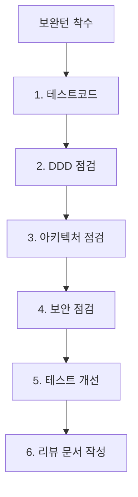

# 10. 리뷰 (Code Reviews & Quality Checks) 요약 가이드

## 📋 폴더 개요
기능 구현 완료 후 보완턴(Refinement Turn) 단계에서 작성된 회차별 코드리뷰 및 품질 검토 보고서를 보관합니다.

## 📑 하위 문서 목록
| 문서번호 | 파일명 | 문서 제목 | 주요 내용 요약 |
| :--- | :--- | :--- | :--- |
| `10-01` | `260917_001_바이브코딩환경_및_에이전트관리설계.md` | 바이브 코딩 환경 구축 및 에이전트 관리 설계 | OCR 토글, 작업정보관리, 작업그래프 뷰모드, 18대 문서 체계 및 보완턴 6단계 평가 |

