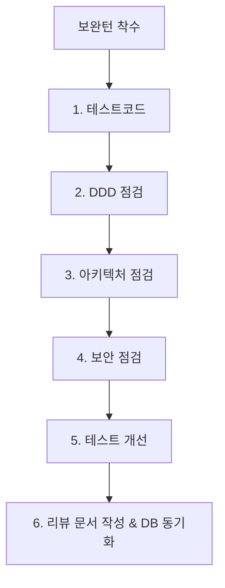

# 10. 리뷰 (Code Reviews & Quality Checks) 요약 가이드

## 📋 폴더 개요
기능 구현 완료 후 보완턴(Refinement Turn) 단계에서 작성된 회차별 코드리뷰 및 품질 검토 보고서를 보관합니다.

## 📑 하위 문서 목록
| 문서번호 | 파일명 | 문서 제목 | 주요 내용 요약 |
| :--- | :--- | :--- | :--- |
| `10-01` | `260917_001_바이브코딩환경_및_에이전트관리설계.md` | 바이브 코딩 환경 구축 및 에이전트 관리 설계 | OCR 토글, 작업정보관리, 작업그래프 뷰모드, 18대 문서 체계 및 보완턴 6단계 평가 |
| `10-02` | `260917_002_매턴응답_자동처리_및_고아문서정리_설계.md` | 매 턴 응답 자동 처리 및 고아 문서 정화 설계 | 리뷰문서 자동작성/DB등록, 세션/태스크/루프 상태 갱신, 대화추적 영속화, 실물없는 고아문서 DB 삭제 |
| `10-03` | `260917_003_18대_문서체계_및_한글표준화_설계.md` | 18대 기술문서 분류 체계 및 한글 표준화 설계 | 00.시작~17.참고 18대 디렉터리 체계, 전체 한글 파일명 전환, 편집이력 및 보완턴 가이드 수립 |
| `10-04` | `260917_004_문서번호체계_및_작업그래프_필터개선_설계.md` | 문서번호 체계 및 작업그래프 필터 개선 설계 | 각 폴더 README 인덱스, GFM 표/Mermaid 뷰어 고도화, 작업그래프 상태 멀티 체크박스 필터 |
| `10-05` | `260917_005_세션종합정리_및_하네스_완결_검증.md` | 세션 종합 정리 및 하네스 완결 검증 | Step 1~14 대화 턴 전수 영속화, 세션-태스크-루프 완료 종결, DB 무결성 최종 검증 |
| `10-06` | `260917_006_작업그래프_고도화_및_대화턴연동_구현_리뷰.md` | 작업그래프 고도화 및 대화턴 연동 구현 | 줌비율 저장, 간격 반응형 화살표선, 하위집중 모드, 계층그룹 뷰/성능대응, 대화턴 이동 |
| `10-07` | `260917_007_대화턴_응답전문_100퍼센트_저장_및_문서본문_DB검색_연동_리뷰.md` | 대화턴 응답전문 100% 저장 및 문서본문 DB검색 연동 | 응답전문 서식 100% 보존, 문서 본문 doc_payload 전수 적재 및 PostgreSQL JSONB 검색 연동 |
| `10-08` | `260917_008_목록헤더_3단계정렬_고정헤더_및_태스크백로그_거버넌스_구현_리뷰.md` | 목록헤더 3단계 정렬, 고정헤더 및 태스크 백로그 거버넌스 구현 | asc/desc/init 3단계 정렬, sticky top-0 고정 헤더, 대화턴 100% 현행화, 03-08 백로그 거버넌스 정책 수립 |
| `10-09` | `260917_009_태스크정리_세션마감_및_하네스_완결_최종_리뷰.md` | 태스크정리 세션마감 및 하네스 완결 최종 리뷰 | 세션/태스크/루프 8단계 전원 완료 종결, 3계층 집계 영속화, 41개 문서 전수 DB 동기화 |
| `10-10` | `260918_010_에이전트정보_오류조치_및_토큰한도제외_리뷰.md` | 에이전트 정보 오류조치 및 토큰한도제외 리뷰 | 1033 에러 로컬 폴백 스토어 구축, 429 턴 저장 제외(03-09) 구현, 태스크 승급 완료 |
| `10-11` | `260918_011_OOP_도메인기반_토큰감지_및_화면크래시_보완_승급_리뷰.md` | OOP/DDD 토큰감지 및 화면크래시 보완 승급 리뷰 | Strategy/Registry 도메인 서비스 아키텍처, ErrorBoundary & 1급 탭 신설, AGENTS.md 규제 게이트 수립 |
| `10-12` | `260920_012_DB장애대응정책_및_AGENTS_v2_거버넌스_승급_리뷰.md` | DB장애대응정책 및 AGENTS v2 거버넌스 승급 리뷰 | 정책 2.1~2.5 UI/UX 전면 적용, 03-10 정책 수립, AGENTS v2.0 게이트 강화 및 하네스 완결 |
| `10-13` | `260920_013_AGENTS_v2_1_통합거버넌스_제정_및_상태머신_승급_리뷰.md` | AGENTS v2.1 통합거버넌스 제정 및 상태머신 승급 리뷰 | 3계층 상태머신, GitHub REST API 제어, 턴추적 기술주체 규정, 03-11 정책 수립 및 종결 |
| `10-14` | `260921_014_세션격리_및_DB영속화_보안보완_승급_리뷰.md` | 세션격리 및 DB영속화, P0 보안보완 승급 리뷰 | 세션단위 스토어 격리, 3계층 하네스 동적 DB영속화, P0 보안(Path Traversal/Atomic Write) 조치 및 무결성 100점 달성 |
| `10-15` | `260921_015_하이브리드_아키텍처_리팩토링_및_디자인패턴_적용_리뷰.md` | 하이브리드 아키텍처 리팩토링 및 디자인패턴 적용 리뷰 | 타겟비즈니스(ppdf)와 에이전트(aiagent) 도메인 격리, 복잡(헥사고날)+단순(레이어드) 하이브리드 아키텍처, 5대 디자인 패턴 적용 및 15-04 교육자료 발행 |
| `10-16` | `260921_016_GitHub_원격동기화_누락방지_자동푸시_파이프라인_구축_리뷰.md` | GitHub 원격동기화 누락방지 자동푸시 파이프라인 구축 및 AGENTS 규정 개정 리뷰 | 컨테이너 .git 부재 시 Git Data API 기반 Commit/Push 파이프라인(scripts/github_sync_push.ts) 구축 및 AGENTS.md 규제 영구화 |
| `10-17` | `260921_017_DB테이블_인덱스개선_대화턴_일괄영속화_및_전수점검_가드레일_구축_리뷰.md` | DB 테이블 인덱스/감사컬럼 개선, 대화턴 일괄영속화 및 전수점검 가드레일 구축 리뷰 | 복합 인덱스 7종 및 DEFAULT 부여, 대화턴 33건 전수 영속화, 4단계 전수점검 CLI/UI 및 Push 가드레일 완비 |
| `10-18` | `260922_018_상단메뉴_버전위치_정돈_및_대화턴_뷰어버튼명_표준화_리뷰.md` | 상단 메뉴 버전위치 정돈, 툴 높이 통일 및 대화턴 뷰어 버튼명 표준화 리뷰 | 로고 옆 시스템명 단독 배치 및 버전정보 햄버거 메뉴 이동, 우측 툴 높이 32px 통일, 대화턴 뷰어 버튼명(뷰어) 및 상태 배지 너비 표준화 |
| `10-19` | `260922_019_토큰소진방지_자가적응형쿼터관리_및_OOP_DDD_리팩토링_리뷰.md` | 토큰 소진 방지 텔레메트리, 자가 적응형 쿼터 관리 및 OOP/DDD 리팩토링 리뷰 | 4계층 텔레메트리, 자가적응형 EMA(α), 무손실 인계 도시에, OOP 5대 패턴 리팩토링 및 Suite 6 TDD 완결 |
| `10-20` | `260922_020_PostgreSQL_aiagent_5대_메타원장테이블_마이그레이션_및_도메인엔티티_구축_리뷰.md` | PostgreSQL aiagent 5대 메타·원장 테이블 마이그레이션 및 도메인 엔티티 구축 리뷰 | 5대 테이블 DDL/Seed 적재, OOP/DDD 5대 도메인 모델, 백엔드 Express REST API 8종 및 Suite 7 TDD 완결 |
| `10-21` | `260923_021_비LLM_긴급Push_다차원_토큰쿼터_엔진_및_세션_재해복구_체계_구축_리뷰.md` | 비-LLM 긴급 Push, 다차원 토큰 쿼터 엔진 및 세션 재해복구 체계 구축 리뷰 | 비-LLM GitHub Push 우회로, Pro(250회)/Flash(2,500회) 듀얼 쿼터 및 무중단 폴백, 행(Hang) 5종 진단, 세션DR 패널 구축 및 Suite 4 TDD 완결 |
| `10-22` | `260923_022_재해복구_관제실_UI_스냅샷_파일화_개선_및_관리자_메타거버넌스_대시보드_구축_리뷰.md` | 재해복구 관제실 UI/스냅샷 파일화 개선 및 관리자 메타거버넌스 대시보드 구축 리뷰 | 관제실 에이전트통계 전용배치 & 딥슬레이트 UI, 스냅샷 JSON/MD 파일화 및 미완료 작업 추적, 4대 요금제·모델·원장통제 관리자 백오피스 구축 |
| `10-23` | `260923_023_복수계정_토큰정책_세션자원현행화_및_모델설정_구현_리뷰.md` | 복수계정 토큰정책, 세션 자원 현행화 및 모델설정 구현 리뷰 | 벤더 속성(AI수집/시스템등록), 복수 Gemini 계정·오버라이드, 세션 자원 스냅샷 바인딩, 온디맨드 재동기화(Re-sync), 정수 단위 무오차 쿼터 차감 및 거버넌스 뷰 신설 |
| `10-24` | `260923_024_PDF_이미지_전처리_및_3대_OCR_엔진_어댑터_구현_리뷰.md` | PDF 이미지 전처리 및 3대 OCR 엔진 어댑터 구현 리뷰 | 5단계 이미지 전처리 파이프라인, 테두리 트리밍 & 양면 분할, 3대 OCR 엔진(WASM/클라우드/도커) 어댑터, 앙상블 라우터, 2-Way BBox 교정 스튜디오 및 13종 단위검증 완결 |
| `10-25` | `260924_025_거버넌스_4대_식별자_포맷_및_기술문서_체계_표준화_리뷰.md` | 거버넌스 4대 식별자 포맷 및 기술문서 체계 표준화 리뷰 | 세션/태스크/루프/대화턴 4대 ID 표준 채번 엔진, 98개 기술문서 Mermaid 이미지 래퍼 및 최하단 편집이력 전수 표준화 |

  
  
<em>[그림] 10. 리뷰 (Code Reviews & Quality Checks) 요약 가이드 - 아키텍처 및 상태 흐름도 다이어그램 1</em>

