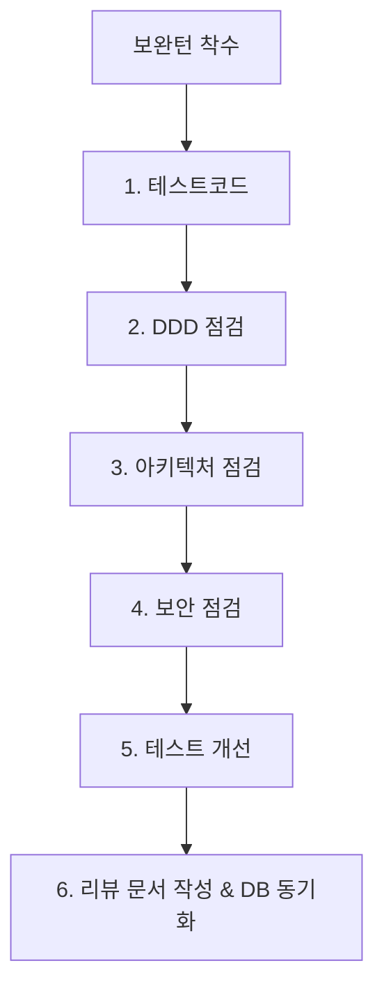

# 10. 리뷰 (Code Reviews & Quality Checks) 요약 가이드

## 📋 폴더 개요
기능 구현 완료 후 보완턴(Refinement Turn) 단계에서 작성된 회차별 코드리뷰 및 품질 검토 보고서를 보관합니다.

## 📑 하위 문서 목록
| 문서번호 | 파일명 | 문서 제목 | 주요 내용 요약 |
| :--- | :--- | :--- | :--- |
| `10-01` | `260917_001_바이브코딩환경_및_에이전트관리설계.md` | 바이브 코딩 환경 구축 및 에이전트 관리 설계 | OCR 토글, 작업정보관리, 작업그래프 뷰모드, 18대 문서 체계 및 보완턴 6단계 평가 |
| `10-02` | `260917_002_매턴응답_자동처리_및_고아문서정리_설계.md` | 매 턴 응답 자동 처리 및 고아 문서 정화 설계 | 리뷰문서 자동작성/DB등록, 세션/태스크/루프 상태 갱신, 대화추적 영속화, 실물없는 고아문서 DB 삭제 |
| `10-03` | `260917_003_18대_문서체계_및_한글표준화_설계.md` | 18대 기술문서 분류 체계 및 한글 표준화 설계 | 00.시작~17.참고 18대 디렉터리 체계, 전체 한글 파일명 전환, 편집이력 및 보완턴 가이드 수립 |
| `10-04` | `260917_004_문서번호체계_및_작업그래프_필터개선_설계.md` | 문서번호 체계 및 작업그래프 필터 개선 설계 | 각 폴더 README 인덱스, GFM 표/Mermaid 뷰어 고도화, 작업그래프 상태 멀티 체크박스 필터 |
| `10-05` | `260917_005_세션종합정리_및_하네스_완결_검증.md` | 세션 종합 정리 및 하네스 완결 검증 | Step 1~14 대화 턴 전수 영속화, 세션-태스크-루프 완료 종결, DB 무결성 최종 검증 |
| `10-06` | `260917_006_작업그래프_고도화_및_대화턴연동_구현_리뷰.md` | 작업그래프 고도화 및 대화턴 연동 구현 | 줌비율 저장, 간격 반응형 화살표선, 하위집중 모드, 계층그룹 뷰/성능대응, 대화턴 이동 |
| `10-07` | `260917_007_대화턴_응답전문_100퍼센트_저장_및_문서본문_DB검색_연동_리뷰.md` | 대화턴 응답전문 100% 저장 및 문서본문 DB검색 연동 | 응답전문 서식 100% 보존, 문서 본문 doc_payload 전수 적재 및 PostgreSQL JSONB 검색 연동 |
| `10-08` | `260917_008_목록헤더_3단계정렬_고정헤더_및_태스크백로그_거버넌스_구현_리뷰.md` | 목록헤더 3단계 정렬, 고정헤더 및 태스크 백로그 거버넌스 구현 | asc/desc/init 3단계 정렬, sticky top-0 고정 헤더, 대화턴 100% 현행화, 03-08 백로그 거버넌스 정책 수립 |
| `10-09` | `260917_009_태스크정리_세션마감_및_하네스_완결_최종_리뷰.md` | 태스크정리 세션마감 및 하네스 완결 최종 리뷰 | 세션/태스크/루프 8단계 전원 완료 종결, 3계층 집계 영속화, 41개 문서 전수 DB 동기화 |
| `10-10` | `260918_010_에이전트정보_오류조치_및_토큰한도제외_리뷰.md` | 에이전트 정보 오류조치 및 토큰한도제외 리뷰 | 1033 에러 로컬 폴백 스토어 구축, 429 턴 저장 제외(03-09) 구현, 태스크 승급 완료 |
| `10-11` | `260918_011_OOP_도메인기반_토큰감지_및_화면크래시_보완_승급_리뷰.md` | OOP/DDD 토큰감지 및 화면크래시 보완 승급 리뷰 | Strategy/Registry 도메인 서비스 아키텍처, ErrorBoundary & 1급 탭 신설, AGENTS.md 규제 게이트 수립 |
| `10-12` | `260920_012_DB장애대응정책_및_AGENTS_v2_거버넌스_승급_리뷰.md` | DB장애대응정책 및 AGENTS v2 거버넌스 승급 리뷰 | 정책 2.1~2.5 UI/UX 전면 적용, 03-10 정책 수립, AGENTS v2.0 게이트 강화 및 하네스 완결 |
| `10-13` | `260920_013_AGENTS_v2_1_통합거버넌스_제정_및_상태머신_승급_리뷰.md` | AGENTS v2.1 통합거버넌스 제정 및 상태머신 승급 리뷰 | 3계층 상태머신, GitHub REST API 제어, 턴추적 기술주체 규정, 03-11 정책 수립 및 종결 |
| `10-14` | `260921_014_세션격리_및_DB영속화_보안보완_승급_리뷰.md` | 세션격리 및 DB영속화, P0 보안보완 승급 리뷰 | 세션단위 스토어 격리, 3계층 하네스 동적 DB영속화, P0 보안(Path Traversal/Atomic Write) 조치 및 무결성 100점 달성 |
| `10-15` | `260921_015_하이브리드_아키텍처_리팩토링_및_디자인패턴_적용_리뷰.md` | 하이브리드 아키텍처 리팩토링 및 디자인패턴 적용 리뷰 | 타겟비즈니스(ppdf)와 에이전트(aiagent) 도메인 격리, 복잡(헥사고날)+단순(레이어드) 하이브리드 아키텍처, 5대 디자인 패턴 적용 및 15-04 교육자료 발행 |
| `10-16` | `260921_016_GitHub_원격동기화_누락방지_자동푸시_파이프라인_구축_리뷰.md` | GitHub 원격동기화 누락방지 자동푸시 파이프라인 구축 및 AGENTS 규정 개정 리뷰 | 컨테이너 .git 부재 시 Git Data API 기반 Commit/Push 파이프라인(scripts/github_sync_push.ts) 구축 및 AGENTS.md 규제 영구화 |
| `10-17` | `260921_017_DB테이블_인덱스개선_대화턴_일괄영속화_및_전수점검_가드레일_구축_리뷰.md` | DB 테이블 인덱스/감사컬럼 개선, 대화턴 일괄영속화 및 전수점검 가드레일 구축 리뷰 | 복합 인덱스 7종 및 DEFAULT 부여, 대화턴 33건 전수 영속화, 4단계 전수점검 CLI/UI 및 Push 가드레일 완비 |
| `10-18` | `260922_018_상단메뉴_버전위치_정돈_및_대화턴_뷰어버튼명_표준화_리뷰.md` | 상단 메뉴 버전위치 정돈, 툴 높이 통일 및 대화턴 뷰어 버튼명 표준화 리뷰 | 로고 옆 시스템명 단독 배치 및 버전정보 햄버거 메뉴 이동, 우측 툴 높이 32px 통일, 대화턴 뷰어 버튼명(뷰어) 및 상태 배지 너비 표준화 |
| `10-19` | `260922_019_토큰소진방지_자가적응형쿼터관리_및_OOP_DDD_리팩토링_리뷰.md` | 토큰소진방지 자가적응형쿼터관리 및 OOP DDD 리팩토링 리뷰 | 자가적응형 쿼터 알림, Strategy 패턴 쿼터 정책 분기, 회귀 테스트 구축 |
| `10-20` | `260922_020_PostgreSQL_aiagent_5대_메타원장테이블_마이그레이션_및_도메인엔티티_구축_리뷰.md` | PostgreSQL aiagent 5대 메타원장테이블 마이그레이션 및 도메인엔티티 구축 리뷰 | 하네스 메타원장 스키마 DDL 작성, Node pg 클러스터 브릿지 연동 |
| `10-21` | `260923_021_비LLM_긴급Push_다차원_토큰쿼터_엔진_및_세션_재해복구_체계_구축_리뷰.md` | 비LLM 긴급 Push 다차원 토큰쿼터 엔진 및 세션 재해복구 체계 구축 리뷰 | 비-LLM 우회로 구축, EmergencyGitPushEngine, 세션 DR 스냅샷 |
| `10-22` | `260923_022_재해복구_관제실_UI_스냅샷_파일화_개선_및_관리자_메타거버넌스_대시보드_구축_리뷰.md` | 재해복구 관제실 UI 스냅샷 파일화 및 관리자 대시보드 구축 리뷰 | DR 관제실 UI, 스냅샷 파일화 저장소, 관리자 메타거버넌스 대시보드 |
| `10-23` | `260923_023_복수계정_토큰정책_세션자원현행화_및_모델설정_구현_리뷰.md` | 복수계정 토큰정책 세션자원현행화 및 모델설정 구현 리뷰 | 멀티 계정 토큰 쿼터 정책, 세션 리소스 카탈로그 현행화 |
| `10-24` | `260923_024_PDF_이미지_전처리_및_3대_OCR_엔진_어댑터_구현_리뷰.md` | PDF 이미지 전처리 및 3대 OCR 엔진 어댑터 구현 리뷰 | OpenCV 캔버스 전처리, Tesseract/Paddle/Google OCR 어댑터 |
| `10-25` | `260924_025_거버넌스_4대_식별자_포맷_및_기술문서_체계_표준화_리뷰.md` | 거버넌스 4대 식별자 포맷 및 기술문서 체계 표준화 리뷰 | 세션/태스크/루프/트레이스 식별자 표준화, 18대 디렉터리 체계 |
| `10-26` | `260924_026_800쪽_대용량_가상뷰어_메모리가드_및_로컬실행환경_보완_리뷰.md` | 800쪽 대용량 가상뷰어 메모리가드 및 로컬실행환경 보완 리뷰 | 가상 스크롤러, LRU 페이지 캐시, 60fps 렌더링 최적화 |
| `10-27` | `260926_027_TDD_종합_회귀_점검_매뉴얼_및_AGENTS개정_리뷰.md` | TDD 종합 회귀 점검, 사용자 서비스 매뉴얼 및 AGENTS 개정 리뷰 | 3대 스위트 24개 테스트 100% PASS, 11-03 매뉴얼, 규칙 2.4 개정 |
| `10-28` | `260927_028_화면UI기획_초안문서화_반응형와이어프레임_및_단축키도구관리_구현_리뷰.md` | 화면 UI 기획 초안 문서화, 반응형 와이어프레임 및 단축키·도구그룹·아이콘 관리 코드리뷰 | 관리자 16대·사용자 9대 기획초안, PG-ADM/USR 프로그램ID 체계표, 와이어프레임 스튜디오, 단축키/도구그룹 관리(중복추가/초기화), 아이콘 디자인 리소스 레지스트리 구축 |
| `10-29` | `260927_029_리소스점검_및_GitHub_하네스_거버넌스_현행화_리뷰.md` | 리소스점검 및 GitHub 하네스(이슈·PR·브랜치) 거버넌스 현행화 코드리뷰 | 깨진 문서/폴더 정돈, 브랜치/PR/이슈 명명규칙 표준화, PR 자동생성·머지 파이프라인 구축, 과거 이슈/PR/브랜치 전수 한글화 현행화 |
| `10-30` | `260927_030_전수_목록_화면_UI정책_일괄적용_및_비LLM_긴급백업_복구_리뷰.md` | 전수 목록 화면 UI 정책 일괄 적용 및 비-LLM 긴급 소스 백업 복구 코드리뷰 | 목록 헤더 너비 조절/정렬 분리/중앙 정렬 3대 표준 정책 일괄 적용, Trace ID DESC 기본정렬, 에이전트 관제실 [🚨 DR 긴급관제] 모달 및 상단 네비게이션 복구, tsc 에러 0건 및 무결성 100점 달성 |
| `10-31` | `260927_031_원격dev_동기화_작업브랜치생성_및_작업그래프_README_복구_리뷰.md` | 원격 dev 동기화 머지, 작업브랜치 생성 및 작업그래프·README 복구 코드리뷰 | 원격 397개 파일 전수 로컬 동기화, AGENTS.md 및 로컬 스토어 안전 보존, 신규 작업브랜치 생성, 작업그래프 상태 필터링 무결성 보정, README.md 및 167개 기술문서 100% 복구 |
| `10-32` | `260928_032_PG_USR_02_캔버스크롭_4방향모서리조절_구글흰색소셜로고_프리셋모달_서브영역정리_코드리뷰.md` | PG-USR-02 캔버스크롭·4방향모서리조절·구글흰색소셜로고·프리셋모달 및 서브영역정리 코드리뷰 | 불필요 점선 서브영역 삭제, PG-USR-04/07 전용 컴포넌트 신규 구현, 공식 화이트 구글 소셜 로고 & 줄바꿈 방지, 마우스/터치 전역 드래그 이동 및 4방향 모서리 리사이즈, HTML5 Canvas 크롭 엔진, 12종 확장 프리셋 모달, 첫화면/로그인화면 레이아웃 정리 |
| `10-33` | `260930_033_사용자관리_프로필크롭연동_인라인정보수정_이메일2FA인증옵션화_및_비상복구코드_코드리뷰.md` | 사용자관리(PG-USR-04) 프로필 크롭 연동, 인라인 정보수정 모드, 시스템 정책 연동 이메일·2FA 옵션화 및 비상 복구코드 코드리뷰 | 360px 모바일 프로필 좌측잘림 방어, 퀵설정 DnD 롱프레스 순서 재배치, 아바타 톤다운 연필 수정버튼 및 크롭/프리셋 모달 전역 승격 연동, 이름·별명·연락처·이메일 인라인 수정 모드, 이메일 변경 인라인 인증번호 발송·6자리 검증 연속 동선 일체화, 시스템 정책 연동 이메일·2FA 옵션화(필수 vs 선택) 및 비상 복구코드 10개 관리 모달 완결 |
| `10-34` | `260930_034_토큰소진_모니터링_개선_AI_Studio_에러분류_및_대화턴_전수영속화_코드리뷰.md` | 토큰 소진 모니터링 개선, AI Studio 에러분류 및 대화턴 전수 영속화 코드리뷰 | AI Studio 2대 고유 에러(Ran for 0s / Quota exceeded, unexpected error) 감지기 및 진단 메서드, KST 16:00 슬라이딩 윈도우 기반 적응형 쿼터 소진 예측 API, 운영정책 03-19 제정, SESSION-0018 전체 6개 대화 턴 원본 프롬프트 및 Markdown 전문 100% 무손실 영속화, 컨텍스트 단절 예방 세션 리프레시 백로그 분리 |
| `10-35` | `260930_035_aiagent_11대테이블_코멘트적용_대화턴_스키마정돈_및_KST16시_토큰집계_코드리뷰.md` | aiagent 11대 테이블/컬럼 코멘트 적용, 대화턴 스키마 정돈 및 KST 16시 토큰집계 코드리뷰 | 11대 테이블 및 120여 개 컬럼 한글 코멘트 일괄 등록, agent_conversation_trace 컬럼 순서 논리적 재배치(loop_id, response_summary, 계정컬럼), 104건 무손실 스왑 및 7대 인덱스 최적화, KST 16:00 슬라이딩 윈도우 토큰 집계 뷰 및 실시간 API 연동 |
| `10-36` | `260930_036_PG_USR_05_옵션처리_편집레이어_일체형배치_및_모바일_카테고리접힘_최적화_코드리뷰.md` | PG-USR-05 옵션처리 편집레이어 네비게이션 일체형 배치 및 모바일 도서카테고리 위로접기 배너 상시노출 코드리뷰 | 옵션처리 팝업 네비게이션 div를 미리보기 div 내부로 직접 내포(자르기: 잘린크기 아래 / 표준화: 규격정보 아래), 드래그 앵커 클리핑 방지, 모바일 뷰포트 카테고리 접힘 배너 상시 노출 및 소멸 방어, 모바일 팝업크기버튼/목록헤더 뷰어아이콘 정리, tsc/빌드 100% 성공 |
| `10-37` | `261001_037_Xodo_스타일_팝오버_틀_및_초슬림_2단_툴바_좌상단_플로팅_쪽수칩_코드리뷰.md` | Xodo 스타일 팝오버 틀 및 초슬림 2단 툴바, 좌상단 플로팅 쪽수 칩(157/504) UI 뼈대 구현 코드리뷰 | 초슬림 2단 통폐합 툴바(88px 이하), 모드 드롭다운 스위처, Xodo 표준 ToolStylePopover(획/불투명도/4대프리셋/24색팔레트), 좌상단 157/800 플로팅 배지 및 쪽수점프, 밑줄주석 상황별 액션 팝오버 및 3번째 형태전환(형광펜/취소선/물결선/밑줄) 구현 |
| `10-38` | `261002_038_목차TOC제거_주석행체크박스및선택레이어팝업_OCR위아래탐색및즉시현행화_완결_코드리뷰.md` | 목차 TOC 제거·주석 선택목록 레이어팝업·OCR 위아래 탐색 및 즉시 현행화 완결 코드리뷰 | 목차 탭 복구 및 'toc' 영문 배제(북마크/목차/주석 3탭 스타일 100% 일치), 검색창 좌측 - 도구 우측 정렬 표준화, 주석 선택목록 레이어 팝업 카드 및 '전체' 토글, OCR 변경건 위/아래(▲/▼) 순차 탐색 및 즉시 현행화(⚡) 구현 |
| `10-39` | `261002_039_PG_USR_06_가상뷰어_아이콘규격통일_슬라이드휠드래그인터랙션결함해소_완결_코드리뷰.md` | PG-USR-06 가상뷰어 아이콘 규격 통일 및 슬라이드 휠·드래그 인터랙션 결함 해소 완결 코드리뷰 | 가로/세로 전환버튼 및 닫기버튼 w-7 h-7·w-4 h-4 100% 일체화, Lucide X 컴포넌트 전면 교체, Undo/Redo 및 정렬 기본 아이콘 표준화, HorizontalSlideContainer CSS 스냅 충돌 제거 및 60fps 다이렉트 휠 스크롤·window 드래그 추종 완결 |

```mermaid
graph TD
    Turn[보완턴 착수] --> Step1[1. 테스트코드]
    Step1 --> Step2[2. DDD 점검]
    Step2 --> Step3[3. 아키텍처 점검]
    Step3 --> Step4[4. 보안 점검]
    Step4 --> Step5[5. 테스트 개선]
    Step5 --> Step6[6. 리뷰 문서 작성 & DB 동기화]
```
