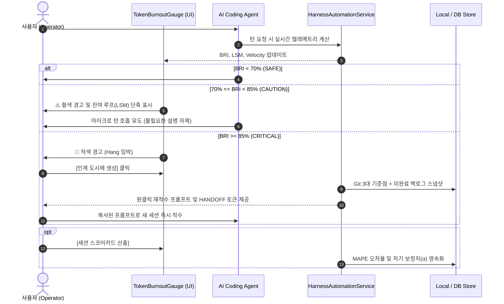

# 11-02. 에이전트 토큰 관리 및 무손실 세션 인계 운영 프로세스 가이드

> **문서 상태**: 운영 표준 가이드 (Standard Operating Procedure)  
> **최초 작성일**: 2026-09-22  
> **소관**: purePDFrend 에이전트 운영팀  
> **적용 대상**: AI 에이전트 대화 작업 세션을 운영·관리하는 모든 엔지니어 및 사용자

---

## 1. 표준 세션 라이프사이클 운영 플로우

  
  
<em>[그림] 11-02. 에이전트 토큰 관리 및 무손실 세션 인계 운영 프로세스 가이드 - 아키텍처 및 상태 흐름도 다이어그램 1</em>

---

## 2. 상황별 운영 조치 절차 (SOP)

### 2.1 BRI 70% 초과 (CAUTION) 인입 시
1. 진행 중이던 태스크의 잔여 루프 마진($LSM$)을 확인합니다.
2. $LSM \le 2$인 경우 새로운 하위 작업을 벌리지 않고 현재 루프를 신속히 `#루프정리` 합니다.
3. 헬스체크나 Git 작업은 터미널 압축기(E-기능) 또는 `scripts/github_sync_push.ts` 내부 서비스를 호출하여 프롬프트 토큰을 절감합니다.

### 2.2 BRI 85% 초과 (CRITICAL) 인입 시
1. 에이전트에게 추가 기능 구현을 중단하도록 지시합니다.
2. 화면 상단의 **[인계 도시에 생성]** 버튼을 클릭하여 `HandoffDossierModal`을 엽니다.
3. 발급된 `resume_prompt`를 복사하고, **[세션 연장 실행]** 버튼을 눌러 새 세션을 등록합니다.
4. 새로운 채팅창을 열고 복사한 프롬프트를 입력하여 즉시 작업을 승계합니다.

### 2.3 세션 정상 마감 시 (`#세션정리`)
1. 회고 작성 전 **[세션 스코어카드 산출]**을 실행하여 MAPE 오차율과 추천 API 목록을 확인합니다.
2. 산출된 $\alpha$ 보정치가 세션 메타정보에 반영되었는지 확인합니다.
3. 회고 문서(`docs/13.회고/`)에 해당 세션의 토큰 소비 실적 및 $\alpha$ 보정 결과를 기재합니다.

---

## 📋 편집 이력 (Revision History)

| 작업일자 | 이슈 | 태스크 | 작업자 | 작업내용 | 사용 AI 모델명 | 에이전트 | 참고링크 |
| :--- | :--- | :--- | :--- | :--- | :--- | :--- | :--- |
| 2026-09-24 | #12 | TASK-0013 | gemini | 거버넌스 4대 ID 포맷 개선 및 18대 문서 체계 편집이력/다이어그램 표준화 | Gemini 1.5 Pro | Google Antigravity | [03-01. 문서 정책](../03.정책/03-01_문서작성_및_편집이력_정책.md) |
