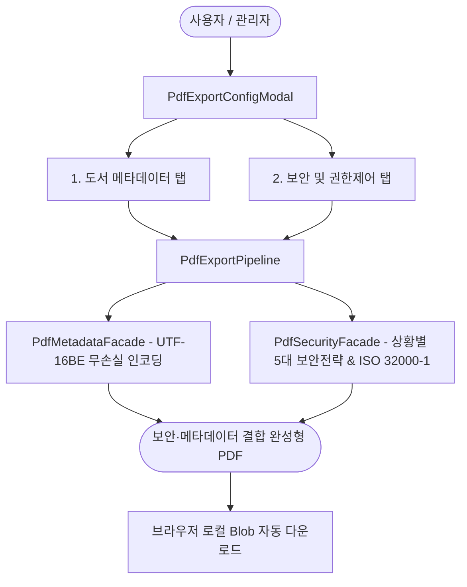
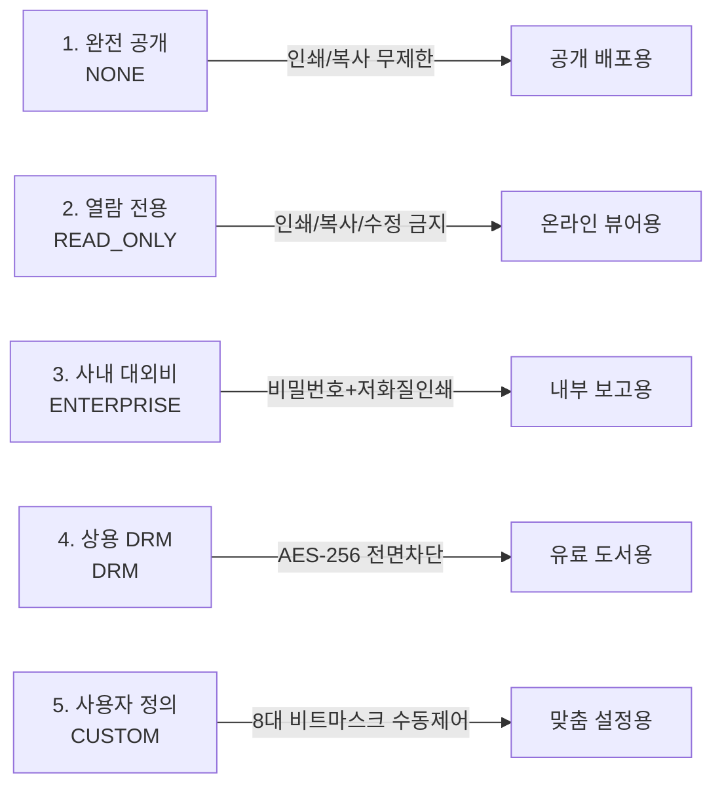

# 11-03. [05-23] PDF 메타데이터 및 상황별 보안설정 사용자 운영 매뉴얼

> **문서 번호**: `11-03`  
> **태스크 ID**: `TASK-0014-04`  
> **세션 ID**: `SESSION-260925-0014`  
> **작성 일자**: 2026-09-26  
> **작성 주체**: purePDFrend Software Architecture & Operations Team

---

## 1. 개요 및 목적

본 매뉴얼은 purePDFrend의 **도서 서지·활동 메타데이터 주입기** 및 **상황별 5대 PDF 보안/암호화 엔진**을 현업 실무자 및 전자책/도서 관리자가 손쉽게 활용할 수 있도록 작성된 사용자 운영 지침서입니다.

---

## 2. 도서 서지 및 활동 메타데이터 설정 가이드

### 2-1. 메타데이터 설정 탭 진입
1. purePDFrend 상단 내비게이션에서 **[시나리오 설계]** 화면으로 이동합니다.
2. 좌측 메뉴의 **[시나리오 5: 메타데이터 주입]** 또는 **[시나리오 6: 보안 및 권한제어]**를 선택합니다.
3. 우측 프리뷰 영역 상단의 **[📄 PDF 내보내기 설정 모달 열기]** 버튼을 클릭합니다.
4. 상단 탭에서 **[도서 메타데이터]**를 선택합니다.

### 2-2. 주요 설정 필드 안내
| 분류 | 입력 항목 | 설명 및 유효성 규칙 |
| :--- | :--- | :--- |
| **기본 서지 정보** | **도서 제목 (Title)** | 필수 입력. 국문/영문/특수기호 지원 (예: 엔터프라이즈 PDF 제작 총괄) |
| | **저자 / 필자 (Author)** | 도서 저자 및 공저자 명시 |
| | **출판사 (Publisher)** | 도서 발행 출판사명 |
| | **ISBN (13자리)** | 국제표준도서번호 (예: 978-89-000-0000-0). 형식 미준수 시 보정 안내 |
| **독서 관리 정보** | **현재 회독 상태** | `1독`, `2독`, `3독(N독)` 등 반복 독서 회독수 선택 |
| | **독서 진도율 (%)** | 0% ~ 100% 수치 슬라이더 또는 직접 입력 |
| | **독서 상태** | `독서전`, `독서중`, `완독`, `보류` 중 선택 |
| | **서평 및 독서 메모** | 도서 핵심 요약 메모 (UTF-16BE로 PDF 내에 무손실 영구 보존) |
| **연계 활동 정보** | **활동 분류** | `강의도서`, `그룹독서`, `뉴런데브`, `인프런강의` 등 연계 태그 지정 |

---

## 3. 상황별 5대 보안 프로필 및 세부 권한 제어 가이드

### 3-1. 상황별 보안 프로필 (5대 보안 전략)
상단 탭에서 **[보안 및 권한제어]**를 선택한 후, 배포 목적에 맞는 프로필을 선택합니다.

1. **완전 공개 (NONE)**:
   - 비밀번호 없음. 인쇄, 복사, 텍스트 추출, 주석 수정 등 모든 권한이 허용됩니다.
2. **열람 전용 (READ_ONLY)**:
   - 복사 및 내용 수정, 인쇄를 원천 차단하여 순수 눈으로만 읽는 전자책 배포에 적합합니다.
3. **사내 대외비 (ENTERPRISE)**:
   - 암호화 적용. 텍스트 복사는 금지되며, 오직 저화질 인쇄(150 DPI) 및 주석 작성만 허용됩니다.
4. **상용 DRM (DRM)**:
   - 최고 강도 AES-256 암호화 적용. 인쇄, 복사, 화면 캡처, 양식 작성 일체를 완전 통제합니다.
5. **사용자 정의 (CUSTOM)**:
   - 8대 권한 플래그 체크박스를 통해 필요한 권한만 개별 선택할 수 있습니다.

### 3-2. 비밀번호 정책
- **열람용 비밀번호 (User Password)**: 문서를 열람할 때 일반 사용자에게 요구되는 암호.
- **관리자 비밀번호 (Owner Password)**: 권한 제어를 해제하거나 Adobe Acrobat 등에서 보안 설정을 변경할 때 요구되는 마스터 암호.
- *(주의)* 관리자 암호와 열람용 암호는 서로 다르게 설정하는 것이 보안상 안전합니다.

---

## 4. 내보내기 파이프라인 및 완성 파일 검증

1. 모달 하단의 **[📥 보안/메타데이터 적용 PDF 생성 및 다운로드]** 버튼을 클릭합니다.
2. `PdfExportPipeline`이 백그라운드에서 실행되며:
   - 캔버스 렌더링 시 **WinAnsi 인코딩 충돌을 방지**하도록 본문이 안전하게 조립됩니다.
   - 입력한 도서 서지 및 활동 정보가 **UTF-16BE 인코딩을 통해 InfoDict 및 커스텀 네임스페이스**에 주입됩니다.
   - 선택한 보안 프로필에 따라 **ISO 32000-1 권한 비트마스크 및 /Encrypt 트레일러**가 합성됩니다.
3. 생성이 완료되면 브라우저에서 `.pdf` 파일이 자동으로 다운로드됩니다.
4. Adobe Acrobat Reader 또는 Chrome 브라우저에서 다운로드된 PDF를 열어 `[문서 속성]`(Ctrl+D)을 확인하면 주입된 메타데이터와 보안 권한을 바로 확인할 수 있습니다.

---

## 5. 원격 브랜치 승급 모니터링 가이드

1. purePDFrend 시스템 관리자는 `GET /api/agent/git/branch-status` 엔드포인트를 통해 GitHub 원격 레포(`dev`, `stg`, `main`)의 배포 일치 여부를 실시간 조회할 수 있습니다.
2. **피드백 지표 해석**:
   - `promotionCompleted: true`: 결과 소스 파일이 3대 브랜치에 완전히 반영되어 배포가 완료된 상태입니다.
   - `shaMatchStatus: 'IDENTICAL_SHA'`: Fast-Forward 승급을 통해 3개 브랜치의 Commit SHA까지 100% 동일하게 일치하는 가장 완벽한 상태입니다.
   - `shaMatchStatus: 'IDENTICAL_TREE_DIFFERENT_COMMIT_SHA'`: 결과 파일은 완벽히 같으나 개별 머지 커밋으로 기록된 상태입니다.
