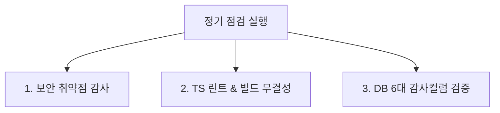

# 12. 점검 (Audits & Checklists) 요약 가이드

## 📋 폴더 개요
정기 보안 점검표, 린트 및 타입 정적 분석, DB 감사 컬럼 무결성 검증 체크리스트를 보관합니다.

## 📑 하위 문서 목록
| 문서번호 | 파일명 | 문서 제목 | 주요 내용 요약 |
| :--- | :--- | :--- | :--- |
| `12-01` | `12-01_정기_보안_및_품질_체크리스트.md` | 정기 보안 및 품질 체크리스트 | XSS/SQLI 차단 여부, TypeScript 컴파일 무경고, 감사 컬럼 누락 점검 |

