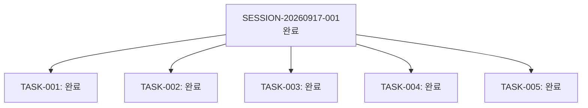

# 13-01. SESSION-20260917-001 세션 종합 KPT 회고록

> **세션 식별자**: `SESSION-20260917-001`  
> **세션 명칭**: purePDFrend-바이브코딩환경구축-및-에이전트거버넌스설계  
> **수행 기간**: 2026-09-17 ~ 2026-09-20  
> **총괄 에이전트**: Gemini (AI Agent) & 사용자  
> **상태**: 세션 완료 및 종결 (Session Closed)

---

## 📊 1. 세션 수행 요약 (Executive Summary)

본 세션에서는 purePDFrend 프로젝트의 기본 인프라와 AI 에이전트 거버넌스 프레임워크를 수립하고, 컨테이너 샌드박스의 제약을 극복하는 실질적인 엔지니어링 표준을 완성했습니다.

- **완료된 태스크 (총 5개)**:
  1. `TASK-20260917-001`: 바이브 코딩 환경 구축 및 에이전트 하네스 거버넌스 설계
  2. `TASK-20260918-002`: 에이전트 정보 접속 오류 해결 및 토큰 한도 초과 턴 저장 제외 정책(03-09) 수립
  3. `TASK-20260918-003`: OOP 및 도메인기반 토큰감지 아키텍처 구축 및 화면 오류 2차 완전 보완
  4. `TASK-20260920-004`: DB 장애 대응 처리 정책(2.1~2.5) UI 반영 및 AGENTS.md v2.0 거버넌스 승급
  5. `TASK-20260920-005`: AGENTS.md v2.1 통합 거버넌스 규약 제정 및 3계층 상태머신, GitHub REST API 원격 배포 체계 수립

---

## 🎯 2. KPT 상세 회고

### 🟢 Keep (지속 유지할 점)
1. **GitHub REST API 기반 샌드박스 원격 Git 제어**:
   - 로컬 `.git` 및 `gh` CLI 부재 시에도 `GITHUB_TOKEN`과 GitHub REST API를 통해 이슈, PR, 머지, 브랜치 배포(`dev` ➔ `stg` ➔ `main`)를 100% 자동화 달성.
2. **도메인 주도 토큰 한도 초과 오류 턴 자동 격리 (03-09)**:
   - Strategy/Registry 패턴 기반 `TokenQuotaDetectionService`를 통해 429/Resource Exhausted 턴을 완벽 격리하여 데이터 무결성 보장.
3. **무중단 Zero-Hang DB 장애 대응 체계 (2.1 ~ 2.5)**:
   - Cloudflare 1033 브릿지 단절 상황에서도 화면 프리징 없이 로컬 폴백 스토어(`local_agent_store.json`)와 방어 배지로 안정적 서빙.
4. **18대 문서 체계 및 거버넌스 연동**:
   - 정책(03-xx), 리뷰(10-xx), 회고(13-xx)의 린트/컴파일 검증 기반 상시 현행화.

### 🔴 Problem (발견된 문제점 및 한계)
1. **정적 로컬 스토어의 데이터 누적**:
   - `local_agent_store.json`이 단일 파일에 지속적으로 누적되어 세션 간 상태 분리가 모호해질 위험 존재.
2. **코드 내 기본값/하드코딩 의존성 잔재**:
   - API가 파라미터가 아닌 코드 레벨 기본 페이로드를 참조하거나 교차 검증 절차가 부재했던 점.
3. **세션 마감 시 DB-스토어 간 자동 감사 부재**:
   - `sessions`, `tasks`, `loops` 수량 및 상태가 DB와 일치하는지 판별하는 전용 감사 API 부재.

### 🔵 Try (다음 세션 시도 사항)
1. **세션 시작 시 스토어 초기화 및 격리**:
   - 새 세션 시작 시 `local_agent_store.json`을 현재 세션 전용으로 초기화하여 오염 방지.
2. **동적 파라미터 기반 API 및 등록 ➔ 조회 교차 무결성 검증**:
   - 하네스 메타데이터 및 트레이스 API의 완전 동적화 및 INSERT 후 SELECT 즉시 대조 검증 연동.
3. **세션 감사 API (`/api/agent/session/audit`) 신설**:
   - `#세션정리` 시점에 3계층 데이터 정합성을 DB와 자동 대조하여 Pass/Fail 감사 리포트 출력.
4. **대화 턴 전문 및 문서 본문의 Markdown 100% 복구 지원**:
   - DB 데이터만으로 원본 Markdown 뷰 화면을 무손실 재현할 수 있는 영속화 파이프라인 고도화.

---

## 📈 3. 하네스 상태 종결

  
  
<em>[그림] 13-01. SESSION-20260917-001 세션 종합 KPT 회고록 - 아키텍처 및 상태 흐름도 다이어그램 1</em>

---

## 📋 편집 이력 (Revision History)

| 작업일자 | 이슈 | 태스크 | 작업자 | 작업내용 | 사용 AI 모델명 | 에이전트 | 참고링크 |
| :--- | :--- | :--- | :--- | :--- | :--- | :--- | :--- |
| 2026-09-20 | #10 | TASK-005 | gemini | 최초 제정 및 도메인 거버넌스 수립 | Gemini 2.5 Flash | Google AI Studio | [03-01. 문서 정책](../03.정책/03-01_문서작성_및_편집이력_정책.md) |
| 2026-09-21 | #14 | TASK-008 | gemini | v2.2 전면 개정: 8대 필드 편집이력, 상호 링크, 다이어그램 이미지화 및 DB 영속화 표준 반영 | Gemini 3.8 Flash | Google AI Studio | [03-01. 문서 정책](../03.정책/03-01_문서작성_및_편집이력_정책.md) |
