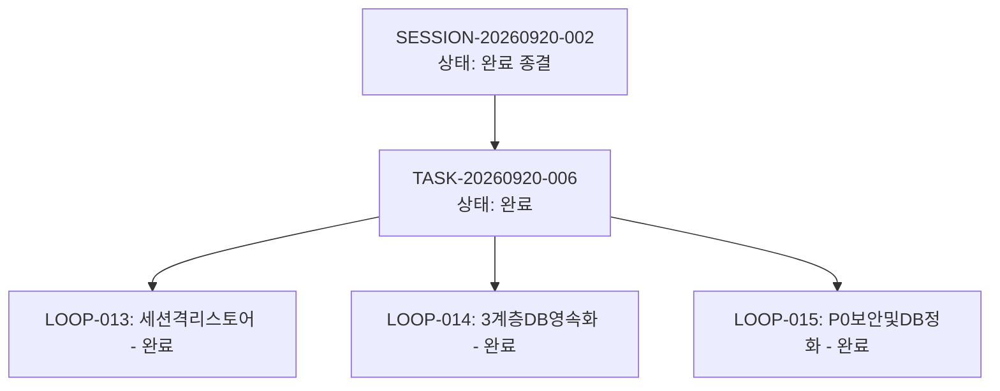

# 13-02. SESSION-20260920-002 세션 종합 KPT 회고록

> **세션 식별자**: `SESSION-20260920-002`  
> **세션 명칭**: purePDFrend-에이전트프로세스혁신-동적DB영속화-및-보안보완  
> **수행 기간**: 2026-09-20 ~ 2026-09-21  
> **총괄 에이전트**: Gemini (AI Agent) & 사용자  
> **상태**: 세션 완료 및 종결 (Session Closed)

---

## 📊 1. 세션 수행 요약 (Executive Summary)

본 세션에서는 이전 세션(13-01) 회고에서 도출된 Try 과제를 완벽하게 실현하여, 정적 하드코딩을 완전히 탈피하고 세션 격리, 실시간 DB 영속화, P0 보안 방어 및 무결성 실시간 감사 체계를 완결했습니다.

- **완료된 태스크 (1건)**:
  - `TASK-20260920-006`: 세션단위 로컬 스토어 격리 및 동적 DB 영속화 API 구축 (상태: `완료`)
- **완료된 루프 (3건)**:
  - `LOOP-20260920-013`: 세션단위 로컬스토어 격리 초기화 및 아카이빙 (`완료`)
  - `LOOP-20260920-014`: 3계층 하네스 동적 DB 영속화 및 Self-Cross Check (`완료`)
  - `LOOP-20260920-015`: P0 보안취약점 조치 및 DB 중복정화, 무결성 A+ 달성 (`완료`)
- **완료된 코드리뷰**:
  - `docs/10.리뷰/260921_014_세션격리_및_DB영속화_보안보완_승급_리뷰.md`
- **배포 승급**:
  - GitHub REST API 기반 `dev` ➔ `stg` ➔ `main` 3개 브랜치 커밋 100% 일치 배포 완료

---

## 🎯 2. KPT 상세 회고

### 🟢 Keep (지속 유지할 점)
1. **세션 단위 스토어 격리 및 안전 아카이빙 (`data/archives/`)**:
   - 신규 세션 시작 시 이전 세션 스토어를 타임스탬프와 함께 자동 아카이빙하고 현재 세션만 격리 관리하여 상태 오염 원천 차단.
2. **REST API 기반 실시간 DB Self-Cross Check 영속화**:
   - `session/init`, `task/save`, `loop/save`, `trace/turn` 전 엔드포인트에서 등록 즉시 SELECT 대조 검증을 수행하는 엔지니어링 신뢰도 확보.
3. **P0 보안 결함 및 시스템 안정성 완결**:
   - `resolveSafeDocsPath`를 통한 상위 경로 탐색(Path Traversal) 원천 차단 (`403 Forbidden`).
   - `saveLocalStore`의 `.tmp` 임시파일 및 `renameSync` 원자적 쓰기(Atomic Write) 적용.
   - `sanitizeIdentifier` 필터를 통한 SQL Injection 방어.
   - `/api/agent/session/finalize` 동적 세션 및 하위 태스크/루프 완료 승급 체계 구축.
4. **종합 무결성 실시간 감사 API (`/api/agent/audit/integrity`)**:
   - 고아 레코드 0건, 스토어-DB 패리티 100%, 53개 문서 SHA-256 해시 100% 일치로 **100점 (Grade: A+ PERFECT)** 달성.
5. **정책 03-09 토큰 쿼터 거버넌스 완벽 준수**:
   - 429/RESOURCE_EXHAUSTED 오류 턴 0건 영구 격리 유지.

### 🔴 Problem (발견된 문제점 및 한계)
1. **모바일 뷰 레이아웃 넘침(Overflow)**:
   - 모바일(화면 폭 < 768px) 환경에서 가로 폭을 초과하는 탭, 필터 버튼, 테이블 컬럼으로 인해 화면이 잘리거나 가로 스크롤이 흔들리는 현상 존재.
2. **상단 네비게이션 메뉴의 관련성 결여 및 과다 나열**:
   - 헤더에 7~8개의 1급 메뉴(`문서`, `대화추적`, `작업정보`, `작업그래프`, `무결성감사`, `서비스모니터링`, `ScenarioView`)가 병렬 나열되어 인지 과부하 발생.
3. **높은 정보 밀도로 인한 시각적 피로도**:
   - 대화 턴 원시 JSON, 문서 SHA-256 해시값, 세부 감사 항목이 메인 카드에 항상 노출되어 스크롤 길이가 지나치게 길어짐.

### 🔵 Try (다음 세션 시도 사항 - UX 개선 중심)
1. **[1순위] 메뉴 구성 체계화 및 정보구조(IA) 3대 그룹화**:
   - 8개 탭을 [1] 하네스 거버넌스, [2] 추적 및 지식창고, [3] PDF 서비스 3개 대분류 탭으로 단순화.
2. **[2순위] 모바일 반응형 헤더 & 가로 스크롤 칩 필터 구축**:
   - 모바일 햄버거 메뉴 및 `overflow-x-auto whitespace-nowrap` 가로 스와이프 칩 도입, 최소 터치 영역 44px 확보.
3. **[3순위] 상세 정보 계층 분리 (슬라이드 드로어 & 아코디언 토글)**:
   - 상세 JSON/해시는 우측 슬라이드 드로어(Sheet) 또는 접이식 아코디언(Collapsible)으로 분리하여 핵심 정보 우선 노출.
4. **공식 등록된 백로그 4대 과제 연계 추진**:
   - `BACKLOG-001` ~ `BACKLOG-004` (마크다운 청크 분할, SSE 스트리밍, ScenarioView WASM, 자동감사 크론) 단계적 이행.

---

## 📈 3. 하네스 상태 종결 메트릭

- **하네스 최종 상태**:
  - `SESSION-20260920-002`: `완료`
  - `TASK-20260920-006`: `완료`
  - `LOOP-20260920-013 ~ 015`: `완료`
  - 대화 턴 전수 영속화 (Step 1~3): `TRACE-001 ~ TRACE-003` 완비
- **무결성 감사 점수**: **100 / 100 점 (A+ PERFECT, PASSED)**
- **원격 Git 동기화**: `dev` = `stg` = `main` = `610edfd` (100% 동기화)

---

## 📝 편집 이력 (Revision History)

| 작업일자 | 이슈 | 태스크 | 작업자 | 작업내용 | 사용 AI 모델명 | 에이전트 | 참고링크 |
| :--- | :--- | :--- | :--- | :--- | :--- | :--- | :--- |
| 2026-09-20 | #10 | TASK-005 | gemini | 최초 제정 및 도메인 거버넌스 수립 | Gemini 2.5 Flash | Google AI Studio | [03-01. 문서 정책](../03.정책/03-01_문서작성_및_편집이력_정책.md) |
| 2026-09-21 | #14 | TASK-008 | gemini | v2.2 전면 개정: 8대 필드 편집이력, 상호 링크, 다이어그램 이미지화 및 DB 영속화 표준 반영 | Gemini 3.8 Flash | Google AI Studio | [03-01. 문서 정책](../03.정책/03-01_문서작성_및_편집이력_정책.md) |
