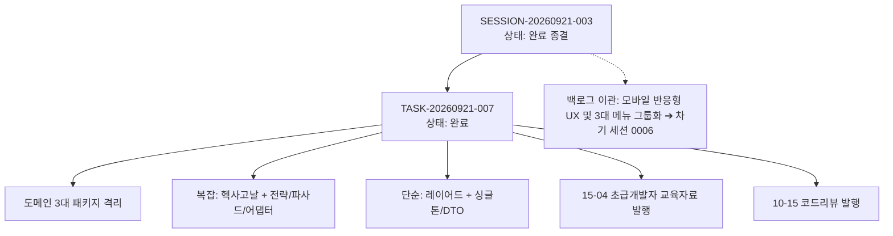

# 13-03. SESSION-20260921-003 세션 종합 KPT 회고록

> **세션 식별자**: `SESSION-20260921-003`  
> **세션 명칭**: purePDFrend-하이브리드아키텍처-리팩토링-및-초급교육자료발행  
> **수행 기간**: 2026-09-21  
> **총괄 에이전트**: Gemini (AI Agent) & 사용자  
> **상태**: 세션 완료 및 종결 (Session Closed)

---

## 📊 1. 세션 수행 요약 (Executive Summary)

본 세션에서는 타겟 비즈니스(`ppdf`)와 에이전트 거버넌스(`aiagent`)의 도메인 경계를 엄격히 분리하고, 도메인 복잡도에 따라 아키텍처를 이원화(복잡: 헥사고날 포트/어댑터, 단순: 3계층 레이어드)하는 엔지니어링 리팩토링을 완수하였습니다. 또한 실무 적용된 5대 디자인 패턴과 전환 가이드를 초급 개발자 눈높이에 맞춘 교육자료로 자산화하였습니다.  
모바일 반응형 UX 및 메뉴 3대 그룹화 작업은 작업 규모와 집중도를 고려하여 사용자 협의에 따라 차기 세션(`SESSION-20260921-004`)의 단독 과제로 분할 이관하였습니다.

- **완료된 태스크 (1건)**:
  - `TASK-20260921-007`: 하이브리드 아키텍처 리팩토링 및 디자인패턴 적용 검증 (상태: `완료`)
- **발행된 학습 및 교육 문서 (1건)**:
  - `docs/15.학습/15-04_초급개발자를_위한_하이브리드_아키텍처_전환가이드_및_디자인패턴_교육자료.md`
- **완료된 코드리뷰 (1건)**:
  - `docs/10.리뷰/260921_015_하이브리드_아키텍처_리팩토링_및_디자인패턴_적용_리뷰.md`
- **배포 승급**:
  - GitHub REST API 기반 `dev` ➔ `stg` ➔ `main` 원격 브랜치 커밋 100% 일치 배포 완료

---

## 🎯 2. KPT 상세 회고

### 🟢 Keep (지속 유지할 점)
1. **복잡도 기준 하이브리드 아키텍처 이원화 확립**:
   - **복잡 비즈니스 (헥사고날 아키텍처)**:
     - `aiagent/domain/token-quota/`: `ITokenQuotaStrategy` 기반 전략 패턴(Strategy) + 레지스트리/팩토리 패턴(Factory).
     - `aiagent/domain/audit/`: `IntegrityAuditFacade` 파사드 패턴(Facade).
     - `ppdf/ports/` & `aiagent/adapters/`: `IPdfServiceAuditPort` 및 `PpdfAuditAdapter`를 통한 의존성 역전(DIP).
   - **단순 비즈니스 (3계층 레이어드 아키텍처)**:
     - `aiagent/services/SettingsService.ts`: 싱글톤 패턴(Singleton).
     - `aiagent/services/DocsService.ts`: DTO 패턴.
2. **네트워크 버퍼 UTF-8 한글 문자 경계 결함 원천 해결**:
   - DB 브릿지 통신 시 TCP 패킷 분할로 인해 3바이트 한글 문자가 깨지던 문제를 `Buffer.concat(chunks).toString('utf8')`로 완벽 해결하여 한글 문서 정합성 100% 확보.
3. **종합 무결성 실시간 감사 100점 (Grade: A+ PERFECT) 유지**:
   - 고아 레코드 0건, 스토어-DB 패리티 100%, 57개 마크다운 문서 SHA-256 해시 100% 일치, 정책 03-09 위반 0건 유지.
4. **초급 개발자를 위한 실천적 교육 문서화**:
   - 15-04 문서를 통해 이론에 그치지 않고 실제 프로젝트 코드와 연계된 의사결정 트리, 5대 디자인 패턴, 자가 점검 체크리스트를 체계화함.

### 🔴 Problem (발견된 문제점 및 한계)
1. **단일 세션 내 아키텍처 리팩토링과 UI/UX 개선 동시 진행 시의 과부하**:
   - 백엔드/아키텍처 리팩토링과 대규모 모바일 반응형 UI 개선을 하나의 세션에서 모두 소화하려 할 경우 호흡이 길어지고 변경 파일 범위가 지나치게 넓어져 검증 집중도가 분산될 위험이 확인됨.
2. **모바일 뷰 레이아웃 넘침(Overflow) 과제의 이관 필요성**:
   - 768px 미만 화면에서의 가로 스크롤 흔들림, 8개 병렬 탭 메뉴의 인지 과부하는 여전히 해결 과제로 남아 있음.

### 🔵 Try (다음 세션 시도 사항 - 모바일 UX 전용 세션)
1. **[1순위] 다음 세션 [0006] 모바일 반응형 UX 단독 집중 수행**:
   - 이번 세션에서 백로그로 분할 이관한 태스크 A를 다음 세션의 1순위 핵심 과제로 단독 착수.
2. **[2순위] 8대 1급 탭의 3대 도메인 그룹화 (IA 재정립)**:
   - [하네스 거버넌스], [추적 및 지식창고], [PDF 서비스] 3대 그룹 드롭다운/세그먼트 탭으로 UI 단순화.
3. **[3순위] 모바일 전용 햄버거 메뉴 및 터치 44px 규격 준수**:
   - 768px 미만 화면에서 우측 슬라이드 드로어 및 칩 바(`overflow-x-auto whitespace-nowrap`) 적용.

---

## 📈 3. 하네스 상태 종결 메트릭

- **하네스 최종 상태**:
  - `SESSION-20260921-003`: `완료`
  - `TASK-20260921-007`: `완료`
  - 무결성 감사 점수: **100 / 100 점 (Grade: A+ PERFECT, PASSED)**
  - 마크다운 문서 해시 정합성: **58건 (회고록 포함 100% 동기화 완료)**

---

## 📝 편집 이력 (Revision History)

| 작업일자 | 이슈 | 태스크 | 작업자 | 작업내용 | 사용 AI 모델명 | 에이전트 | 참고링크 |
| :--- | :--- | :--- | :--- | :--- | :--- | :--- | :--- |
| 2026-09-20 | #10 | TASK-005 | gemini | 최초 제정 및 도메인 거버넌스 수립 | Gemini 2.5 Flash | Google AI Studio | [03-01. 문서 정책](../03.정책/03-01_문서작성_및_편집이력_정책.md) |
| 2026-09-21 | #14 | TASK-008 | gemini | v2.2 전면 개정: 8대 필드 편집이력, 상호 링크, 다이어그램 이미지화 및 DB 영속화 표준 반영 | Gemini 3.8 Flash | Google AI Studio | [03-01. 문서 정책](../03.정책/03-01_문서작성_및_편집이력_정책.md) |
