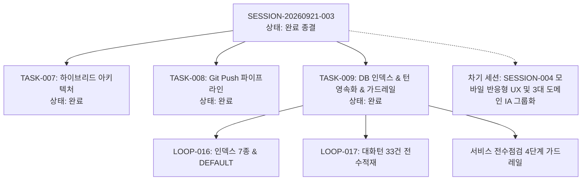

# 13-04. SESSION-20260921-003(2차) 세션 종합 KPT 회고록

> **세션 식별자**: `SESSION-20260921-003`  
> **세션 명칭**: `[0005]purePDFrend-대화턴영속화_DB인덱스개선_및_서비스전수점검가드레일완결`  
> **수행 일자**: 2026-09-21  
> **총괄 에이전트**: Gemini (AI Agent) & jkoogit  
> **상태**: 세션 최종 완료 및 종결 (Session Closed)

---

## 📊 1. 세션 수행 요약 (Executive Summary)

본 세션 후반부(2차 세션정리)에서는 대화 턴(Turn)이 22건에서 멈춰 있던 긴급 이슈를 해결하고, 대규모 AI 에이전트 환경에 최적화된 DB 구조 개편 및 상시 품질 보증 체계를 완결하였습니다.

- **완료된 태스크 (3건)**:
  - `TASK-20260921-007`: 하이브리드 아키텍처 리팩토링 및 디자인패턴 적용 검증 (상태: `완료`)
  - `TASK-20260921-008`: GitHub 원격동기화 누락방지 자동푸시 파이프라인 구축 및 AGENTS 규정 개정 (상태: `완료`)
  - `TASK-20260921-009`: DB 인덱스/감사컬럼 개선, 대화턴 일괄영속화 및 4단계 서비스 전수점검 가드레일 구축 (상태: `완료`)
- **수행된 루프 (2건)**:
  - `LOOP-20260921-016`: DB 테이블 복합 인덱스 7종 생성 및 감사컬럼 `DEFAULT` 부여 개선 (상태: `완료`)
  - `LOOP-20260921-017`: 대화턴 생명주기 체크포인트 일괄영속화 파이프라인 구축 및 세션003 전수적재 (상태: `완료`)
- **발행된 정책 및 리뷰 문서**:
  - 정책 `03-12`: 서비스 전수점검 및 상시 가드레일 거버넌스 운영정책
  - 리뷰 `10-17`: DB 테이블 인덱스/감사컬럼 개선, 대화턴 일괄영속화 및 전수점검 가드레일 구축 리뷰
- **배포 승급**:
  - Git Data API 기반 Commit/Push 후 `dev` = `stg` = `main` 3대 브랜치 최신 커밋 100% 일치 배포 완료 (`3636d979d2651a8243a900be39c7611f1fc5f1a4`)

---

## 🎯 2. KPT 상세 회고

### 🟢 Keep (지속 유지할 점)
1. **대화 턴 생명주기 체크포인트 일괄 영속화 파이프라인 정착**:
   - 에이전트 응답 후킹이 어려운 환경에서 하네스 단계 전이 시점(#태스크승급, #세션정리, 루프 종료)마다 미등록 턴을 안전하게 수집하고, 정책 03-09(429 토큰 소진 격리)를 거쳐 33건 전수 영속화 달성.
2. **PostgreSQL 복합 인덱스 7종 및 감사컬럼 `DEFAULT` 개편**:
   - `aiagent` 스키마 6대 테이블에 7개 복합 인덱스를 적용하여 풀 테이블 스캔을 원천 차단하고, 타임스탬프 기본값 부여로 신뢰성 극대화.
3. **4단계 서비스 전수 점검 파이프라인 및 원격 푸시 가드레일 (Pre-flight Gate)**:
   - CLI 명령어(`npm run check:service`), 네비게이션 상단 실시간 점검 위젯, 원격 Git Push 사전검증을 연동하여 100점 만점이 아닐 경우 배포 푸시를 즉시 차단(ABORT)하는 안전망 완비.
4. **시스템 거버넌스 100점 만점 (`A+ PERFECT`) 유지**:
   - 고아 레코드 0건, 스토어-DB 패리티 100%, 61개 기술문서 SHA-256 해시 100% 일치, 정책 03-09 위반 0건 유지.

### 🔴 Problem (발견된 문제점 및 한계)
1. **대화 턴 영속화 지연 인식**:
   - 실시간 후킹 부재로 인해 대화 턴이 즉시 반영되지 않아 사용자가 22건에서 멈춘 것으로 인식하는 혼선이 있었음. 생명주기 체크포인트 동기화와 UI 상태 표기를 더욱 직관적으로 노출할 필요가 있음.
2. **모바일 반응형 UX 과제의 누적**:
   - 세션 003에서 아키텍처 및 DB 인프라/거버넌스 안정화에 집중함에 따라, 768px 미만 모바일 뷰 최적화와 3대 도메인 그룹화(IA 개편) 과제가 차기 세션의 핵심 숙제로 이월됨.

### 🔵 Try (다음 세션 시도 사항 - SESSION-20260921-004)
1. **[1순위] 모바일 반응형 UX 및 레이아웃 넘침(Overflow) 완전 해소**:
   - 768px 미만 화면 가로 스크롤 제거, 우측 슬라이딩 햄버거 드로어 탑재, 44px 이상 터치 규격 보장.
2. **[2순위] 8대 상단 메뉴의 3대 도메인 그룹화 (IA 전면 개편)**:
   - [하네스 거버넌스], [추적 및 지식창고], [PDF 스튜디오] 3개 세그먼트/드롭다운으로 네비게이션 헤더 단순화 및 인지 부하 감소.
3. **[3순위] 대화 턴 실시간 수집 시각화 강화**:
   - 네비게이션 바 또는 하네스 화면에서 현재 세션의 미저장 턴 여부 및 체크포인트 동기화 상태를 시각적 인디케이터로 안내.

---

## 📈 3. 하네스 상태 종결 메트릭

- **하네스 최종 상태**:
  - `SESSION-20260921-003`: `완료`
  - 세션 내 태스크 3건 / 루프 2건: **전수 `완료`**
  - 대화 턴(Traces): **총 33건 영속화 완료**
  - 무결성 감사 점수: **100 / 100 점 (Grade: A+ PERFECT, PASSED)**
  - 기술문서 SHA-256 해시 정합성: **61개 전수 일치 (100% 동기화)**
  - 3대 브랜치 최신 커밋 일치: **`dev` = `stg` = `main`**

---

## 📝 편집 이력 (Revision History)

| 작업일자 | 이슈 | 태스크 | 작업자 | 작업내용 | 사용 AI 모델명 | 에이전트 | 참고링크 |
| :--- | :--- | :--- | :--- | :--- | :--- | :--- | :--- |
| 2026-09-20 | #10 | TASK-005 | gemini | 최초 제정 및 도메인 거버넌스 수립 | Gemini 2.5 Flash | Google AI Studio | [03-01. 문서 정책](../03.정책/03-01_문서작성_및_편집이력_정책.md) |
| 2026-09-21 | #14 | TASK-008 | gemini | v2.2 전면 개정: 8대 필드 편집이력, 상호 링크, 다이어그램 이미지화 및 DB 영속화 표준 반영 | Gemini 3.8 Flash | Google AI Studio | [03-01. 문서 정책](../03.정책/03-01_문서작성_및_편집이력_정책.md) |
