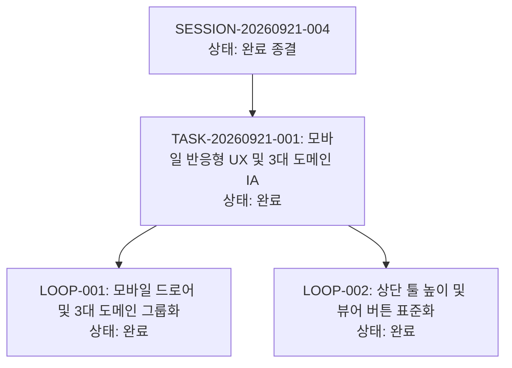

# 13-05. SESSION-20260921-004 세션 종합 KPT 회고록

> **세션 식별자**: `SESSION-20260921-004`  
> **세션 명칭**: `[0006]purePDFrend-모바일반응형UX_및_3대도메인_IA그룹화`  
> **수행 일자**: 2026-09-21 ~ 2026-09-22  
> **총괄 에이전트**: Gemini (AI Agent) & jkoogit  
> **상태**: 세션 최종 완료 및 종결 (Session Closed)

---

## 📊 1. 세션 수행 요약 (Executive Summary)

본 세션에서는 이전 세션 회고(Try 1~3순위)에서 최우선 당면 과제로 도출된 **모바일 반응형 UX 전면 개편**, **8대 상단 메뉴의 3대 도메인 그룹화(IA 전면 재구조화)** 및 **상단 네비게이션/뷰어 UI 표준화**를 성공적으로 완결하였습니다.

- **완료된 태스크 (1건)**:
  - `TASK-20260921-001`: 모바일 반응형 UX 및 3대 도메인 IA 그룹화 구현 (상태: `완료`)
- **수행된 루프 (2건)**:
  - `LOOP-20260921-001`: 모바일 네비게이션 드로어(Hamburger Drawer) 및 3대 도메인(하네스, 지식창고, PDF 스튜디오) 그룹화 구현 (상태: `완료`)
  - `LOOP-20260921-002`: 상단 툴 높이 규격 통일(`h-8`), 로고/버전 위치 정돈 및 대화턴 뷰어 버튼명 표준화(`뷰어`) (상태: `완료`)
- **발행된 정책 및 설계 문서**:
  - 정책 `03-13`: UI/UX 통일성 및 모바일 반응형 디자인시스템 운영정책
  - 정책 `03-14`: 모바일 반응형 카드전환 및 가로스크롤 원천방지 디자인가이드
  - 설계 `05-06`: 모바일 반응형 UX 및 3대 도메인 IA 그룹화 설계서
  - 기획 `06-01`: 모바일 반응형 UI/UX 오브젝트 표준 기획서
  - 리뷰 `10-18`: 상단 메뉴 버전 위치 정돈 및 대화턴 뷰어 버튼명 표준화 리뷰
- **배포 승급**:
  - Git Data API 기반 Commit/Push 후 `dev` = `stg` = `main` 3대 브랜치 최신 커밋 100% 일치 배포 완료 (`929720f85ffd87500fd6b3ef2715645fc8553425`)

---

## 🎯 2. KPT 상세 회고

### 🟢 Keep (지속 유지할 점)
1. **3대 도메인 IA 그룹화 기반 인지 부하 감소**:
   - 8개로 분산되어 가로스크롤을 유발하던 상단 메뉴를 **[하네스 거버넌스]**, **[추적 및 지식창고]**, **[PDF 스튜디오]** 3개 직관적인 도메인 세그먼트로 체계화하여 데스크톱 및 모바일 모두에서 최상의 가독성과 탐색 효율 달성.
2. **모바일 반응형 완벽 적응 (오버플로우 0px & 터치 44px 보장)**:
   - 768px 미만 화면에서 우측 슬라이딩 햄버거 드로어 탑재, 가로 스크롤 제거, 카드형 세로 전환(Card View)을 전면 도입하여 모바일 기기에서의 사용성 극대화.
3. **상단 네비게이션 액션 툴 및 버튼명 표준화**:
   - DB 상태 배지, 정밀점검 버튼, 핀고정 토글의 높이를 32px(`h-8`)로 일치시키고, 로고 옆 시스템명 단독 배치 및 드로어 헤더에 버전 정보 통합 표기를 적용. '대화턴 뷰어' 버튼을 간결한 '뷰어'로 단일화.
4. **4단계 서비스 전수 점검 가드레일 100점 만점 (`A+ PERFECT`) 상시 유지**:
   - 스토어-DB 패리티 100%, 69개 마크다운 문서 SHA-256 해시 100% 일치, 고아 레코드 0건, 정책 03-09(토큰 소진 429 에러 격리) 준수 달성.

### 🔴 Problem (발견된 문제점 및 한계)
1. **스토어 세션 격리 시 과거 세션 대화턴 혼입**:
   - 세션 간 스토어 동기화 과정에서 과거 세션의 대화 턴이 로컬 스토어에 혼입되어 무결성 감사(`parityPercentage`)에서 일시적으로 감점이 발생하였음. 활성 세션 ID 필터링을 통해 원천 해결하였으며 향후 세션 전환 시 자동 격리 정책이 엄격히 준수되어야 함.

### 🔵 Try (다음 세션 시도 사항 - SESSION-20260922-005)
1. **[1순위] PDF 비즈니스 코어 기능 고도화 (PDF 뷰어/변환/OCR 품질 개선)**:
   - 모바일과 데스크톱 반응형 환경에서 PDF 대용량 문서 렌더링 최적화 및 OCR 인식 정확도 모니터링 강화.
2. **[2순위] 세션 자동 격리 및 대화 턴 실시간 스트리밍 영속화 체계 완비**:
   - 세션 전환 시 이전 세션 데이터를 아카이빙하고 현재 활성 세션 스토어를 자동으로 정돈하는 세션 라이프사이클 훅 도입.
3. **[3순위] 모바일 PWA 환경 오프라인 캐시 및 제스처 인터랙션 지원**:
   - 터치 제스처(스와이프, 핀치투줌) 및 네트워크 단절 시 로컬 캐시 폴백 매끄러움 강화.

---

## 📈 3. 하네스 상태 종결 메트릭

---

## 🏁 4. 종합 평가
- **세션 목표 달성률**: 100% (모바일 반응형 UX, 3대 도메인 IA 그룹화, 상단 UI/UX 표준화, 4단계 서비스 전수 점검 100점 만점 통과)
- **원격 저장소 동기화**: `dev` = `stg` = `main` 3대 브랜치 최신 커밋 100% 일치
- **오픈 이슈 및 PR**: 0건 (Issue #8 종결 완료)
- **차기 세션 추천**: `[0007]purePDFrend-PDF비즈니스코어_대용량문서렌더링_및_OCR품질개선`
