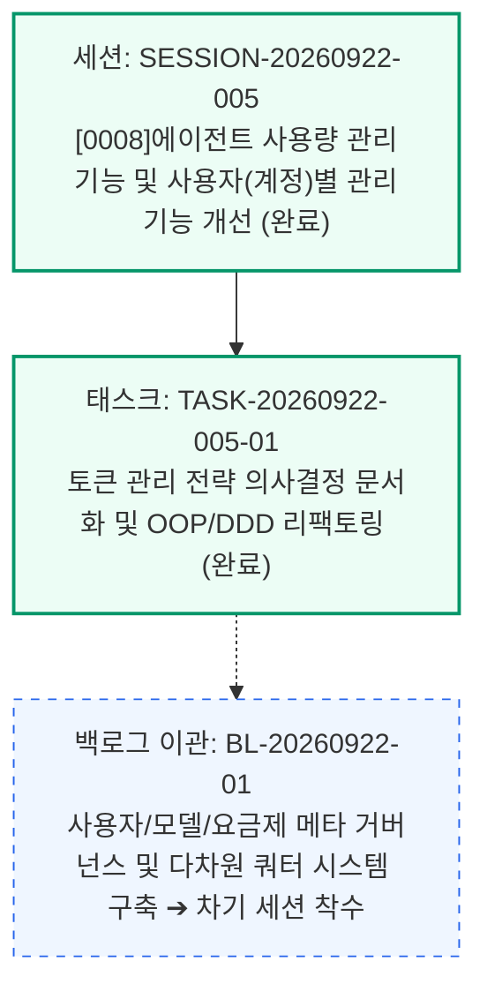

# 13-06. SESSION-20260922-005 세션 종합 KPT 회고록

> **세션 식별자**: `SESSION-20260922-005`  
> **세션 명칭**: `[0008]에이전트 사용량 관리기능 및 사용자(계정)별 관리기능 개선`  
> **수행 일자**: 2026-09-22  
> **총괄 에이전트**: Gemini (AI Agent) & jkoogit  
> **상태**: 세션 최종 완료 및 종결 (Session Closed)

---

## 📊 1. 세션 수행 요약 (Executive Summary)

본 세션에서는 에이전트의 불시 토큰 고갈 및 컨텍스트 윈도우 한도 초과(429, RESOURCE_EXHAUSTED)로 인한 먹통(Hang/Freeze) 사태를 원천 예방하고, 자가 적응형 쿼터 관리 및 무손실 세션 인계(Lossless Handoff) 체계를 구축하였습니다. 또한 초기 단일 거대 클래스 구조를 **OOP 기반 도메인 주도 설계(DDD)**로 전면 리팩토링하고 교육 자료 수준의 학습 문서를 완성하였습니다.

- **완료된 태스크 (1건)**:
  - `TASK-20260922-005-01`: 토큰 관리 전략 의사결정 문서화 및 OOP/DDD 리팩토링 (상태: `완료`)
- **수행된 핵심 아키텍처 개선**:
  - **전략 패턴(Strategy)**: 제공자별(Gemini, Claude, OpenAI) 가중치 분리 및 OCP 보장
  - **값 객체(Value Object)**: 불변 `TokenTelemetry` 및 도메인 판정 메서드 캡슐화
  - **빌더 패턴(Builder)**: Git 3대 기준점 및 백로그 인계 체이닝 빌더 구현
  - **도메인 서비스(Domain Service)**: 지수이동평균(EMA) $\alpha$ 보정치 산출 격리
  - **파사드 패턴(Facade)**: 기존 컴포넌트 및 API 100% 하위 호환성 보장
- **발행된 8대 산출물 및 학습 문서**:
  - 결정 `04-02`: 토큰소진방지 및 자가적응형 쿼터관리 의사결정 (ADR)
  - 정책 `03-15`: 토큰소진 선제방지 및 무손실 세션인계 운영정책
  - 설계 `05-07`: 실시간 토큰텔레메트리 및 자가적응형 도메인설계
  - 기획 `06-02`: 에이전트 사용량 거버넌스 및 쿼터관리 기획서
  - 구현 `09-02`: 토큰관리 텔레메트리 및 하네스인계 구현명세
  - 리뷰 `10-19`: 토큰소진방지 자가적응형쿼터관리 및 OOP/DDD 리팩토링 리뷰
  - 운영 `11-02`: 에이전트 토큰 및 세션인계 운영프로세스 가이드
  - 학습 `15-05`: 초기구현 대비 OOP 도메인주도설계 리팩토링 및 디자인패턴 교육자료
- **품질 검증 및 배포 승급**:
  - TDD 단위 테스트 6개 스위트 전원 성공 (Suite 6 신규 추가)
  - 4단계 서비스 전수 점검 가드레일 **100점 만점 [A+ (PERFECT)]** 달성
  - Git Data API를 통해 `dev` = `stg` = `main` 3대 브랜치 최신 커밋 완벽 동기화

---

## 🎯 2. KPT 상세 회고

### 🟢 Keep (지속 유지할 점)
1. **의사결정(ADR)부터 교육문서(학습)까지의 8대 산출물 완결성**:
   - 정책, 설계, 기획, 구현, 리뷰, 운영, 학습의 18대 문서 체계에 걸쳐 상호 교차 참조가 완벽하게 일치하도록 전수 인덱싱 및 DB 영속화 완결.
2. **단일 거대 클래스(God Class) 안티패턴 해소 및 OCP 실현**:
   - 5대 GoF 디자인 패턴을 적용하여 향후 신규 모델(Llama, Mistral 등) 추가 시 기존 비즈니스 로직을 전혀 수정하지 않고 확장 가능하도록 구조적 토대 마련.
3. **무결성 4단계 전수 점검 가드레일의 100점 만점 상시 준수**:
   - 로컬 문서 생성 즉시 DB 해시를 일치시키고, 고아 레코드 발생을 방지하는 CI/CD 사전 점검 자동화 파이프라인의 고신뢰성 확인.

### 🔴 Problem (발견된 문제점 및 한계)
1. **단일 세션 기준 임계치 측정의 다중 세션 맹점**:
   - 사용자/계정 기준이 아닌 개별 세션 버짓(100k)만 측정할 경우, 여러 세션을 교대로 생성했을 때 계정 전체 쿼터 고갈을 사전 감지하지 못하는 사각지대 식별.
2. **사용자/모델/버전/요금제 메타 기준정보의 테이블 미비**:
   - 모델별 단가, 시간/일/주/월/프로모션별 다차원 한도, 사용자별 할당 요금제 메타데이터를 관리하는 DB 테이블이 아직 없어 체계적인 백오피스 관리가 요구됨.

### 🔵 Try (다음 세션 시도 사항 - SESSION-20260922-006)
1. **[1순위] `aiagent` 스키마 4대 테이블 신설 및 DB 영속화**:
   - `agent_user_account`, `agent_model_catalog`, `agent_billing_plan`, `agent_account_quota_ledger` DDL 마이그레이션 적용.
2. **[2순위] 다차원 토큰 차감 우선순위 알고리즘 및 2계층 복합 위험 지수($CBRI$) 구현**:
   - 프로모션 ➔ 일일/월간 ➔ 추가 한도 순차 차감 및 계정 통합 잔여량 기반 선제적 경고 게이트 연동.
3. **[3순위] 백오피스 사용자·모델·요금제 메타 거버넌스 관리 UI 구축**:
   - 모델 기준정보 자동 수집 엔진 및 화면 내 사용자별 한도 조정/세션 동결 인터랙션 구현.

---

## 📈 3. 하네스 상태 종결 메트릭

  
  
<em>[그림] 13-06. SESSION-20260922-005 세션 종합 KPT 회고록 - 아키텍처 및 상태 흐름도 다이어그램 1</em>

- **최종 GitHub 원격 동기화 브랜치**: `dev`, `stg`, `main` (100% 동일 SHA 동기화 완료)
- **종결 일시**: 2026-09-22 14:15 KST

---

## 📋 편집 이력 (Revision History)

| 작업일자 | 이슈 | 태스크 | 작업자 | 작업내용 | 사용 AI 모델명 | 에이전트 | 참고링크 |
| :--- | :--- | :--- | :--- | :--- | :--- | :--- | :--- |
| 2026-09-24 | #12 | TASK-0013 | gemini | 거버넌스 4대 ID 포맷 개선 및 18대 문서 체계 편집이력/다이어그램 표준화 | Gemini 1.5 Pro | Google Antigravity | [03-01. 문서 정책](../03.정책/03-01_문서작성_및_편집이력_정책.md) |
