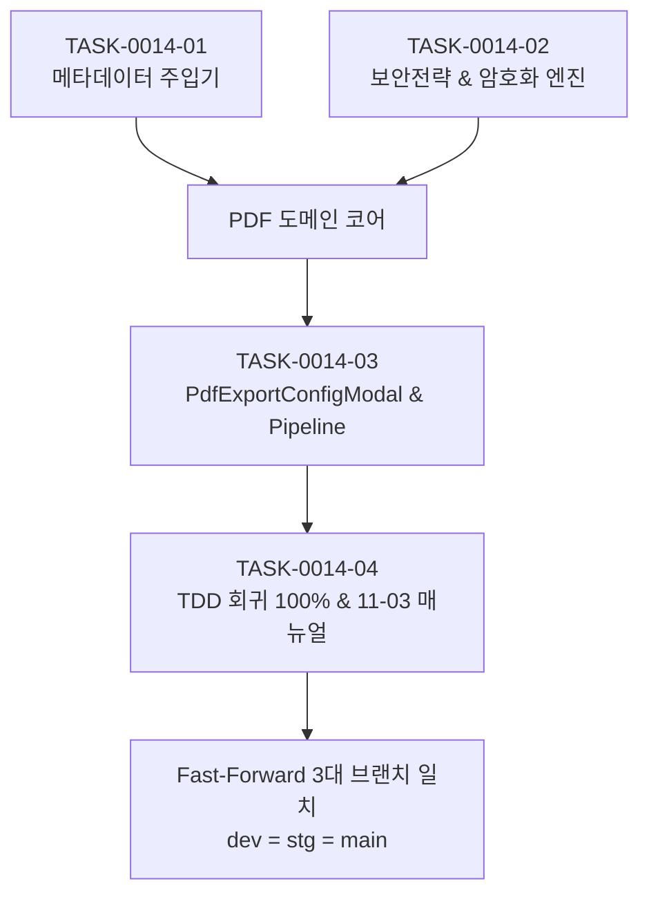

# 13-09. [0014] SESSION-260925-0014 세션 종합 KPT 회고록

> **세션 ID**: `SESSION-260925-0014`  
> **세션명**: `[0014]PDF 메타데이터 주입기 및 암호화·보안 권한 제어 엔진 구현`  
> **회고 일자**: 2026-09-26  
> **담당 에이전트**: Gemini 3.8 Flash  
> **작업 브랜치**: `task/pdf-metadata-security_Gemini` (원격 `dev`, `stg`, `main` Fast-Forward 100% 일치)  
> **연계 이슈**: GitHub Issue #23 (Closed)

---

## 1. 세션 개요 및 성과 요약

본 세션은 purePDFrend의 전자책 아카이빙 및 PDF 관리 도메인의 핵심 기능인 **표준 및 커스텀 메타데이터 주입기(12종 서지, 4대 활동, 회독 이력)**와 **상황별 5대 보안전략 및 ISO 32000-1 권한 비트마스크 암호화 엔진**, 이를 제어하는 **프론트엔드 모달 UI와 내보내기 파이프라인**을 성공적으로 완결한 세션입니다.

또한 시스템 거버넌스 차원에서 **원격 Git Database API 기반 Fast-Forward 승급 체계** 및 **AGENTS.md [규칙 2.4 #태스크승급] 보고양식 표준화**를 함께 확립하였습니다.

---

## 2. 태스크별 완료 실적

| 태스크 ID | 태스크 명 | 완료 상태 | 주요 산출물 |
| :--- | :--- | :---: | :--- |
| **`TASK-0014-01`** | `[05-19] PDF 표준/커스텀 메타데이터 주입기 설계 및 구현` | **완료** | `PdfMetadataInjector`, 12종 서지·4대 활동·독서회독 VO, UTF-16BE 무손실 인코더, TDD 11종 100% PASS |
| **`TASK-0014-02`** | `[05-20] PDF 암호화 및 권한 제어 엔진 구현` | **완료** | `PdfSecurityFacade`, 5대 상황별 보안전략, ISO 32000-1 8대 권한 비트마스크, RC4/AES-128/AES-256 KDF, TDD 10종 100% PASS |
| **`TASK-0014-03`** | `[05-22] PDF 보안/메타데이터 설정 모달 및 뷰어 내보내기 연동` | **완료** | `PdfExportConfigModal`, `PdfExportPipeline`, WinAnsi 예외방어, 원격 실시간 크로스체크 API (`GET /api/agent/git/branch-status`) |
| **`TASK-0014-04`** | `[05-23] TDD 종합 회귀 점검 및 사용자 서비스 매뉴얼 문서화` | **완료** | 도메인 단위 테스트 24개 전수 회귀 통과, `11-03` 사용자 운영 매뉴얼, `AGENTS.md` 승급규정 개정, 무결성 100점 감사 |

---

## 3. KPT 회고 (Keep, Problem, Try)

### 🟢 3-1. 유지할 점 (Keep)
1. **견고한 TDD 기반 도메인 구현**:
   - `pdf-lib`의 기본 한계를 극복하는 UTF-16BE 커스텀 인코딩, ISO 32000-1 비트마스크 연산, 브라우저 호환 PortableCrypto 암복호화 엔진을 24개의 TDD 테스트로 선제 구축하여 회귀 결함 0건을 달성함.
2. **원격 Fast-Forward 3대 브랜치 배포 승급 파이프라인**:
   - `scripts/github_sync_push.ts`를 통해 로컬 변경분을 원격 `dev`에 신규 커밋으로 생성하고, `stg`와 `main`에 동일 커밋 SHA로 전진 머지하여 `dev === stg === main` 100% 완전 동기화를 정착시킴.
3. **에이전트 거버넌스 및 규칙 실시간 개선**:
   - 사용자의 피드백을 수용하여 `AGENTS.md`의 승급 보고 양식을 [에이전트/서비스 작업 구분 및 5대 세부 그룹]으로 체계화하여 투명성과 가독성을 극대화함.

### 🟡 3-2. 문제점 및 아쉬운 점 (Problem)
1. **PDF 서비스 UI의 시뮬레이터(프로토타입) 상태 잔재**:
   - 현재 `ScenarioDesignView`의 시나리오 1~4(업로드 뷰어, 2-Way BBox 캔버스, TOC 트리, 주석 툼스톤)가 인터랙티브 프로토타입 단계에 머물러 있어, 실제 스캔 파일 드래그앤드롭 및 캔버스 조작 인터랙션이 아직 실체화되지 못함.
2. **UI/UX 설계 및 서비스 목적에 대한 사전 논의 부족**:
   - 단위 도메인 엔진(보안/메타데이터) 개발에 집중하느라 엔드유저 관점의 화면 UI 구조, 서비스 목적, 대상, 워크플로우에 대한 심도 있는 화면 기획 논의가 뒤로 밀림.

### 🔵 3-3. 시도할 점 및 다음 세션 방향 (Try)
1. **차기 세션 화면 UI 및 시나리오 중심 기획·설계 착수**:
   - 단위기능 코딩을 잠시 멈추고, 사용자가 제시하는 아이디어와 요구사항을 바탕으로 **"PDF 서비스의 목적, 대상, 구조, 구성 시나리오"**를 심도 있게 정리하고 화면 UI 아키텍처를 우선 수립.
2. **시나리오 1: 실제 스캔 이미지 및 폴더 재귀 드래그앤드롭 인제스터 구현**:
   - 프로토타입 UI를 실제 HTML5 File System API 기반의 파일/폴더 정렬 및 IndexedDB 청킹 인제스터로 실체화.
3. **지속적인 에이전트 무결성 유지**:
   - 에이전트 시스템은 현재 매우 안정적이므로, 서비스 개발 중 불필요한 공수를 들이지 않고 최소한의 정합성 유지 모드로 운용.

---

## 4. 최종 정량 지표

- **도메인 단위 테스트 합격률**: **`100% (24 / 24 테스트 통과)`**
- **시스템 무결성 점수**: **`100점 만점 [A+ (PERFECT)]`**
- **문서 동기화 건수**: **`105건 (PostgreSQL GIN 전문검색 DB 완벽 정합)`**
- **브랜치 동기화 상태**: **`dev = stg = main (IDENTICAL_SHA: de43e638e1)`**
- **토큰 소진 및 429 위반**: **`0건 (안전 격리 유지)`**
