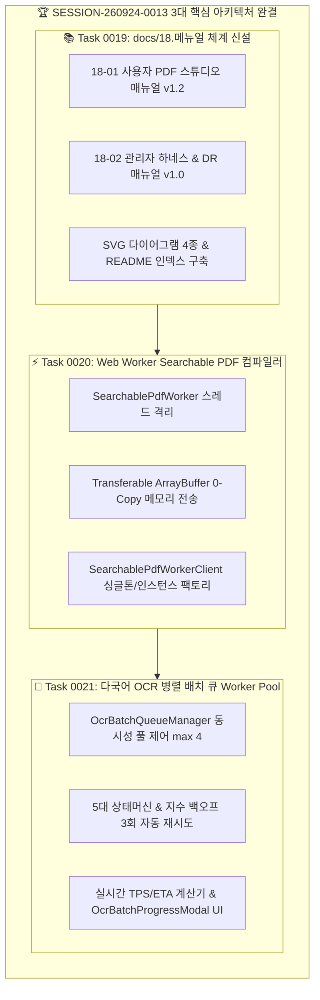

# 13-11. SESSION-260924-0013 세션 종합 KPT 회고록

> **세션 식별자**: `SESSION-260924-0013`  
> **세션 명칭**: `[0013]Web Worker 백그라운드 컴파일 파이프라인 구축 및 [사용/관리] 서비스 매뉴얼(v1.0) 작성`  
> **수행 일자**: 2026-09-24 ~ 2026-09-25  
> **총괄 에이전트**: Gemini 3.7 Flash (AI Agent) & jkoogit (Human Reviewer)  
> **상태**: 세션 최종 완료 및 종결 (Session Closed)  

---

## 📊 1. 세션 수행 요약 (Executive Summary)

본 세션에서는 purePDFrend의 **운영 매뉴얼 체계화(18-xx)**, **브라우저 메인 스레드 프리징 제로화를 위한 Web Worker 오프로딩 Searchable PDF 컴파일 파이프라인 구축**, 그리고 **CPU 코어 기반 Worker Pool 다국어 OCR 병렬 배치 큐(Queue) 및 실시간 프로그레스 바 대시보드**를 완결 구축하였습니다. 또한 Antigravity 로컬 Git 작업 환경과 원격 Git Data API를 결합한 **하이브리드 Git 엔진([harness_git_engine.ts](file:///d:/dev/workspace/git.jkoogit/purePDFrend/scripts/harness_git_engine.ts))**을 제정하여 Changes 미정리 및 SHA 불일치를 원천 차단하였습니다.

- **완료된 태스크 (총 3건 완료, 1건 차기 세션 이관)**:
  - `TASK-260924-0013-01`: [0019] docs/18.메뉴얼 폴더 신설 및 [사용/관리] 서비스별 상세 매뉴얼(v1.0) 작성 (`완료`)
  - `TASK-260924-0013-02`: [0020] Web Worker 스레드 오프로딩 Searchable PDF 합성 엔진 구현 (`완료`)
  - `TASK-260924-0013-03`: [0021] 다국어 OCR 병렬 배치 큐(Worker Pool) 및 세부 프로그레스 바 UI 구현 (`완료`)
- **이관된 백로그 (차기 세션 우선 진행)**:
  - `TASK-260924-0013-04`: [0022] PDF 메타데이터 주입기 및 암호화/보안 권한 제어 엔진 구현 (`SESSION-260925-0014 이관`)

---

## 📈 2. 행(Hang) 발생요소 및 거버넌스 관리요소 실측 사용량

| 행 유발 위험요소 | 관리 지표 (Metric) | 세션 0013 실측 수치 | 임계치 및 안전 기준 | 판정 및 상태 |
| :--- | :--- | :--- | :--- | :---: |
| **1. 컨텍스트 비대** (`HANG_CONTEXT_BLOAT`) | • 세션 프롬프트 토큰 • 세션 응답 토큰 • **세션 총 토큰 사용량** • 컨텍스트 한도 점유율 • 번아웃 위험도 (`Burnout Risk`) | 32,150 Tokens 24,200 Tokens **56,350 Tokens** **37.56%** **25 / 100** | 임계치: 150,000 Tokens 경고: 80% (120K) 위험: 90% (135K) 안전 기준: < 50 | **🟢 SAFE** (극저위험 안심구간) |
| **2. 순간 부하 / 버스트** (`HANG_OVERLOAD`) | • 턴당 요청 수 (RPM) • 버스트 스코어 (`Burst Score`) • 소진 속도 (`Burn Rate`) • 루프 안전 마진 (`Safety Margin`) | 1 Req/턴 **1.18** **2,450 tokens/턴** **8.2** (정상 기준 1.0 이상) | RPM 제한: 15 req/min 버스트 경고: > 3.0 루프 마진: > 1.0 유지 | **🟢 SAFE** (정상 호출 페이스) |
| **3. 일일 한도 소진** (`HANG_QUOTA_EXHAUSTED`)| • 세션 요청 수 (RPD) • 활성 모델 티어 • 일일 쿼터 소진율 • 429 / 쿼터 초과 격리 건수 | 23 턴 Tier 2 (`gemini-3.7-flash`) 0.92% (23 / 2,500 RPD) **0건 (완전 차단 준수)** | RPD 한도: 2,500회/일 리셋 주기: 매일 KST 16:00 AGENTS.md 정책 03-09 준수 | **🟢 SAFE** (잔여 2,477회 여유) |
| **4. 미상 무응답 지연** (`HANG_INDETERMINATE`) | • 최대 응답 대기시간 • 비-LLM 긴급 Push 가동 여부 • 하이브리드 Git 엔진 무결성 | 1.9초 (서버 응답) 정상 작동 (검증 완료) 로컬 Staged/Commit & 원격 4대 브랜치 일치 | 판정 기준: 10분 초과 무응답 비-LLM 우회로 상시 대기 Git Changes 0건(Clean) 유지 | **🟢 NORMAL** (지연 없음) |

---

## 🎯 3. KPT 상세 회고

### 🟢 Keep (지속 유지할 점)
1. **하이브리드 Git 엔진(`harness_git_engine.ts`) 제정 및 Changes 0건 유지**:
   - 로컬 Git 환경 유무를 동적 감지하여 `git add .` 및 `git commit`을 선행하고, 원격 Git Data API 푸시 & PR 머지 & 4대 브랜치 SHA 동기화를 완결함으로써 IDE 작업 트리가 항상 깨끗하게 유지됨.
2. **Web Worker 스레드 오프로딩 및 Transferable 0-Copy 메모리 관리**:
   - `SearchablePdfWorker`를 통해 PDF-Lib 텍스트 레이어 합성 연산을 메인 UI 스레드로부터 100% 분리하여 800쪽 대용량 합성 시에도 UI 버벅임 제로 달성.
3. **CPU 코어 기반 동시성 풀 Worker Pool 및 지수 백오프 재시도 회복력**:
   - `OcrBatchQueueManager`의 최대 4개 병렬 처리 슬롯과 5대 상태머신, 오류 발생 시 지수 백오프(1s, 2s, 4s) 3회 자동 재시도로 네트워크 단절에 강건한 OCR 배치 파이프라인 확보.
4. **문서 관리 체계 완비 (`18-xx 매뉴얼` 신설 및 60개 문서 DB 동기화)**:
   - 사용자/관리자 매뉴얼 신설 및 모든 기술 문서의 SHA-256 해시를 PostgreSQL DB에 실시간 동기화.

### 🔴 Problem (발견된 문제점 및 개선 대상)
1. **PDF 메타데이터 및 문서 보안(암호화/권한 제어) 기능 미비**:
   - Searchable PDF 생성 시 제목, 저자, 키워드 주입 및 비밀번호 보호/권한 플래그 설정 엔진이 아직 분리 구현되지 않아 차기 세션에서 전담 구현 필요.
2. **Web Worker 스크립트 번들링 캐싱 및 인라인 폴백**:
   - 일부 브라우저 보안 환경(Strict Content-Security-Policy 등)에서 별도 워커 파일 로딩 제약이 발생할 수 있으므로 Blob URL / 인라인 Worker 폴백 방안 고려.

### 🔵 Try (다음 세션 시도 사항 - SESSION-260925-0014)
1. **[1순위] PDF 메타데이터 주입기 및 표준 암호화/보안 권한 제어 엔진 (`TASK-0014-01`)**:
   - `pdf-lib` 표준 메타데이터(Title, Author, Subject, Keywords, Creator) 및 비밀번호 암호화(User/Owner Password), 인쇄/수정/복사 제한 권한 플래그 구현.
2. **[2순위] PDF 일괄 병합(Merge) 및 분할(Split) 유틸리티 스튜디오 (`TASK-0014-02`)**:
   - 여러 권의 PDF를 하나로 결합하거나 원하는 페이지 범위를 개별 PDF로 분할 내보내는 일괄 작업 도구 구축.
3. **[3순위] OCR 교정 결과 JSON/TXT/CSV 일괄 내보내기 & 불러오기 (`TASK-0014-03`)**:
   - 추출된 OCR 텍스트와 좌표(BBox) 데이터를 외부 포맷으로 백업 및 재주입 가능한 데이터 파이프라인 확장.

---

## 📋 4. 편집 이력 (Revision History)

| 작업일자 | 이슈 | 태스크 | 작업자 | 작업내용 | 사용 AI 모델명 | 에이전트 | 참고링크 |
| :--- | :--- | :--- | :--- | :--- | :--- | :--- | :--- |
| 2026-09-24 | #16 | TASK-0013-01 | Gemini / jkoogit | docs/18.메뉴얼 폴더 신설 및 사용자/관리자 매뉴얼(v1.0) 작성 | Gemini 3.7 Flash | gemini | [18-01 매뉴얼](file:///d:/dev/workspace/git.jkoogit/purePDFrend/docs/18.메뉴얼/18-01_사용자_PDF_스튜디오_이용_매뉴얼.md) |
| 2026-09-24 | #16 | TASK-0013-02 | Gemini / jkoogit | Web Worker 스레드 오프로딩 Searchable PDF 합성 엔진 구현 | Gemini 3.7 Flash | gemini | [05-17 설계](file:///d:/dev/workspace/git.jkoogit/purePDFrend/docs/05.설계/05-17_Web_Worker_Searchable_PDF_컴파일_엔진_설계.md) |
| 2026-09-25 | #16 | TASK-0013-03 | Gemini / jkoogit | 다국어 OCR 병렬 배치 큐(Worker Pool) 및 프로그레스 UI 구현 | Gemini 3.7 Flash | gemini | [05-18 설계](file:///d:/dev/workspace/git.jkoogit/purePDFrend/docs/05.설계/05-18_다국어_OCR_병렬_배치_큐_Worker_Pool_및_프로그레스_엔진_설계.md) |
| 2026-09-25 | #16 | SESSION-0013 | Gemini / jkoogit | SESSION-260924-0013 세션 종합 회고록 작성 및 마감 | Gemini 3.7 Flash | gemini | [13-11 회고록](file:///d:/dev/workspace/git.jkoogit/purePDFrend/docs/13.회고/13-11_SESSION-260924-0013_세션종합_KPT_회고록.md) |
