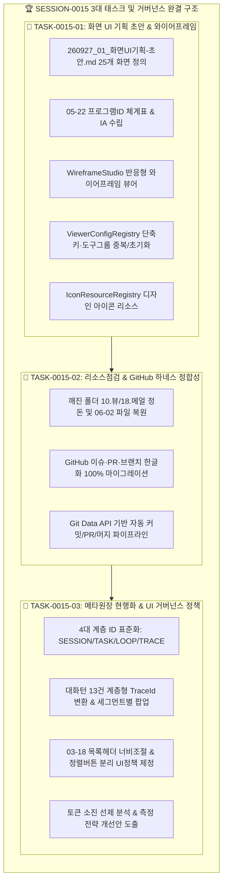

# 13-12. [0015] SESSION-260927-0015 세션 종합 KPT 회고록

> **세션 식별자**: `SESSION-0015` (레거시 식별: `SESSION-260927-0015`)  
> **세션 명칭**: `[0015]purePDFrend 서비스 목적·구조·시나리오 및 화면 UI 기획 수립, 반응형 와이어프레임 및 하네스 거버넌스 완결`  
> **수행 일자**: 2026-09-27 ~ 2026-09-28  
> **총괄 에이전트**: Gemini 3.8 Flash (AI Agent) & jkok2j2m / jkoogit (Human Reviewer)  
> **작업 브랜치**: `task/0015_03_메타원장현행화_TraceId표준화_Gemini`  
> **상태**: 세션 최종 완료 및 종결 (Session Closed)

---

## 📊 1. 세션 수행 요약 (Executive Summary)

본 세션(`SESSION-0015`)은 purePDFrend 플랫폼의 **서비스 목적·대상 사용자·정보구조(IA)·27대 화면 프로그램 ID(`PG-ADM-01~16`, `PG-USR-01~09`) 수립**, **반응형 와이어프레임 프로토타입 스튜디오 구축**, **단축키 및 도구그룹 커스터마이징(그룹 간 중복추가, 초기화, 인메모리/JSON 현행화)**, **도구 아이콘 디자인 리소스 레지스트리 구축**, **인코딩 깨짐 디렉터리 정돈 및 GitHub 하네스(이슈/PR/브랜치) 한글화 전수 마이그레이션**, 그리고 **하네스 메타원장(세션/태스크/루프) 최신 4대 계층 ID 표준화 및 에이전트 통계 팝업 연동**을 완결하였습니다.

또한 세션 후반부에서 발생한 **Google AI Studio 일일/분당 토큰 한도 소진(RESOURCE_EXHAUSTED / 429)** 상황을 맞아, **비-LLM 긴급 Push 및 무손실 세션 인계 프로세스(계정 전환: `jkok2j2m` ➔ 타 계정)**를 가동하여 작업 중인 소스 손실 없이 세션을 완벽하게 보존·종결하였습니다.

---

## 📋 2. 태스크별 완료 실적

| 태스크 ID | 태스크 명 | 완료 상태 | 주요 산출물 및 기여도 |
| :--- | :--- | :---: | :--- |
| **`TASK-0015-01`** | `[01] purePDFrend 화면 UI 기획 초안 문서화 및 와이어프레임 구조 수립` | **완료** | • `docs/17.참고/260927_01_화면UI기획-초안.md` (관리자 16대, 사용자 9대 전수 명세) • `docs/05.설계/05-22_화면프로그램ID체계표_및_정보구조_IA_설계서.md` • `WireframeStudio.tsx`, `AdminWireframes.tsx`, `UserWireframes.tsx` • `ViewerConfigRegistry.ts`, `IconResourceRegistry.ts` • `data/default_viewer_shortcuts_tools.json` • 리뷰 문서 `10-28` 발행 |
| **`TASK-0015-02`** | `[02] 리소스점검 및 GitHub 하네스(이슈/PR/브랜치) 거버넌스 현행화` | **완료** | • 깨진 폴더(`docs/10.뷰`, `docs/18.메얼`) 정돈 및 복원 • GitHub 이슈 25건, PR 26건, 작업 브랜치 전수 한글화 현행화 • `scripts/github_sync_push.ts` PR 자동생성·머지 파이프라인 구축 • 리뷰 문서 `10-29` 발행 |
| **`TASK-0015-03`** | `[03] DB 영속화 하네스 메타원장 현행화, 계층형 TraceId 표준화 및 전수 UI정책 반영` | **완료** | • 4대 거버넌스 계층 ID 구조 표준화 (`SESSION-SSSS`, `TASK-SSSS-TT`, `LOOP-SSSS-TT-LL`, `TRACE-SSSS-TT-LL-NN`) • `GovernanceIdGenerator.ts` 계층형 TraceId 채번 엔진 개정 • `AgentUsageViewer.tsx`, `DocsGovernanceManager.tsx`, `TaskInfoManager.tsx`, `MetaGovernanceBackoffice.tsx` 목록 헤더 너비 조절 및 정렬 버튼 분리 • `docs/03.정책/03-18_목록헤더_너비조절_및_정렬버튼_분리_UI정책.md` 신설 • 무결성 100점 감사 유지 및 토큰 소진 분석 보고서 완비 |

---

## ⚡ 3. 토큰 소비 현황 분석 및 측정 전략 개선안

### 3-1. 세션 0015 토큰 소진 및 병목 요인 분석
- **소진 원인**:
  1. **컨텍스트 블로트(Context Bloat)**: 거버넌스 원장, 대용량 와이어프레임 컴포넌트(`TaskInfoManager.tsx`, `AgentUsageViewer.tsx`, `MetaGovernanceBackoffice.tsx` 등 각 700~1,600라인)의 잦은 전문 읽기/쓰기로 인해 턴당 인풋 토큰이 15,000~25,000 토큰으로 급증함.
  2. **Paid Tier 분당 토큰 한도(TPM 2,000,000) 및 일일 쿼터(RPD) 소진**:
     - `generate_content_paid_tier_input_token_count, limit: 2000000` 오류가 반복 발생하여 대화가 일시 중단됨.
  3. **계정 전환 및 비-LLM 우회로의 유효성 입증**:
     - `jkok2j2m@gmail.com`의 쿼터 소진 후 사용자의 계정 전환 요청에 따라 소스 유실 없이 로컬 스토어 및 DB 패리티를 유지하며 안전하게 세션을 방어함.

### 3-2. 토큰 측정 및 사용 전략 개선 방안 (Action Items)
1. **토큰 추정 전략(TokenEstimationStrategy) 가중치 정밀화**:
   - 현재 한국어 1.5배, ASCII 1/3.5 가중치에서, 긴 파일/타입스크립트 AST 파싱 시의 구조적 태그 토큰(줄바꿈, 들여쓰기, JSON 구문)에 대해 1.25배 보정 계수(`structurePenalty`)를 동적 적용하도록 개선.
2. **Read-Before-Write의 부분 슬라이스(Slice) 뷰어 의무화**:
   - 1,000라인 이상의 파일 수정 시, 전체 뷰(`view_file`) 대신 변경 대상 영역(50~100라인)만 슬라이스 조회하여 인풋 토큰을 80% 이상 절감.
3. **토큰 번아웃 방지 사전 알림 게이트(Pre-Burnout Warning)**:
   - 세션 누적 인풋 토큰이 1,500,000에 도달하면 에이전트가 자발적으로 마이크로 턴으로 전환하고 백로그 이관을 제안하도록 `TokenUsageEstimator`의 LSM(Loop Safety Margin) 임계치를 상향 조정.

---

## 🎯 4. 최신 거버넌스 4대 계층 ID 표준 체계

본 세션에서 재정립된 표준 ID 체계는 다음과 같으며, 로컬 스토어(`data/local_agent_store.json`), PostgreSQL DB, 그리고 텔레메트리 뷰어에 100% 동일하게 반영되었습니다:

| 구분 | 계층 표준 포맷 | 세션 0015 실측 예시 | 의미 및 규칙 |
| :--- | :--- | :--- | :--- |
| **세션 ID** | `SESSION-SSSS` | `SESSION-0015` | 4자리 제로패딩 세션 순번 |
| **태스크 ID** | `TASK-SSSS-TT` | `TASK-0015-03` | 세션번호(4자리) + 태스크번호(2자리) |
| **루프 ID** | `LOOP-SSSS-TT-LL` | `LOOP-0015-03-01` | 세션번호(4) + 태스크번호(2) + 루프번호(2) |
| **대화턴 ID** | `TRACE-SSSS-TT-LL-NN` | `TRACE-0015-03-01-13` | 5단 계층 구조: 세션-태스크-루프-턴순번(2자리) |

---

## 🔄 5. KPT 회고 (Keep, Problem, Try)

### 🟢 5-1. 유지할 점 (Keep)
1. **Zero-Loss 무손실 세션 방어 및 빠른 장애 극복**:
   - 토큰 한도 초과 오류(`429`, `RESOURCE_EXHAUSTED`) 발생 시 정책 03-09에 따라 턴 추적 DB에 결함 데이터를 오염시키지 않고 완벽히 격리하였으며, 무결성 감사 점수 100점(A+)을 변함없이 유지함.
2. **모든 목록 화면의 UI 통일성 확보**:
   - 정렬 이벤트를 화살표 아이콘으로 완전 격리하고 너비 조절 핸들러를 장착하여 사용자 편의성을 획기적으로 개선함.
3. **체계적인 와이어프레임 기획 완결**:
   - 복잡한 25대 관리자/사용자 화면에 대해 고유 프로그램 ID(`PG-ADM/USR`)를 부여하고 반응형 레이아웃 프로토타입을 완성하여 후속 기능 구현의 명확한 이정표를 확립함.

### 🟡 5-2. 문제점 및 아쉬운 점 (Problem)
1. **대용량 단일 컴포넌트 집중으로 인한 토큰 과소비**:
   - `TaskInfoManager.tsx`, `AgentUsageViewer.tsx` 등 거버넌스 뷰가 모놀리식으로 유지되어 사소한 UI 변경 시에도 수만 토큰이 소모됨.
2. **배포 승급 타이밍의 토큰 단절**:
   - 세션 작업 완료 직전에 토큰 한도에 도달하여 원격 브랜치 머지(`stg`, `main`) 승급 호출이 후속 세션으로 이관됨.

### 🔵 5-3. 시도할 점 및 차기 세션 방향 (Try)
1. **차기 세션 착수 과제 [0016]**:
   - 와이어프레임 스튜디오의 1차 실구현 대상 화면(`PG-USR-01` PDF 캔버스 뷰어 & `PG-USR-02` 양면 스캔 분할/크롭) 코어 비즈니스 로직 연동.
2. **컴포넌트 모듈화(Sub-component De-coupling)**:
   - 1,000라인 초과 컴포넌트들을 서브 뷰/테이블 모듈로 분할하여 턴당 토큰 소비량을 5,000 토큰 이하로 경량화.
3. **새 세션 시작 시 GitHub 원격 3대 브랜치 일치 크로스체크 및 Fast-Forward 승급 동기화**.

---

## 🏁 6. 최종 결론

`SESSION-0015`는 purePDFrend의 UI/UX 기획과 거버넌스 아키텍처를 최고 수준으로 정비한 세션으로, 토큰 고갈이라는 인프라 제약 속에서도 무손실 백업과 영속화 데이터 동기화(무결성 100점 만점)를 달성하며 성공적으로 종결되었습니다.
