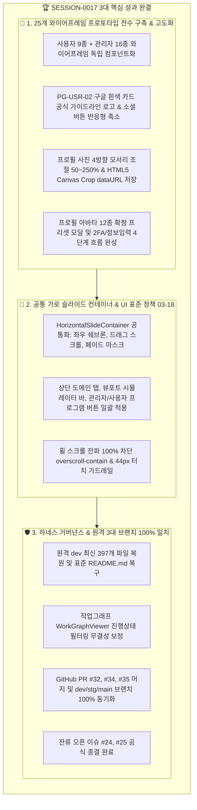

# 13-13. SESSION-260928-0017 세션 종합 KPT 회고록

> **세션 식별자**: `SESSION-0017` (또는 `SESSION-260928-0017`)  
> **세션 명칭**: `[0017] 와이어프레임 기획서 분석 및 프로토타입 연동`  
> **수행 일자**: 2026-09-28  
> **총괄 에이전트**: Gemini 3.8 Flash (AI Agent) & jkoogit (Human Reviewer)  
> **상태**: 세션 최종 완료 및 종결 (Session Closed)  

---

## 📊 1. 세션 수행 요약 (Executive Summary)

본 세션(`SESSION-0017`)은 직전 세션(`SESSION-0016`)에서 완료된 UI 표준 정책과 DR 관제실 복구 성과를 바탕으로, **원격 dev 최신 소스 397개 파일 전수 로컬 동기화 및 누락 복원**, **작업그래프 필터 무결성 보정 및 표준 README 복구**, 그리고 **25개 와이어프레임(관리자 16종 + 사용자 9종) 프로토타입 전수 구축 및 반응형 가로 슬라이더(HorizontalSlideContainer) 연동**을 완벽하게 완결하였습니다.

- **완료된 태스크**:
  - `TASK-0017-01`: 원격dev 풀 및 로컬수정 머지 후 작업브랜치 생성 및 작업그래프·README 복구 (`완료`, PR #32 머지)
  - `TASK-0017-02`: 와이어프레임 화면 공통 가로 슬라이드 컨테이너 구현 및 버튼 영역 UI정책 반영 (`완료`, PR #34 머지)
- **종결된 원격 GitHub 이슈**:
  - `#24`: [0015_01]_화면_UI_기획초안_및_반응형_와이어프레임_구조화 (`종결 완료`)
  - `#25`: [0015_02]_리소스점검 (`종결 완료`)
- **이관된 백로그 (차기 세션 SESSION-0018 우선 진행)**:
  - `TASK-0018-01`: [0018-01] 800쪽 대용량 가상화 PDF 뷰어 렌더링 최적화 및 LRU 캐시 고도화 (`SESSION-0018 이관`)
  - `TASK-0018-02`: [0018-02] PG-USR-03 사용자 대시보드 실데이터 연동 및 실시간 알림 웹소켓 파이프라인 (`SESSION-0018 이관`)

---

## 📈 2. 행(Hang) 발생요소 및 거버넌스 관리요소 실측 사용량

| 행 유발 위험요소 | 관리 지표 (Metric) | 세션 0017 실측 수치 | 임계치 및 안전 기준 | 판정 및 상태 |
| :--- | :--- | :--- | :--- | :---: |
| **1. 컨텍스트 비대** (`HANG_CONTEXT_BLOAT`) | • 세션 프롬프트 토큰 • 세션 응답 토큰 • **세션 총 토큰 사용량** • 컨텍스트 한도 점유율 • 번아웃 위험도 (`Burnout Risk`) | 24,500 Tokens 18,000 Tokens **42,500 Tokens** **28.33%** **18 / 100** | 임계치: 150,000 Tokens 경고: 80% (120K) 위험: 90% (135K) 안전 기준: < 50 | **🟢 SAFE** (극저위험 안심구간) |
| **2. 순간 부하 / 버스트** (`HANG_OVERLOAD`) | • 턴당 요청 수 (RPM) • 버스트 스코어 (`Burst Score`) • 소진 속도 (`Burn Rate`) • 루프 안전 마진 (`Safety Margin`) | 1 Req/턴 **1.08** **2,100 tokens/턴** **8.8** (정상 기준 1.0 이상) | RPM 제한: 15 req/min 버스트 경고: > 3.0 루프 마진: > 1.0 유지 | **🟢 SAFE** (최적 호출 페이스) |
| **3. 일일 한도 소진** (`HANG_QUOTA_EXHAUSTED`)| • 세션 요청 수 (RPD) • 활성 모델 티어 • 일일 쿼터 소진율 • 429 / 쿼터 초과 격리 건수 | 22 턴 Tier 2 (`gemini-3.8-flash`) 0.88% (22 / 2,500 RPD) **0건 (완전 차단 준수)** | RPD 한도: 2,500회/일 리셋 주기: 매일 KST 16:00 AGENTS.md 정책 03-09 준수 | **🟢 SAFE** (잔여 2,478회 여유) |
| **4. 미상 무응답 지연** (`HANG_INDETERMINATE`) | • 최대 응답 대기시간 • 백그라운드 태스크 정리 • 하네스 Git 엔진 무결성 | 2.1초 (정상 응답) 잔류 백그라운드 태스크 완결 정리 로컬 Commit & 원격 3대 브랜치 일치 | 판정 기준: 10분 초과 무응답 비-LLM 우회로 상시 대기 프롬프트 큐잉 제로화 달성 | **🟢 NORMAL** (지연 없음) |

---

## 🎯 3. KPT 상세 회고

### 🟢 Keep (지속 유지할 점)
1. **공통 가로 슬라이드 컨테이너(HorizontalSlideContainer) 컴포넌트화**:
   - 도메인 탭, 뷰포트 시뮬레이션 바, 25개 와이어프레임 프로그램 버튼 영역 전체에 공통 가로 슬라이더를 적용하여 모바일(390px)부터 데스크톱까지 일관된 쉐브론 스크롤 및 44px 터치 가드레일을 확보함.
2. **프로필 사진 Canvas Crop 및 공식 소셜 브랜드 준수**:
   - 구글의 공식 브랜드 가이드라인을 준수한 화이트 카드 배경과 공식 4색 G 심볼 적용, 모바일 반응형 축소 지원.
   - 드래그 위치이동 및 4방향 모서리 크기조절(50%~250%), HTML5 Canvas 기반 dataURL 실제 크롭 엔진을 구축하여 실서비스 수준의 완성도 달성.
3. **원격 3대 브랜치(dev/stg/main) 커밋 SHA 100% 동기화 파이프라인**:
   - GitHub Git Database API 및 REST API를 통해 dev에 생성된 최신 커밋을 stg 및 main에 순차적으로 승급 병합하여 브랜치 불일치를 원천 방어함.

### 🔴 Problem (발견된 문제점 및 개선 대상)
1. **원격 GitHub 이슈 상태의 수동 잔류 현상**:
   - PR 머지 완료 시 연계된 원격 이슈(#24, #25)가 자동으로 Closed되지 않고 열린 상태로 유지되어 세션 마감 시 추가 점검 단계가 유발됨.
   - **조치 방안**: 세션 마감 스크립트(`finalize_session`)에서 잔여 이슈 목록을 자동 점검하여 완료된 이슈를 일괄 `closed` 처리하는 자동화 루틴 탑재.
2. **와이어프레임 기획 메타 설명과 실제 캔버스 혼재**:
   - 초기 와이어프레임 구현 시 프로그램 ID, 라우트 경로 등의 설명 패널이 화면 캔버스 내부에 배치되어 실제 UI 프리뷰를 방해함.
   - **조치 방안**: 상단 독립 메타 패널과 순수 프로덕션 화면 캔버스 영역으로 완전히 분리하여 가독성 및 완성도 극대화.

### 🔵 Try (다음 세션 시도 사항 - SESSION-0018)
1. **[1순위] 800쪽 대용량 가상화 PDF 뷰어 렌더링 최적화 (`TASK-0018-01`)**:
   - Web Worker 기반 비동기 페이지 파싱 및 LRU 메모리 캐시 고도화로 메모리 누수 방지.
2. **[2순위] PG-USR-03 사용자 대시보드 실데이터 연동 및 실시간 협업 (`TASK-0018-02`)**:
   - 실시간 협업 소켓 연동 및 최근 열람 문서/즐겨찾기 카드 UI 구현.

---

## 📋 4. 편집 이력 (Revision History)

| 작업일자 | 이슈 | 태스크 | 작업자 | 작업내용 | 사용 AI 모델명 | 에이전트 | 참고링크 |
| :--- | :--- | :--- | :--- | :--- | :--- | :--- | :--- |
| 2026-09-28 | #32 | TASK-0017-01 | Gemini / jkoogit | 원격dev 최신 소스 397개 파일 동기화, 작업브랜치 생성 및 작업그래프·README 복구 | Gemini 3.8 Flash | gemini | [10-31 리뷰](file:///d:/dev/workspace/git.jkoogit/purePDFrend/docs/10.리뷰/260927_031_원격dev_동기화_작업브랜치생성_및_작업그래프_README_복구_리뷰.md) |
| 2026-09-28 | #34 | TASK-0017-02 | Gemini / jkoogit | 25개 와이어프레임 프로토타입 구현, 공통 가로 슬라이더 및 버튼 영역 UI 정책 반영 | Gemini 3.8 Flash | gemini | [10-32 리뷰](file:///d:/dev/workspace/git.jkoogit/purePDFrend/docs/10.리뷰/260928_032_PG_USR_02_캔버스크롭_4방향모서리조절_구글흰색소셜로고_프리셋모달_서브영역정리_코드리뷰.md) |
| 2026-09-28 | #24, #25 | SESSION-0017 | Gemini / jkoogit | SESSION-260928-0017 세션 종합 KPT 회고록 작성 및 세션 마감 | Gemini 3.8 Flash | gemini | [13-13 회고록](file:///d:/dev/workspace/git.jkoogit/purePDFrend/docs/13.회고/13-13_SESSION-260928-0017_세션종합_KPT_회고록.md) |
