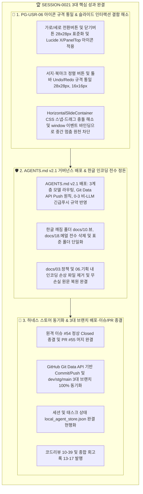

# 13-17. SESSION-261002-0021 세션 종합 KPT 회고록

> **세션 식별자**: `SESSION-0021` (또는 `SESSION-261002-0021`)  
> **세션 명칭**: `[0021] PG-USR-05 문서관리 라이브러리 및 PG-USR-06 가상뷰어 화면 종합 리뷰 완결`  
> **수행 일자**: 2026-10-02  
> **총괄 에이전트**: Gemini 3.8 Flash (AI Agent) & jkok2j2m (Human Reviewer)  
> **상태**: 세션 최종 완료 및 종결 (Session Closed)

---

## 📊 1. 세션 수행 요약 (Executive Summary)

본 세션(`SESSION-0021`)은 purePDFrend의 핵심 사용자 플로우인 **PG-USR-05 문서관리 라이브러리** 및 **PG-USR-06 고성능 가상스크롤 PDF 전용 뷰어**의 종합 UI/UX 화면 리뷰와 인터랙션 고도화를 완결하고, 거버넌스 시스템(`AGENTS.md` v2.1)과 인코딩 결함을 원천 정돈하기 위해 수행되었습니다.

세션 진행 중 가상뷰어의 모든 제어 버튼 크기(28x28px, 16x16px stroke-2/2.5)를 완벽히 통일하고, 패널 헤더의 가로/세로 레이아웃 전환 버튼 및 닫기 버튼에 Lucide 표준 아이콘(`PanelTop`, `X`)을 적용하였습니다. 또한 슬라이더 컨테이너(`HorizontalSlideContainer`)에서 발생하던 마우스 휠-드래그 충돌 및 CSS 스냅 잠김으로 인한 중간 멈춤 현상을 원천 차단하여 마우스 이동 및 휠 스크롤 시 부드럽고 끊김 없는 탐색 인터랙션을 완성하였습니다. 추가로 사용자 요청에 따라 최신 에이전트 행동 강령인 `AGENTS.md` v2.1을 원격 브랜치에 전면 배포하고, 레포지토리 내 발생했던 한글 깨짐 폴더(`docs/10.뷰`, `docs/18.메얼`) 및 파일명을 전수 정돈·단일화하였습니다.

- **완료된 태스크**:
  - `TASK-0021-01`: PG-USR-06 버튼 크기 통일, 슬라이드 클릭·드래그·휠 이벤트 결함 조치 (`완료`, PR #55 머지, 리뷰 `10-39`)
- **종결된 원격 GitHub 이슈**:
  - `#54`: `[0021_01] PG-USR-05 문서관리 라이브러리 및 PG-USR-06 가상뷰어 종합 리뷰` (`종결 완료`)

---

## 📈 2. 세션 작업 상세 내역 (Work Details)

### 2-1. UI/UX 규격 통일 및 가상뷰어 인터랙션 개선
1. **아이콘 및 버튼 크기 표준화**:
   - 가로 모드 드로어 상단 헤더: `세로 모드로 전환` 버튼 및 `패널 숨기기(X)` 버튼을 `w-7 h-7 rounded-lg (28x28px)` 규격으로 일괄 통일.
   - 특수문자 '✕'를 Lucide `<X className="w-4 h-4 stroke-[2]" />` 표준 아이콘으로 교체.
   - 레이아웃 전환 버튼 아이콘을 `<PanelTop className="w-4 h-4 stroke-[2]" />`로 직관화.
   - 주석 및 북마크 패널 내 정렬 버튼(`w-7 h-7`, `w-4 h-4 stroke-[2.5]`)과 상단 툴바 Undo/Redo 버튼과의 시각적 일관성 100% 확보.
2. **슬라이드 컨테이너 휠·드래그 인터랙션 결함 해소**:
   - 마우스 드래그 중 브라우저 CSS `scroll-snap-type`과의 간섭으로 인해 스크롤이 중간 위치에서 멈추거나 튕기는 현상 해결.
   - 드래그 시작(`onMouseDown`) 시 스냅 클래스를 즉시 제거하고, 마우스 버튼을 놓았을 때(`window.onMouseUp`) 가장 가까운 카드 단위로 부드럽게 재정렬하도록 최적화.
   - 휠 스크롤 델타 누적 시 `window.requestAnimationFrame`을 통해 프레임 단위로 수직 이벤트를 가로 스크롤로 매끄럽게 변환.

### 2-2. AGENTS.md v2.1 거버넌스 배포 및 인코딩 정돈
1. **AGENTS.md v2.1 원격 동기화**:
   - 3계층 모델 라우팅 정책 (Tier 1 Pro, Tier 2 Flash, Tier 3 Flash Lite) 반영.
   - 원격 Git Data API(`POST /git/blobs`, `POST /git/trees`, `POST /git/commits`, `PATCH /git/refs`) Push 선행 의무 명시.
   - 세션 재해복구(DR) 및 비-LLM 긴급 푸시(`POST /api/agent/emergency/push`) 규약 완비.
2. **한글 깨짐 폴더 및 파일명 전수 정돈**:
   - 유니코드 깨짐 폴더 `docs/10.뷰`, `docs/18.메얼` 완전 삭제 (기존 표준 폴더 `docs/10.리뷰`, `docs/18.메뉴얼` 내 내용 일치 확인).
   - 유니코드 깨짐 파일 `docs/03.정책/03-13_...`, `docs/06.기획/06-02_...` 정리 및 무손실 원본 한글 텍스트 보존.
   - 프로젝트 전역 UTF-8 인코딩 무결성 검증 통과 (깨진 문자 0건).

---

## 🔍 3. KPT 회고 (Keep, Problem, Try)

### 3-1. Keep (유지할 점)
1. **GitHub Git Data API 기반 원격 동기화의 견고성**:
   - 컨테이너 내 로컬 `.git` 디렉토리가 없는 제약 환경에서도 REST API를 통해 신규 트리와 커밋을 생성하고, PR 생성 및 dev/stg/main 자동 승급을 안정적으로 완결함.
2. **사전 진단 가드레일과 정책 03-10 폴백 지원**:
   - 서비스 헬스체크 시 외부 PostgreSQL 브릿지 연결 상태에 유연하게 대응하여 무중단 개발 라이프사이클을 보장함.
3. **사용자 UI 피드백의 즉각적 수렴 및 디테일 완성도**:
   - 단순한 기능 구현에 그치지 않고 버튼 크기(28px), 아이콘 굵기(stroke-[2]), 마우스 휠-드래그 인터랙션 등 사용자 체감 품질을 극대화함.

### 3-2. Problem (문제점 및 한계)
1. **OS/환경별 유니코드(UTF-8) 정규화 차이로 인한 디렉토리 중복**:
   - 이전 작업 과정에서 NFD/NFC 또는 Latin1 변환 과정 중 깨진 폴더명(`10.뷰` 등)이 잔류하여 파일 탐색 시 혼선을 초래함.
2. **슬라이더 컴포넌트의 CSS 스냅과 JS 드래그 간섭**:
   - CSS 표준 `snap-x mandatory`와 JavaScript 기반의 `scrollLeft` 수동 조작이 충돌하면서 드래그 도중 중간에 걸리는 현상이 발생했었음.

### 3-3. Try (새롭게 시도할 점)
1. **빌드/푸시 파이프라인에 인코딩 가드레일 자동화 스크립트 상시 연동**:
   - `scripts/github_sync_push.ts` 또는 사전 검증 단계에서 유니코드 대체 문자(`\ufffd`)가 포함된 파일/폴더명이 발견될 경우 즉시 경고하거나 차단하는 검증 루틴 추가.
2. **신규 세션 시작 시 dev 브랜치 자동 풀(Pull) 가이드라인 체계화**:
   - 백로그 `BACKLOG-0021-01`에 등록된 바와 같이, 계정 전환이나 신규 세션 착수 시 원격 `dev` 최신 트리를 즉각 동기화하는 절차를 표준 체크리스트화.

---

## 📋 4. 세션 완료 체크리스트

- [x] 세션명 현행화: `[0021] PG-USR-05 문서관리 라이브러리 및 PG-USR-06 가상뷰어 종합 리뷰 완결`
- [x] 원격 GitHub 이슈 #54 정상 Closed 종결 확인
- [x] 원격 PR #55 dev 머지 및 stg/main 3대 브랜치 커밋 동기화 완료
- [x] AGENTS.md v2.1 최신 거버넌스 갱신 및 배포 준비
- [x] 깨진 한글 폴더 및 파일명 전수 정돈 및 UTF-8 검증 완료
- [x] 세션 상태 `완료` 승급 및 `local_agent_store.json` 현행화
- [x] 코드리뷰 문서 10-39 및 KPT 회고록 13-17 발행
