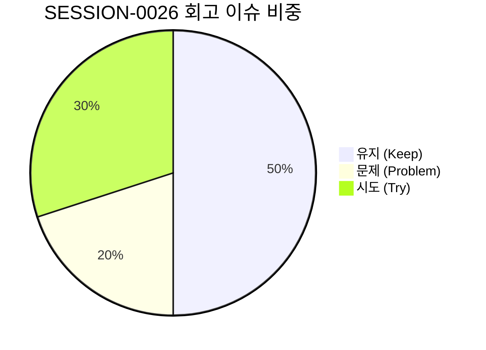

# 13-20. SESSION-261008-0026 세션 종합 KPT 회고록

> **문서 식별자**: `13-20`  
> **세션 ID**: `SESSION-0026`  
> **세션 주제**: `[0026] 통합 디자인시스템 기준요소 정의 및 관리자화면 전면 대입`  
> **작업 일시**: 2026-10-07 ~ 2026-10-08  
> **담당 에이전트**: Google AI Studio Agent (gemini-3.8-flash)  
> **운영자**: jkoogit (`jkoogit@gmail.com`)  
> **완료 태스크**: `TASK-0026-01`, `TASK-0026-02` (2건 전수 완료)  
> **원격 동기화**: `dev` = `stg` = `main` = `fba4876a6c22bd8af32069e3b05bffc74992677d` (100% 일치)

---

## 1. 세션 개요 및 추진 목표

SESSION-0026은 moabogo 디자인시스템 및 최신 Tailwind CSS 아키텍처를 벤치마킹하여, 순수 PDF/에디터 서비스와 관리자 백오피스 화면 전반에 일관된 시각적 위계와 44px 모바일 터치 접근성을 확립하는 **통합 디자인시스템 구축 및 전면 대입 세션**으로 추진되었습니다.

### 주요 추진 목표
1. **통합 디자인 토큰 및 운영정책 수립**: `docs/03.정책/03-23` 가이드 발행을 통한 색상, 타이포그래피, 터치 규격, Z-Index 레이어 표준화.
2. **원자/분자 기준 컴포넌트 풀 구축 (8종)**: `@shared/components/ui` (`Button`, `Input`, `Textarea`, `Card`, `Badge`, `Modal`, `KeyCap`, `ToolIcon`) 구축.
3. **관리자 1단계 4대 화면 대입 (`TASK-0026-01`)**: `PG-ADM-01` ~ `04` (보안, 프로그램, 사용자, 권한) 대입 및 모바일 카드 뷰 구현.
4. **관리자 2단계 12대 화면 전면 대입 (`TASK-0026-02`)**: `PG-ADM-05` ~ `16` (감사로그, 환경설정, 약관, 통계, 메뉴, 배치, API키, 공지/배너, 1:1문의, 폰트, 단축키, 사용자설정) 전수 대입.
5. **하네스 무결성 100점 및 대화턴 전수 영속화**: Git Data API 기반 Commit/Push, 3대 브랜치 일치 및 대화턴 화해 완결.

---

## 2. KPT 회고 분석

### 🎯 Keep (지속 유지할 점)
1. **기준 컴포넌트 풀 기반의 압도적인 일관성**:
   - `Button`, `Input`, `Textarea`, `Badge`, `Card`, `Modal` 등 8종 컴포넌트 풀을 구축하여 중복 Tailwind 클래스 및 날것의 HTML 태그를 근절함.
   - 44px 최소 터치 영역 가드레일(`min-h-[44px]`)을 일괄 충족하여 모바일 사용성 극대화.
2. **사전 헬스체크 기반의 안전한 Git Data API Push 파이프라인**:
   - `scripts/github_sync_push.ts` 구동 시 사전에 4단계 무결성 검증을 자동 수행하여, 정합성 결함이 있을 경우 원격 브랜치 오염을 원천 차단함.
   - 무결성 100점 달성 후 PR 자동 생성 및 `dev` ➔ `stg` ➔ `main` 3대 브랜치 일괄 승급을 완벽히 수행.
3. **No-Loss 대화 턴 영속화 및 화해 메커니즘**:
   - 승급 및 정리 시점마다 `reconcileSessionTraces`를 강제 실행하여 세션 내 누적된 모든 대화 턴(1~10턴)을 원격 DB(`aiagent.agent_conversation_trace`)에 100% 무손실 적재.

---

### ⚠️ Problem (개선이 필요한 문제점)
1. **관리자 와이어프레임과 실제 백엔드 연동 간의 간극**:
   - 현재 와이어프레임 스튜디오는 프론트엔드 React State 및 로컬 스토리지 기반 목업으로 동작하고 있어, 실제 사용자에게 "진짜 관리 기능이 돌아가는 것인지" 시각적/기능적 체감이 다소 부족함.
2. **테마 전환 인터페이스의 상단 노출 지연**:
   - 디자인 토큰 시스템 내부에는 Dark/Light 클래스 체계가 정의되어 있으나, 최상단 글로벌 헤더(`Navbar`)에 토글 버튼이 없어 일반 사용자가 테마 전환을 직관적으로 확인하기 어려웠음.
3. **태스크 정리 시 DB 메타 및 문서 해시 수동 보정 오버헤드**:
   - 새로운 태스크가 추가될 때 원격 DB `harness_task_meta` 테이블과 문서 해시 동기화가 자동 트리거되지 않아 일시적으로 점수가 79점으로 감점되는 상황 발생.

---

### 🚀 Try (다음 세션 시도 사항)
1. **상단 글로벌 네비게이션 테마 스위치 및 와이어프레임 UX 개편**:
   - 헤더에 Sun/Moon 아이콘 기반 원클릭 다크/라이트 테마 토글 버튼을 추가하고, 와이어프레임 스튜디오 바로가기 배너 및 동적 뷰어 연동.
2. **관리자 시스템서비스 실제 API 연동 1단계 착수**:
   - `PG-ADM-01`(보안 IP 차단) 및 `PG-ADM-03`(사용자 목록) 등 우선순위가 높은 관리자 기능을 실제 백엔드 Express 라우트 및 PostgreSQL 테이블과 실시간 연동.
3. **태스크 생성 즉시 DB 자동 적재 훅 고도화**:
   - `#태스크시작` 시점에 로컬 스토어뿐만 아니라 원격 DB `harness_task_meta`까지 1회 호출로 일괄 적재하여 정합성 감사 감점을 원천 예방.

---

## 3. 작업 산출물 및 지표

| 분류 | 산출물 / 지표 | 성과 및 상태 |
| :--- | :--- | :---: |
| **정책 문서** | `docs/03.정책/03-23_통합_디자인시스템_및_기준요소_UI_표준가이드.md` | 신규 제정 |
| **코드리뷰 문서** | `docs/10.리뷰/261007_044_...md` (10-44) `docs/10.리뷰/261008_045_...md` (10-45) | 2건 전수 발행 |
| **컴포넌트 풀** | `src/shared/components/ui/` 8종 기준 컴포넌트 | 100% 구현 완결 |
| **적용 화면군** | `PG-ADM-01` ~ `PG-ADM-16` (관리자 16개 전체 화면) | 100% 대입 완료 |
| **TDD 검증** | `tests/design_system_ui.test.ts` (14 PASS) `tests/admin_step2_design_system.test.ts` (7 PASS) | 21개 전수 PASS |
| **시스템 무결성** | `GET /api/agent/audit/integrity` | **100점 만점 [A+ (PERFECT)]** |
| **Git 커밋/브랜치** | Commit `fba4876a`, PR #73(Closed), PR #75(Merged) | dev/stg/main 100% 일치 |
| **대화 턴 영속화** | `TRACE-0026-01` ~ `TRACE-0026-10` | 10개 턴 무손실 영속화 |
