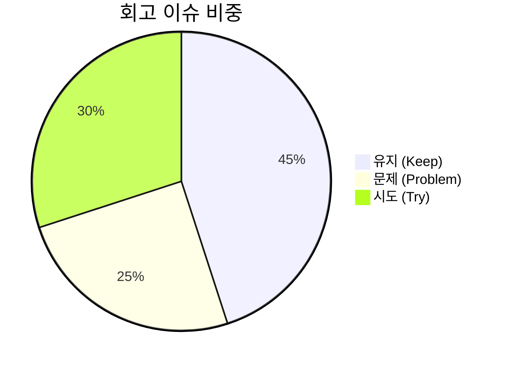

# 13. 회고 (Retrospectives) 요약 가이드

## 📋 폴더 개요
스프린트 및 세션 완료 후 성과를 돌아보고, 유지할 점과 개선할 점(KPT 회고)을 기록합니다.

## 📑 하위 문서 목록
| 문서번호 | 파일명 | 문서 제목 | 주요 내용 요약 |
| :--- | :--- | :--- | :--- |
| `13-01` | `13-01_SESSION-20260917-001_세션종합_KPT_회고록.md` | SESSION-20260917-001 세션 종합 KPT 회고록 | Keep(GitHub REST 제어, 토큰격리, Zero-Hang), Problem(스토어누적, 기본값잔재), Try(세션별 스토어격리, 동적DB검증, 감사API) |
| `13-02` | `13-02_SESSION-20260920-002_세션종합_KPT_회고록.md` | SESSION-20260920-002 세션 종합 KPT 회고록 | Keep(세션격리, 동적DB영속화, P0보안완결, 무결성100점), Problem(모바일넘침, 헤더메뉴과다), Try(IA 3대그룹화, 모바일반응형, 드로어/토글UX) |
| `13-03` | `13-03_SESSION-20260921-003_세션종합_KPT_회고록.md` | SESSION-20260921-003(1차) 세션 종합 KPT 회고록 | Keep(하이브리드 아키텍처 이원화, 5대 디자인패턴, UTF-8 버퍼결함 해결, 15-04 교육자료), Problem(리팩토링+UI과부하), Try(모바일 반응형 UX 단독세션 착수) |
| `13-04` | `13-04_SESSION-20260921-003_2차_세션종합_KPT_회고록.md` | SESSION-20260921-003(2차) 세션 종합 KPT 회고록 | Keep(대화턴 체크포인트 영속화 33건 완결, 복합인덱스 7종, 4단계 서비스전수점검 및 Push 가드레일, 100점 감사), Problem(모바일UX 누적), Try(차기세션 모바일UX 및 3대 IA 그룹화) |
| `13-05` | `13-05_SESSION-20260921-004_세션종합_KPT_회고록.md` | SESSION-20260921-004 세션 종합 KPT 회고록 | Keep(3대 도메인 IA 그룹화, 모바일 반응형 햄버거 드로어, 상단 툴 높이 및 뷰어 버튼 표준화, 전수점검 100점 만점), Problem(스토어 세션 격리 시 혼입), Try(PDF 비즈니스 코어 고도화) |
| `13-06` | `13-06_SESSION-20260922-005_세션종합_KPT_회고록.md` | SESSION-20260922-005 세션 종합 KPT 회고록 | Keep(토큰방지 8대 산출물 완비, OOP/DDD 5대 패턴 리팩토링, 4단계 전수점검 100점), Problem(단일세션 임계치 측정 맹점), Try(사용자·모델·요금제 메타 거버넌스 및 CBRI 구축) |
| `13-07` | `13-07_SESSION-20260922-006_세션종합_KPT_회고록.md` | SESSION-20260922-006 세션 종합 KPT 회고록 | Keep(비-LLM 긴급 Push 우회로, 스냅샷 JSON/MD 파일화, 관리자 백오피스 메타원장, 100점 감사), Problem(PDF 비즈니스 코어 집중 분산, 스냅샷 보관주기 미비), Try(PDF OCR/변환 코어 고도화) |
| `13-08` | `13-08_SESSION-20260923-007_세션종합_KPT_회고록.md` | SESSION-20260923-007 세션 종합 KPT 회고록 | Keep(온디맨드 자원현행화, 복수AI계정 티어오버라이드, 정수단위 무오차쿼터차감, 4단계전수점검 100점), Problem(PDF 비즈니스기능 지연), Try(PDF OCR/교정 스튜디오 고도화) |
| `13-09` | `13-09_SESSION-260925-0014_세션종합_KPT_회고록.md` | SESSION-260925-0014 세션 종합 KPT 회고록 | Keep(TDD 24개 전수통과, Fast-Forward 3대 브랜치 일치, AGENTS.md 승급규정 개정), Problem(PDF UI 시뮬레이터 잔재, 사전 UI설계 논의 부족), Try(차기세션 서비스 목적/대상/구조/시나리오 정리 및 화면 UI 설계 선행) |

