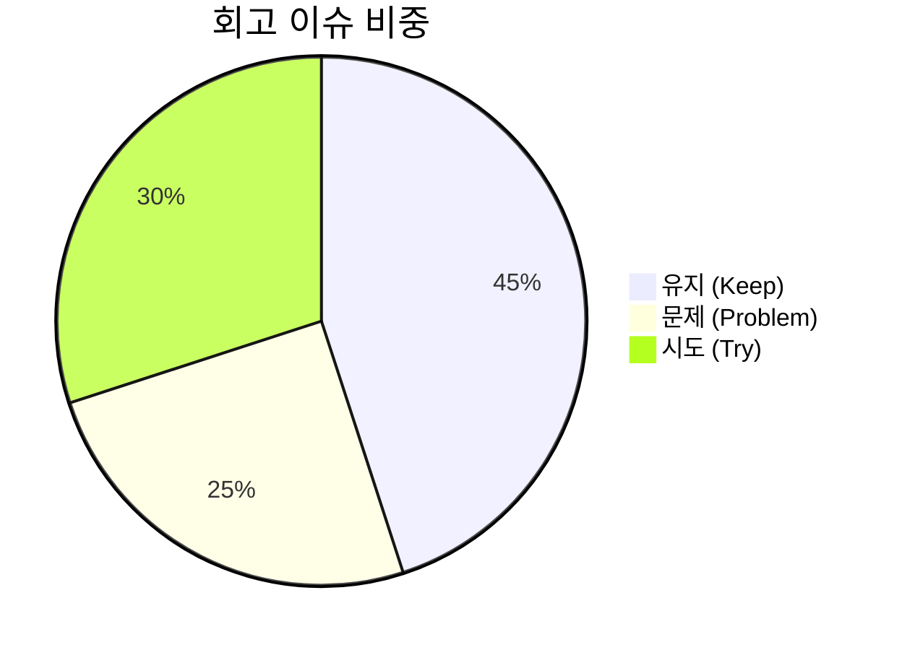

# 13. 회고 (Retrospectives) 요약 가이드

## 📋 폴더 개요
스프린트 및 세션 완료 후 성과를 돌아보고, 유지할 점과 개선할 점(KPT 회고)을 기록합니다.

## 📑 하위 문서 목록
| 문서번호 | 파일명 | 문서 제목 | 주요 내용 요약 |
| :--- | :--- | :--- | :--- |
| `13-01` | `13-01_SESSION-20260917-001_세션종합_KPT_회고록.md` | SESSION-20260917-001 세션 종합 KPT 회고록 | Keep(GitHub REST 제어, 토큰격리, Zero-Hang), Problem(스토어누적, 기본값잔재), Try(세션별 스토어격리, 동적DB검증, 감사API) |

