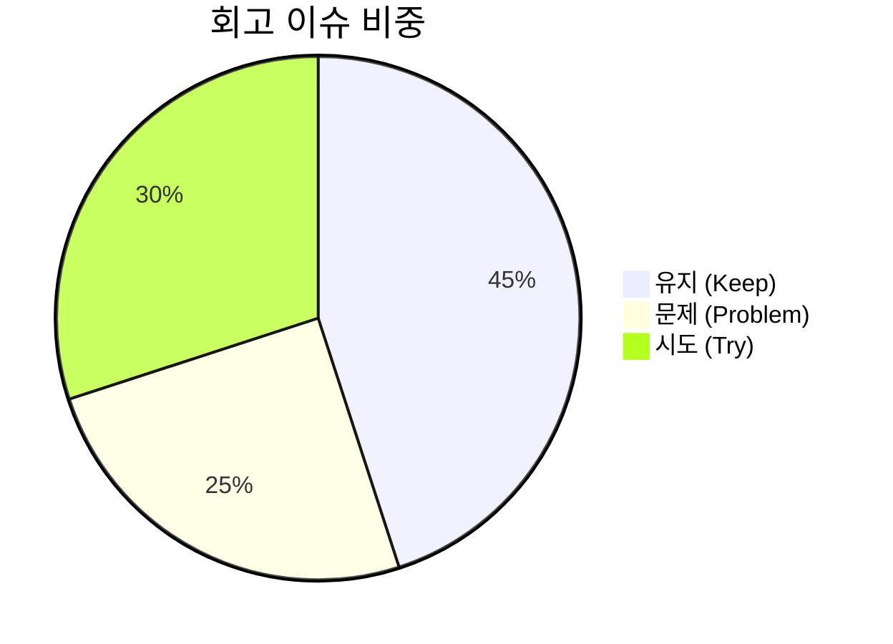

# 13. 회고 (Retrospectives) 요약 가이드

## 📋 폴더 개요
스프린트 및 세션 완료 후 성과를 돌아보고, 유지할 점과 개선할 점(KPT 회고)을 기록합니다.

## 📑 하위 문서 목록
| 문서번호 | 파일명 | 문서 제목 | 주요 내용 요약 |
| :--- | :--- | :--- | :--- |
| `13-01` | `13-01_SESSION-20260917-001_세션종합_KPT_회고록.md` | SESSION-20260917-001 세션 종합 KPT 회고록 | Keep(GitHub REST 제어, 토큰격리, Zero-Hang), Problem(스토어누적, 기본값잔재), Try(세션별 스토어격리, 동적DB검증, 감사API) |
| `13-02` | `13-02_SESSION-20260920-002_세션종합_KPT_회고록.md` | SESSION-20260920-002 세션 종합 KPT 회고록 | Keep(세션격리, 동적DB영속화, P0보안완결, 무결성100점), Problem(모바일넘침, 헤더메뉴과다), Try(IA 3대그룹화, 모바일반응형, 드로어/토글UX) |
| `13-03` | `13-03_SESSION-20260921-003_세션종합_KPT_회고록.md` | SESSION-20260921-003(1차) 세션 종합 KPT 회고록 | Keep(하이브리드 아키텍처 이원화, 5대 디자인패턴, UTF-8 버퍼결함 해결, 15-04 교육자료), Problem(리팩토링+UI과부하), Try(모바일 반응형 UX 단독세션 착수) |
| `13-04` | `13-04_SESSION-20260921-003_2차_세션종합_KPT_회고록.md` | SESSION-20260921-003(2차) 세션 종합 KPT 회고록 | Keep(대화턴 체크포인트 영속화 33건 완결, 복합인덱스 7종, 4단계 서비스전수점검 및 Push 가드레일, 100점 감사), Problem(모바일UX 누적), Try(차기세션 모바일UX 및 3대 IA 그룹화) |
| `13-05` | `13-05_SESSION-20260921-004_세션종합_KPT_회고록.md` | SESSION-20260921-004 세션 종합 KPT 회고록 | Keep(3대 도메인 IA 그룹화, 모바일 반응형 햄버거 드로어, 상단 툴 높이 및 뷰어 버튼 표준화, 전수점검 100점 만점), Problem(스토어 세션 격리 시 혼입), Try(PDF 비즈니스 코어 고도화) |
| `13-12` | `13-12_SESSION-260927-0016_세션종합_KPT_회고록.md` | SESSION-260927-0016 세션 종합 KPT 회고록 | Keep(전수 목록 UI 표준 정책 03-18 일괄 적용, 비-LLM 긴급 Push 및 DR 관제실 상시 복구, Trace ID DESC 기본정렬), Problem(거버넌스 절차 누락 및 백그라운드 태스크 잔류), Try(와이어프레임 기획서 분석 및 프로토타입 구현) |
| `13-13` | `13-13_SESSION-260928-0017_세션종합_KPT_회고록.md` | SESSION-260928-0017 세션 종합 KPT 회고록 | Keep(공통 가로 슬라이더 및 44px 가드레일, Canvas Crop 및 공식 소셜 브랜드 준수, 3대 브랜치 일치), Problem(원격 GitHub 이슈 상태 수동 잔류 현상), Try(800쪽 대용량 가상화 PDF 뷰어 렌더링 최적화) |
| `13-14` | `13-14_SESSION-260930-0018_세션종합_KPT_회고록.md` | SESSION-260930-0018 세션 종합 KPT 회고록 | Keep(GitHub Git Data API Commit/Push 및 PR #42 dev/stg/main 100% 동기화, 대화턴 6개 전수 원문/Markdown 무손실 영속화, KST 16:00 슬라이딩 윈도우 적응형 쿼터 예측 API), Problem(이전 세션 대화턴 누락, 컨텍스트 단절 위험), Try(이전 세션 대화턴 역추적 백필, 800쪽 가상화 뷰어 최적화) |
| `13-15` | `13-15_SESSION-261001-0019_세션종합_KPT_회고록.md` | SESSION-261001-0019 세션 종합 KPT 회고록 | Keep(aiagent 11대 테이블/컬럼 코멘트 등록, 104건 무손실 스키마 스왑, 편집레이어 네비게이션 일체형 내포, 모바일 카테고리 접힘 배너 상시노출, PR #46/#47 머지 및 dev/stg/main 일치), Problem(모달 분리형 레이아웃 시각적 불안정, 조건부 렌더링 누락), Try(PG-USR-06 PDF 전용 가상 뷰어 연동) |
| `13-16` | `13-16_SESSION-261002-0020_세션종합_KPT_회고록.md` | SESSION-261002-0020 세션 종합 KPT 회고록 | Keep(목차 복원·TOC 영문 배제, 툴바 좌우정렬 표준화, 주석 레이어팝업, OCR 위아래 탐색/현행화, 대화턴 10건 무손실 영속화, Git Data API Push 및 PR #52 머지), Problem(자동화 스크립트의 하네스 단계 경계 침범), Try(GitHub Sync Push 스크립트 단계 플래그 분리) |

```mermaid
pie title 회고 이슈 비중
    "유지 (Keep)" : 45
    "문제 (Problem)" : 25
    "시도 (Try)" : 30
```
