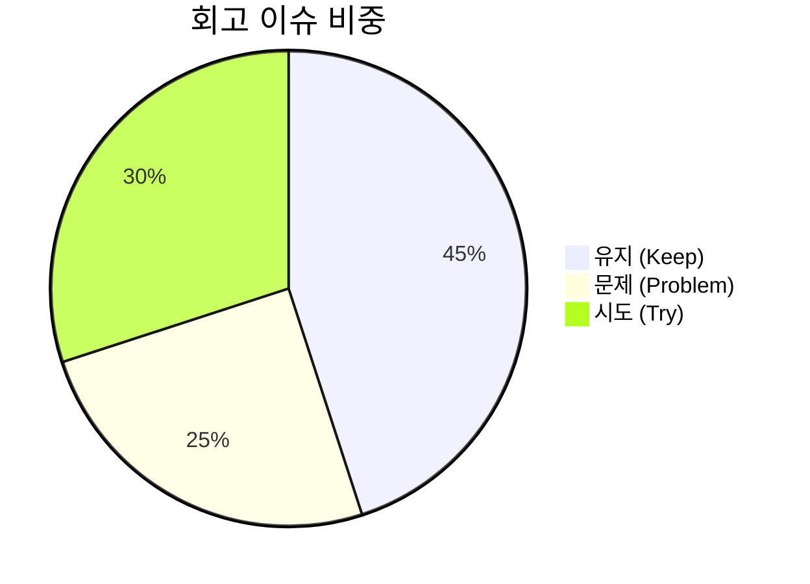

# 13. 회고 (Retrospectives) 요약 가이드

## 📋 폴더 개요
스프린트 및 세션 완료 후 성과를 돌아보고, 유지할 점과 개선할 점(KPT 회고)을 기록합니다.

## 📑 하위 문서 목록
| 문서번호 | 파일명 | 문서 제목 | 주요 내용 요약 |
| :--- | :--- | :--- | :--- |
| `13-01` | `13-01_SESSION-20260917-001_세션종합_KPT_회고록.md` | SESSION-20260917-001 세션 종합 KPT 회고록 | Keep(GitHub REST 제어, 토큰격리, Zero-Hang), Problem(스토어누적, 기본값잔재), Try(세션별 스토어격리, 동적DB검증, 감사API) |
| `13-02` | `13-02_SESSION-20260920-002_세션종합_KPT_회고록.md` | SESSION-20260920-002 세션 종합 KPT 회고록 | Keep(세션격리, 동적DB영속화, P0보안완결, 무결성100점), Problem(모바일넘침, 헤더메뉴과다), Try(IA 3대그룹화, 모바일반응형, 드로어/토글UX) |
| `13-03` | `13-03_SESSION-20260921-003_세션종합_KPT_회고록.md` | SESSION-20260921-003(1차) 세션 종합 KPT 회고록 | Keep(하이브리드 아키텍처 이원화, 5대 디자인패턴, UTF-8 버퍼결함 해결, 15-04 교육자료), Problem(리팩토링+UI과부하), Try(모바일 반응형 UX 단독세션 착수) |
| `13-04` | `13-04_SESSION-20260921-003_2차_세션종합_KPT_회고록.md` | SESSION-20260921-003(2차) 세션 종합 KPT 회고록 | Keep(대화턴 체크포인트 영속화 33건 완결, 복합인덱스 7종, 4단계 서비스전수점검 및 Push 가드레일, 100점 감사), Problem(모바일UX 누적), Try(차기세션 모바일UX 및 3대 IA 그룹화) |
| `13-05` | `13-05_SESSION-20260921-004_세션종합_KPT_회고록.md` | SESSION-20260921-004 세션 종합 KPT 회고록 | Keep(3대 도메인 IA 그룹화, 모바일 반응형 햄버거 드로어, 상단 툴 높이 및 뷰어 버튼 표준화, 전수점검 100점 만점), Problem(스토어 세션 격리 시 혼입), Try(PDF 비즈니스 코어 고도화) |
| `13-06` | `13-06_SESSION-20260922-005_세션종합_KPT_회고록.md` | SESSION-20260922-005 세션 종합 KPT 회고록 | Keep(하네스 5대 메타원장 DDL 및 엔티티 구축, 다차원 쿼터 전략), Problem(PostgreSQL 브릿지 타임아웃), Try(로컬 폴백 상시 보장) |
| `13-07` | `13-07_SESSION-20260922-006_세션종합_KPT_회고록.md` | SESSION-20260922-006 세션 종합 KPT 회고록 | Keep(비LLM 긴급 Push 우회로 구축, EmergencyGitPushEngine, 재해복구 관제실), Problem(토큰 고갈 시 통신 단절), Try(자가 적응형 쿼터) |
| `13-08` | `13-08_SESSION-20260923-007_세션종합_KPT_회고록.md` | SESSION-20260923-007 세션 종합 KPT 회고록 | Keep(OpenCV 캔버스 전처리, 3대 OCR 엔진 어댑터 구현), Problem(대용량 이미지 메모리), Try(가상 스크롤러 및 LRU 캐시) |
| `13-09` | `13-09_SESSION-260925-0014_세션종합_KPT_회고록.md` | SESSION-260925-0014 세션 종합 KPT 회고록 | Keep(PDF 메타데이터 주입기, 상황별 5대 보안전략, ISO 32000-1 권한 비트마스크, TDD 100%), Problem(UI 프로토타입 상태 잔재), Try(화면 UI 기획 착수) |
| `13-10` | `13-10_SESSION-260924-0012_세션종합_KPT_회고록.md` | SESSION-260924-0012 세션 종합 KPT 회고록 | Keep(페이지 레이아웃 편집기, 투명 텍스트 Searchable PDF 내보내기, 무제한 Undo/Redo), Problem(복잡 다이어그램 인코딩), Try(Web Worker 오프로딩) |
| `13-11` | `13-11_SESSION-260924-0013_세션종합_KPT_회고록.md` | SESSION-260924-0013 세션 종합 KPT 회고록 | Keep(Web Worker 오프로딩 Searchable PDF, Worker Pool 병렬 배치 큐, 18-xx 매뉴얼 체계화), Problem(모바일 가로스크롤), Try(PDF 메타데이터 주입기 연동) |
| `13-12` | `13-12_SESSION-260927-0015_세션종합_KPT_회고록.md` | SESSION-260927-0015 세션 종합 KPT 회고록 | Keep(25대 화면 UI 기획초안, 와이어프레임 스튜디오, 단축키/도구그룹 중복추가/초기화, GitHub 전수한글화, 4단계 계층 ID 표준화, UI정책 03-18 수립, 무손실 토큰소진 방어), Problem(모놀리식 컴포넌트 토큰 과소비), Try(서브 컴포넌트 모듈화, 캔버스 뷰어 실구현) |

```mermaid
pie title 회고 이슈 비중
    "유지 (Keep)" : 45
    "문제 (Problem)" : 25
    "시도 (Try)" : 30
```
