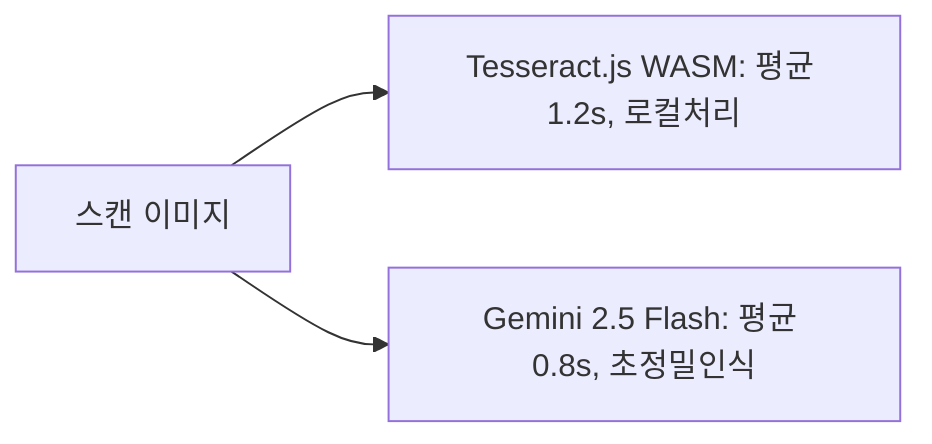

# 14. 실험 (Experiments & POC) 요약 가이드

## 📋 폴더 개요
신규 라이브러리(WASM OCR, PDF 파서 등) 성능 벤치마크, 프로토타입 실험 결과 및 기술 검증 보고서를 수록합니다.

## 📑 하위 문서 목록
| 문서번호 | 파일명 | 문서 제목 | 주요 내용 요약 |
| :--- | :--- | :--- | :--- |
| `14-01` | `14-01_WASM_vs_클라우드_OCR_벤치마크.md` | WASM vs 클라우드 OCR 벤치마크 | Tesseract.js (오프라인, 프라이버시) vs Gemini 2.5 Flash (고정밀, 비용) 비교 분석 |

