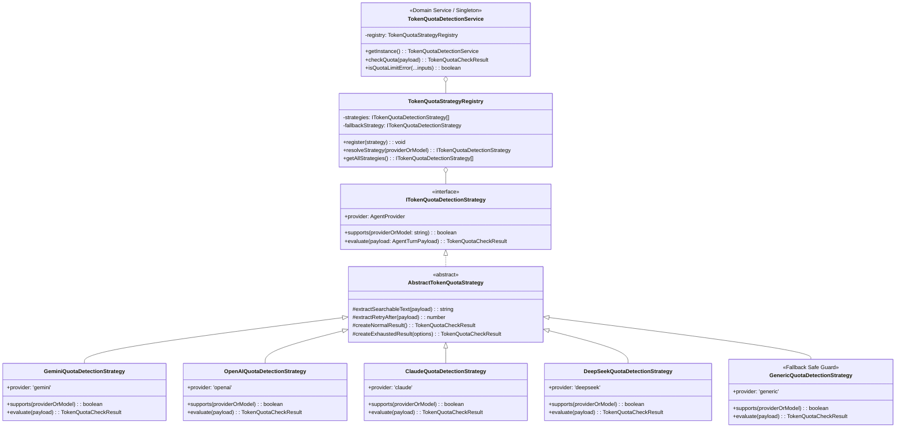

# 15-02. OOP & 도메인 기반 에이전트별 토큰 소진 감지 설계 학습 가이드

## 📌 1. 학습 개요 및 배경

### 1.1 왜 단순 if-else나 단일 정규식은 한계에 부딪히는가?
엔터프라이즈 멀티 에이전트 환경(purePDFrend)에서는 Google Gemini뿐만 아니라 OpenAI(GPT), Anthropic(Claude), DeepSeek, 로컬 LLM(Ollama) 등 다양한 공급자의 모델이 앙상블로 동작합니다.
각 공급자마다 토큰 한도 초과(Rate Limit / Quota Exceeded)를 전달하는 방식이 상이합니다:
- **Google Gemini**: gRPC `RESOURCE_EXHAUSTED`, HTTP 429, API 응답 메시지 내 `quota exceeded`
- **OpenAI**: JSON 에러 페이로드 내 `insufficient_quota`, `rate_limit_exceeded`, `tokens_per_minute`
- **Anthropic Claude**: `rate_limit_error`, `overloaded_error`, `credit balance is too low`
- **DeepSeek**: `insufficient_balance`, `rate limit exceeded`
- **온프레미스/로컬 모델**: HTTP 429 및 한국어 "토큰 한도 초과", "사용량 초과"

만약 이를 단일 함수 내부에서 거대한 `if-else`나 단일 정규식으로 처리하면:
1. **단일 책임 원칙(SRP) 위반**: 한 함수가 모든 공급자의 세부 오류 규격을 전부 알아야 함.
2. **개방-폐쇄 원칙(OCP) 위반**: 신규 에이전트를 추가할 때마다 기존 핵심 로직을 수정해야 하며 사이드 이펙트 발생 위험 증가.
3. **테스트 및 유지보수 곤란**: 특정 공급자의 응답 규격이 바뀌었을 때 단위 테스트 격리가 어려움.

따라서 본 시스템은 **OOP(객체 지향 프로그래밍)**와 **DDD(도메인 주도 설계)**, 그리고 **전략 패턴(Strategy Pattern)** 및 **레지스트리 팩토리 패턴(Registry Factory Pattern)**을 적용하여 최고의 확장성과 운영성을 달성하였습니다.

---

## 🏛️ 2. 아키텍처 다이어그램 (Mermaid)

<div align="center">
  
  <p><em>[그림] 15-02. OOP & 도메인 기반 에이전트별 토큰 소진 감지 설계 학습 가이드 - 아키텍처 및 상태 흐름도 다이어그램 1</em></p>
</div>



---

## 💡 3. 핵심 OOP 및 DDD 설계 원칙 분석

### 3.1 SOLID 원칙 적용

| SOLID 원칙 | 실전 적용 방식 |
| :--- | :--- |
| **SRP (단일 책임 원칙)** | `GeminiQuotaDetectionStrategy`는 Gemini의 에러 규격만 분석하고, `TokenQuotaStrategyRegistry`는 전략의 등록과 검색만 담당합니다. |
| **OCP (개방-폐쇄 원칙)** | 새로운 공급자(예: Ollama, Mistral)가 추가되어도 기존 코드를 단 한 줄도 수정하지 않고 `registry.register(new OllamaStrategy())`로 확장할 수 있습니다. |
| **LSP (리스코프 치환 원칙)** | 모든 공급자 전략은 `ITokenQuotaDetectionStrategy` 계약을 충실히 이행하므로 어디서든 상호 대체 가능합니다. |
| **ISP (인터페이스 분리 원칙)** | `ITokenQuotaDetectionStrategy`는 `supports`와 `evaluate`라는 필수적인 메서드만 간결하게 정의합니다. |
| **DIP (의존 역전 원칙)** | 상위 서비스(`TokenQuotaDetectionService`)는 구체 클래스가 아니라 `ITokenQuotaDetectionStrategy` 추상 인터페이스에 의존합니다. |

### 3.2 DDD(도메인 주도 설계) 패턴

1. **Value Object (값 객체)**:
   - `TokenQuotaCheckResult`: 식별자(ID)가 없고, 한 번 생성되면 변경할 수 없는 불변 객체(readonly)입니다. 판별 여부(`isExhausted`), 사유 코드(`reasonCode`), 감지된 에이전트(`agentProvider`), 대기 권고 시간(`retryAfterSeconds`) 등의 속성을 스스로 검증하고 표현합니다.
   - `AgentTurnPayload`: 검사 대상이 되는 대화 턴의 프롬프트, 응답, 상태코드, 헤더 등을 안전하게 포장합니다.
2. **Domain Service (도메인 서비스)**:
   - `TokenQuotaDetectionService`: 비즈니스 로직(1차 특정 전략 검사 ➔ 2차 범용 폴백 앙상블 체인 검사)을 조율하는 도메인 서비스입니다.

---

## 🛠️ 4. 기술 위주 실전 샘플 코드 가이드

### 4.1 전략 인터페이스 및 추상 기본 클래스

```typescript
// src/domain/token-quota/types.ts
export type AgentProvider = 'gemini' | 'openai' | 'claude' | 'deepseek' | 'ollama' | 'generic';

export interface AgentTurnPayload {
  readonly agentName?: string;
  readonly modelName?: string;
  readonly userPrompt?: string;
  readonly agentResponse?: string;
  readonly responseSummary?: string;
  readonly httpStatus?: number;
  readonly headers?: Record<string, string | string[] | undefined>;
  readonly rawError?: unknown;
}

export interface TokenQuotaCheckResult {
  readonly isExhausted: boolean;
  readonly agentProvider: AgentProvider;
  readonly matchedPattern?: string;
  readonly reasonCode?: string;
  readonly httpStatus?: number;
  readonly retryAfterSeconds?: number;
  readonly diagnosticMessage: string;
}

export interface ITokenQuotaDetectionStrategy {
  readonly provider: AgentProvider;
  supports(providerOrModel: string): boolean;
  evaluate(payload: AgentTurnPayload): TokenQuotaCheckResult;
}
```

### 4.2 구체 전략 예시 (OpenAIQuotaDetectionStrategy)

```typescript
// src/domain/token-quota/strategies/OpenAIQuotaDetectionStrategy.ts
import { AgentProvider, AgentTurnPayload, TokenQuotaCheckResult } from '../types';
import { AbstractTokenQuotaStrategy } from './TokenQuotaStrategy';

export class OpenAIQuotaDetectionStrategy extends AbstractTokenQuotaStrategy {
  readonly provider: AgentProvider = 'openai';

  supports(providerOrModel: string): boolean {
    const target = providerOrModel.toLowerCase();
    return target.includes('openai') || target.includes('gpt') || target.includes('o1');
  }

  evaluate(payload: AgentTurnPayload): TokenQuotaCheckResult {
    const text = this.extractSearchableText(payload);
    const httpStatus = payload.httpStatus;
    const retryAfter = this.extractRetryAfter(payload);

    const openAiPatterns = [
      { pattern: /insufficient_quota/i, code: 'OPENAI_INSUFFICIENT_QUOTA', message: '계정 쿼터 소진' },
      { pattern: /exceeded your current quota/i, code: 'OPENAI_CURRENT_QUOTA_EXCEEDED', message: '플랜 한도 초과' },
      { pattern: /rate_limit_exceeded/i, code: 'OPENAI_RATE_LIMIT_EXCEEDED', message: 'RPM/TPM 초과' },
    ];

    for (const { pattern, code, message } of openAiPatterns) {
      if (pattern.test(text)) {
        return this.createExhaustedResult({
          matchedPattern: pattern.source,
          reasonCode: code,
          diagnosticMessage: message,
          httpStatus: httpStatus || 429,
          retryAfterSeconds: retryAfter,
        });
      }
    }

    if (httpStatus === 429) {
      return this.createExhaustedResult({
        matchedPattern: 'HTTP_429',
        reasonCode: 'OPENAI_HTTP_429',
        diagnosticMessage: 'HTTP 429 상태코드 수신',
        httpStatus: 429,
        retryAfterSeconds: retryAfter,
      });
    }

    return this.createNormalResult();
  }
}
```

### 4.3 도메인 서비스 사용법

```typescript
import { TokenQuotaDetectionService } from './domain/token-quota';

const service = TokenQuotaDetectionService.getInstance();

// 1. 객체 기반 정밀 진단
const checkResult = service.checkQuota({
  agentName: 'openai',
  agentResponse: 'Error: You exceeded your current quota, please check your plan and billing details.',
  httpStatus: 429
});

console.log(checkResult.isExhausted); // true
console.log(checkResult.reasonCode);  // 'OPENAI_CURRENT_QUOTA_EXCEEDED'
console.log(checkResult.diagnosticMessage); // '[openai] 토큰/쿼터 한도 소진 감지: 플랜 한도 초과'

// 2. 가변 인자 기반 간편 검사 (기존 거버넌스 호환)
if (service.isQuotaLimitError(userPrompt, agentResponse)) {
  console.log('저장 대상에서 제외 처리');
}
```

---

## 🚀 5. 초보 개발자를 위한 신규 에이전트 확장 3단계 실습

예를 들어, 사내 온프레미스 `Ollama` 또는 `Mistral` 엔진을 추가하고 싶다면 어떻게 해야 할까요?

### 1단계: 신규 전략 클래스 생성
`src/domain/token-quota/strategies/OllamaQuotaDetectionStrategy.ts` 파일을 생성합니다.

```typescript
import { AgentProvider, AgentTurnPayload, TokenQuotaCheckResult } from '../types';
import { AbstractTokenQuotaStrategy } from './TokenQuotaStrategy';

export class OllamaQuotaDetectionStrategy extends AbstractTokenQuotaStrategy {
  readonly provider: AgentProvider = 'ollama';

  supports(providerOrModel: string): boolean {
    return providerOrModel.toLowerCase().includes('ollama');
  }

  evaluate(payload: AgentTurnPayload): TokenQuotaCheckResult {
    const text = this.extractSearchableText(payload);
    if (/gpu memory exhausted|context window exceeded/i.test(text)) {
      return this.createExhaustedResult({
        matchedPattern: 'ollama_resource_limit',
        reasonCode: 'OLLAMA_RESOURCE_LIMIT',
        diagnosticMessage: 'Ollama VRAM 또는 컨텍스트 윈도우 한도 초과',
      });
    }
    return this.createNormalResult();
  }
}
```

### 2단계: 레지스트리에 등록
`TokenQuotaStrategyRegistry.ts`의 생성자 또는 외부 설정에서 등록합니다:

```typescript
const registry = TokenQuotaDetectionService.getInstance().getRegistry();
registry.register(new OllamaQuotaDetectionStrategy());
```

### 3단계: 즉시 동작 검증
```bash
curl -X POST http://localhost:3000/api/agent/quota/check \
  -H "Content-Type: application/json" \
  -d '{"agentName":"ollama","agentResponse":"Error: GPU memory exhausted during inference"}'
```
응답:
```json
{
  "success": true,
  "result": {
    "isExhausted": true,
    "agentProvider": "ollama",
    "reasonCode": "OLLAMA_RESOURCE_LIMIT",
    "diagnosticMessage": "[ollama] 토큰/쿼터 한도 소진 감지: Ollama VRAM 또는 컨텍스트 윈도우 한도 초과"
  }
}
```
**기존 코드를 손대지 않고도 즉각 신규 공급자가 완벽하게 지원됩니다!**

---

## 🌐 6. 제공되는 REST API 규격

| 메서드 | 엔드포인트 | 설명 |
| :--- | :--- | :--- |
| `GET` | `/api/agent/quota/strategies` | 현재 등록되어 활성화된 모든 에이전트별 전략 목록 반환 |
| `POST` | `/api/agent/quota/check` | 페이로드(프롬프트, 응답, 헤더 등)에 대해 토큰 소진 여부 정밀 진단 |
| `POST` | `/api/agent/chat/traces/cleanup-quota-errors` | 기존 저장된 턴 중 토큰 한도 초과 오류 턴을 일괄 정제 |

---

## 📈 7. 결론 및 거버넌스 효과

1. **운영 신뢰성**: 에이전트 공급자가 늘어나도 각 사의 에러 포맷에 완벽히 대응 가능.
2. **데이터 순수성**: 토큰 한도로 실패한 불완전한 대화 턴이 대화 추적 DB나 사용량 통계에 혼입되는 것을 원천 차단.
3. **코드 청결성**: 거대 분기문 대신 깔끔한 객체 지향 및 도메인 모델로 유지보수 비용 최소화.

---

## 📋 편집 이력 (Revision History)

| 작업일자 | 이슈 | 태스크 | 작업자 | 작업내용 | 사용 AI 모델명 | 에이전트 | 참고링크 |
| :--- | :--- | :--- | :--- | :--- | :--- | :--- | :--- |
| 2026-09-20 | #10 | TASK-005 | gemini | 최초 제정 및 도메인 거버넌스 수립 | Gemini 2.5 Flash | Google AI Studio | [03-01. 문서 정책](../03.정책/03-01_문서작성_및_편집이력_정책.md) |
| 2026-09-21 | #14 | TASK-008 | gemini | v2.2 전면 개정: 8대 필드 편집이력, 상호 링크, 다이어그램 이미지화 및 DB 영속화 표준 반영 | Gemini 3.8 Flash | Google AI Studio | [03-01. 문서 정책](../03.정책/03-01_문서작성_및_편집이력_정책.md) |
