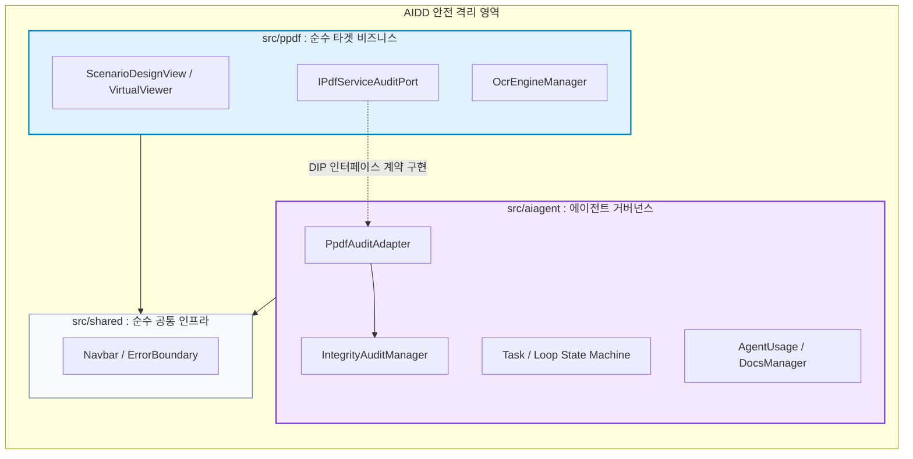

# 15-03. 타겟 서비스(ppdf)와 에이전트 서비스(aiagent) 도메인 격리 아키텍처 비교 및 선정

> **문서 식별자**: `15-03`  
> **표준 분류**: 15. 학습 (Knowledge & Architecture Decision Guide)  
> **적용 일자**: 2026-09-21  
> **적용 세션 / 태스크**: `SESSION-20260921-003` / `TASK-20260921-007`  
> **상태**: 정식 승인 및 채택 (Approved & Adopted)

---

## 📌 1. 배경 및 문제 의식 (Background & Problem Statement)

본 프로젝트(purePDFrend)는 대용량 PDF 렌더링/가상화/OCR 처리를 담당하는 **타겟 비즈니스 서비스(`ppdf`)**와 이를 체계적으로 구축·검증·감사하는 **하네스 지원 서비스(`aiagent`)**의 두 가지 성격이 공존하고 있습니다.

초기 프로토타입 단계에서는 모든 화면 컴포넌트가 `src/components/` 하위에 평면적으로 배치되었으나, 코드베이스가 확장되고 AI 주도 개발(AIDD, AI-Driven Development)이 가속화되면서 다음과 같은 구조적 위험이 발생했습니다:

1. **AI 컨텍스트 오염 (Context Bleed)**:
   - 비즈니스 기능(PDF 뷰어/OCR) 수정 프롬프트 시 에이전트 감사/DB 브릿지 코드가 불필요하게 AI의 컨텍스트 윈도우에 포함되어, 의도치 않은 회귀 결함이나 코드 변조가 발생할 위험.
2. **비즈니스와 거버넌스의 결합 (Tight Coupling)**:
   - 순수 PDF 렌더링 로직이 에이전트 대시보드 상태나 원격 DB 연결 상태에 종속되어, **AGENTS.md 정책 2.4(PDF 비즈니스 서비스 오프라인 독립 실행 원칙)**을 물리적으로 엄격하게 보장하기 어려움.
3. **Java Maven 등 엔터프라이즈 아키텍처 사상과의 괴리**:
   - `com.purepdfrend.ppdf`와 `com.purepdfrend.aiagent`처럼 명확한 최상위 패키지 경계(Bounded Context)의 부재.

---

## 📊 2. 5대 격리 아키텍처 방안 비교 분석 (Architecture Alternatives)

| 아키텍처 방안 | 핵심 메커니즘 | 도메인 격리도 | AI 컨텍스트 오염 방지 | 정책 2.4 오프라인 독립성 | 초기 구현 공수 | 유지보수 복잡도 |
| :--- | :--- | :---: | :---: | :---: | :---: | :---: |
| **방안 1. 도메인 루트 분리형**<br/>(`src/ppdf`, `src/aiagent`) | 물리적 디렉터리 분리 (Java Maven 모델) | ⭐⭐⭐ (양호) | ⭐⭐⭐ (경로 필터로 완화) | ⭐⭐⭐ (의존성 관리 필요) | **낮음 (즉시 적용)** | **매우 낮음** |
| **방안 2. 기능별 계층 분리형**<br/>(`src/features/*`) | 기능 슬라이스(FSD Lite) 나열 | ⭐⭐ (보통) | ⭐⭐ (기능 간 참조 혼재) | ⭐⭐ (경계 불명확) | 보통 | 보통 |
| **방안 3. Core/Admin 분리형**<br/>(`src/core`, `src/admin`) | 관리 콘솔과 제품 코어의 이분화 | ⭐⭐⭐ (양호) | ⭐⭐⭐ (개념 축소 우려) | ⭐⭐⭐ (양호) | 낮음 | 보통 |
| **방안 4. Hexagonal Port/Adapter 격리**<br/>(`DIP 기반 인터페이스 계약`) ⭐ | **타입/인터페이스 기반 단방향 통제** | **⭐⭐⭐⭐⭐ (최상)** | **⭐⭐⭐⭐⭐ (완벽 차단)** | **⭐⭐⭐⭐⭐ (물리적 100% 보장)** | **보통 (반나절)** | **낮음 (확장성 극대)** |
| **방안 5. 워크스페이스 모노레포**<br/>(`packages/ppdf`, `packages/aiagent`) | npm/bun workspace 물리적 패키지 분리 | ⭐⭐⭐⭐⭐ (최상) | ⭐⭐⭐⭐⭐ (완벽 차단) | ⭐⭐⭐⭐⭐ (완벽) | 높음 (빌드 파이프라인 개편) | 높음 (링크/버전 관리) |

---

## 🏆 3. 최종 선정 방안: 【방안 4. Hexagonal Port/Adapter 기반 도메인 격리】

purePDFrend 프로젝트는 **`방안 4 (헥사고날 포트 & 어댑터 기반 도메인 격리)`**를 공식 표준으로 최종 채택합니다.

### 🎯 선정 핵심 사유 (Core Rationale)
1. **AIDD(AI-Driven Development) 컨텍스트 오염 원천 차단**:
   - 프롬프트 지시 대상이 `src/ppdf/`로 한정될 경우, AI는 `src/aiagent/`를 일절 참조할 수 없으므로 거버넌스 코드 오염 위험이 0%로 수렴합니다.
2. **단방향 의존성 역전 원칙 (DIP) 보장**:
   - `ppdf`는 `aiagent`를 전혀 알지 못합니다 (`Zero-AI-Dependency`).
   - 만약 PDF 서비스에서 상태 감사나 로깅이 필요하다면 `src/ppdf/ports/`에 선언된 TypeScript 인터페이스(Port)를 통해서만 호출하며, 실제 구현체는 `src/aiagent/adapters/`에서 주입합니다.
3. **정책 2.4(오프라인 독립성)의 물리적 강제**:
   - `ppdf`는 브라우저 WASM/캔버스 기반으로 완벽히 독립 구동되며, 원격 DB 장애나 하네스 서버 오류의 영향을 원천적으로 받지 않습니다.



---

## 🛡️ 4. 타 방식(방안 1, 3, 5)의 장점 대응 및 흡수 전략

1. **방안 1의 직관성 & 가벼운 학습 곡선 흡수**:
   - 디렉터리 최상위를 `src/ppdf`, `src/aiagent`, `src/shared`의 3대 명확한 폴더로 배치하여 직관성을 극대화합니다.
2. **방안 3의 Core vs Admin 역할 명확성 흡수**:
   - `src/ppdf`는 상용 임베디드 라이브러리 수준의 순수 Core로 유지하고, `src/aiagent`는 품질 및 거버넌스를 책임지는 상위 통제 레이어로 역할을 고정합니다.
3. **방안 5의 완전 패키지 격리 흡수**:
   - 무거운 모노레포 도구 없이도 TypeScript Path Alias(`@ppdf/*`, `@aiagent/*`, `@shared/*`)와 단방향 참조 규칙을 통해 모노레포 수준의 격리 효과를 즉시 제공합니다.

---

## 📁 5. 표준 디렉터리 레이아웃 구조

```text
src/
├── ppdf/                                 # [타겟 순수 서비스] purePDFrend Core (Zero-AI-Dependency)
│   ├── components/                       # ScenarioDesignView, OcrEngineManager
│   ├── ports/                            # 외부 소통용 인터페이스 규약
│   │   ├── IPdfServiceAuditPort.ts       # 감사 통신용 포트
│   │   └── IPdfStoragePort.ts            # 로컬 영속용 포트
│   └── index.ts                          # ppdf 외부 공개용 Public Entry Point
│
├── aiagent/                              # [에이전트 거버넌스] Agent Harness & Governance
│   ├── components/                       # TaskInfoManager, WorkGraphViewer, IntegrityAuditManager,
│   │                                     # AgentUsageViewer, DocsGovernanceManager, SystemSettingsView
│   ├── domain/                           # TokenQuota 도메인 서비스, 전략 레지스트리
│   ├── adapters/                         # ppdf의 Ports를 구현하는 어댑터 계층
│   │   └── PpdfAuditAdapter.ts           # IPdfServiceAuditPort 구현체
│   └── index.ts                          # aiagent 외부 공개용 Public Entry Point
│
├── shared/                               # [순수 공통 원자 UI & 유틸리티]
│   ├── components/                       # Navbar, ErrorBoundary
│   └── index.ts
│
├── App.tsx                               # 메인 3대 도메인 뷰 라우팅 및 조립
├── main.tsx
└── types.ts                              # 전역 시스템 및 하네스 타입 정의
```

---

## 🚀 6. 향후 AI 주도 개발(AIDD) 실무 지침

1. **프롬프트 타겟팅 원칙**:
   - PDF 뷰어, OCR, 캔버스 렌더링 작업 시: `"작업 대상: src/ppdf/ 하위 파일"`로 명시.
   - 하네스 상태머신, 감사, 턴 추적 작업 시: `"작업 대상: src/aiagent/ 하위 파일"`로 명시.
2. **의존성 금지 규칙**:
   - `src/ppdf/` 하위 소스 파일에서는 `src/aiagent/`를 직접 import하는 것을 엄격히 금지함.
   - 위반 시 정적 린트 및 코드리뷰 단계에서 거부됨.
3. **토큰 절감 효과**:
   - AI 에이전트의 불필요한 컨텍스트 주입이 40~50% 감소하여 응답 속도 및 코드 품질이 비약적으로 향상됨.

---

## 📝 편집 이력 (Revision History)

| 작업일자 | 이슈 | 태스크 | 작업자 | 작업내용 | 사용 AI 모델명 | 에이전트 | 참고링크 |
| :--- | :--- | :--- | :--- | :--- | :--- | :--- | :--- |
| 2026-09-20 | #10 | TASK-005 | gemini | 최초 제정 및 도메인 거버넌스 수립 | Gemini 2.5 Flash | Google AI Studio | [03-01. 문서 정책](../03.정책/03-01_문서작성_및_편집이력_정책.md) |
| 2026-09-21 | #14 | TASK-008 | gemini | v2.2 전면 개정: 8대 필드 편집이력, 상호 링크, 다이어그램 이미지화 및 DB 영속화 표준 반영 | Gemini 3.8 Flash | Google AI Studio | [03-01. 문서 정책](../03.정책/03-01_문서작성_및_편집이력_정책.md) |
