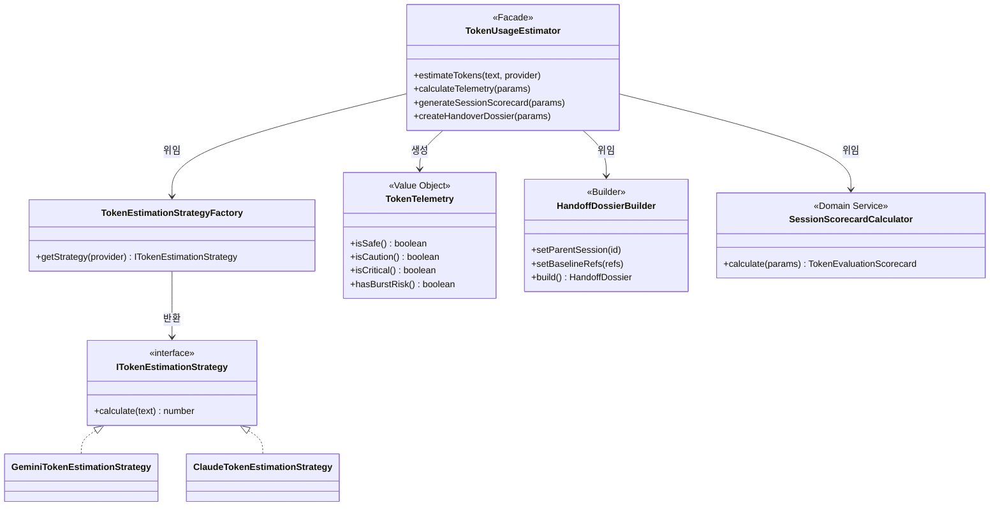

# 15-05. 초기 구현 대비 OOP/도메인 주도 설계(DDD) 리팩토링 및 디자인 패턴 교육 가이드

> **문서 상태**: 교육 및 실무 참조 표준 (Educational Reference)  
> **최초 작성일**: 2026-09-22  
> **소관**: purePDFrend 아키텍처 및 엔지니어링 멘토링 그룹  
> **대상**: 주니어/미드레벨 개발자 및 AI 에이전트 도메인 엔지니어

---

## 1. 개요 및 학습 목표 (Overview & Objectives)

본 문서는 **purePDFrend**의 토큰 관리 및 텔레메트리 시스템을 개발하는 과정에서, **초기 프로토타입 형태의 단일 거대 클래스(Monolithic Static Helper)**에서 출발하여 **OOP 기반의 도메인 주도 설계(DDD) 및 GoF 디자인 패턴**으로 리팩토링한 실제 사례를 심층 분석합니다.

### 🎯 핵심 학습 목표
1. 절차적 정적 유틸리티(God Class)의 안티패턴과 한계점을 이해한다.
2. 전략(Strategy), 값 객체(Value Object), 빌더(Builder), 도메인 서비스(Domain Service), 파사드(Facade)의 5대 패턴이 시스템 결합도를 어떻게 낮추는지 학습한다.
3. 리팩토링 전후의 장단점을 엔지니어링 지표(유지보수성, 테스트 용이성, 결합도, 인지 부하) 관점에서 정량적으로 비교 평가한다.

---

## 2. 아키텍처 구조 비교 (Before vs After)

### 2.1 [Before] 초기 구현 구조 (단일 거대 정적 클래스)
초기에는 빠른 기능 검증을 위해 `TokenUsageEstimator.ts` 파일 하나에 모든 비즈니스 로직을 정적 메서드로 몰아넣었습니다:

```
[초기 구조 - Monolithic Helper]
TokenUsageEstimator (단일 클래스)
 ├── estimateTokens()            // 정규식, 글자수 카운팅, 언어별/모델별 분기 처리
 ├── calculateTelemetry()        // 텔레메트리 지표(v, B, LSM, BRI) 수식 계산
 ├── generateSessionScorecard()  // MAPE 계산, EMA 알파 갱신, API 추천 휴리스틱
 └── createHandoverDossier()     // 인계 토큰 생성, 템플릿 프롬프트 조립
```

- **문제점**:
  - **단일 책임 원칙(SRP) 위반**: 하나의 클래스가 토큰 추정, 위험도 평가, 통계 분석, 문서 템플릿 생성 등 상이한 4가지 책임을 모두 담당.
  - **개방-폐쇄 원칙(OCP) 위반**: 신규 AI 모델(예: DeepSeek, Llama3) 지원 시마다 기존 메서드 내부의 `if-else` 분기문을 계속 수정해야 함.
  - **단위 테스트 격리 불가**: 토큰 추정 로직만 따로 떼어내어 검증하려 해도 거대한 파일 전체에 의존하게 됨.

---

### 2.2 [After] OOP / DDD 리팩토링 구조 (디자인 패턴 적용)

```
[리팩토링 구조 - DDD & Design Patterns]
src/aiagent/domain/token-quota/
 ├── models/
 │    └── TokenTelemetry.ts              [Value Object] 불변 텔레메트리 엔티티 및 비즈니스 판정 메서드
 ├── strategies/
 │    └── TokenEstimationStrategy.ts     [Strategy Pattern] 모델별(Gemini, Claude, GPT) 추정 알고리즘 분리
 ├── builders/
 │    └── HandoffDossierBuilder.ts       [Builder Pattern] 복합 도시에 객체 단계별 조립 및 불변성 보장
 ├── services/
 │    └── SessionScorecardCalculator.ts  [Domain Service] 통계적 EMA 피드백 루프 및 API 오프로딩 추천
 ├── TokenUsageEstimator.ts              [Facade Pattern] 기존 호출부를 100% 호환하는 단일 통합 파사드
 └── types.ts                            [도메인 인터페이스] 불변 VO 인터페이스
```



---

## 3. 적용된 핵심 디자인 패턴 및 코드 분석

### 3.1 전략 패턴 (Strategy Pattern): 모델별 토크나이저 가중치
- **도입 목적**: 모델 제공자(Gemini, Claude, GPT, Ollama)마다 토크나이저 특성이 다르므로 알고리즘을 캡슐화하여 교체 가능하게 함.
- **코드 예시**:
```typescript
export interface ITokenEstimationStrategy {
  readonly provider: AgentProvider;
  calculate(text: string): number;
}

export class ClaudeTokenEstimationStrategy extends BaseTokenEstimationStrategy {
  readonly provider = 'claude';
  readonly baseMultiplier = 1.15; // 클로드 토크나이저 밀도 반영
}
```
- **효과**: 신규 모델 추가 시 기존 코드를 한 줄도 수정하지 않고 새로운 Strategy 클래스만 등록하면 됨 (OCP 완벽 준수).

### 3.2 불변 값 객체 (Value Object): `TokenTelemetry`
- **도입 목적**: 원시 데이터 뭉치(Primitive Obsession) 대신, 상태와 도메인 규칙을 함께 묶어 비즈니스 판단을 객체 스스로에게 위임.
- **코드 예시**:
```typescript
export class TokenTelemetry implements TelemetryMetrics {
  // 모든 필드는 readonly로 불변 보장
  public isCritical(): boolean {
    return this.risk_level === 'CRITICAL' || this.loop_safety_margin < 2;
  }
}
```

### 3.3 빌더 패턴 (Builder Pattern): `HandoffDossierBuilder`
- **도입 목적**: Git 3대 기준점, 세션 메타, 미완료 백로그 등 복잡한 인자 전달 시 발생할 수 있는 매개변수 순서 오류 방지 및 기본값 검증.
- **코드 예시**:
```typescript
const dossier = new HandoffDossierBuilder()
  .setParentSession('SESSION-01')
  .setBranch('dev')
  .setBaselineRefs(gitRefs)
  .setReason('SUSPENDED_QUOTA')
  .build();
```

### 3.4 파사드 패턴 (Facade Pattern): 하위 호환성 및 단일 진입점
- **도입 목적**: 내부 구조가 여러 클래스로 잘게 쪼개지더라도, `server.ts`나 프론트엔드 컴포넌트가 알아야 할 진입점은 `TokenUsageEstimator` 하나로 유지하여 외부 호출부의 변경을 0건으로 통제.

---

## 4. 리팩토링 전후 상세 비교 (장단점 매트릭스)

| 평가 항목 | [Before] 초기 정적 헬퍼 구조 | [After] OOP/DDD 패턴 적용 구조 | 비고 및 평가 |
| :--- | :--- | :--- | :--- |
| **코드 가독성** | 한 파일에 300줄 이상의 이종 로직이 섞여 스크롤 압박 발생 | 각 파일이 50~100줄 이내로 단일 주제만 다루어 즉시 파악 가능 | **After 압승** |
| **확장성 (OCP)** | 신규 모델/규칙 추가 시 기존 메서드 수정 필수 (회귀 버그 위험) | 전략 클래스나 빌더 메서드 추가만으로 무충돌 확장 가능 | **After 압승** |
| **테스트 용이성** | 모킹이 어렵고 복합 입력값 전체를 넣어야만 테스트 가능 | 각 전략(Strategy)이나 빌더를 격리하여 독립 단위 테스트 가능 | **After 압승** |
| **초기 파일 개수** | 파일 1개 (단순함) | 파일 5개 (구조적 계층화) | **Before 우세 (소규모 한정)** |
| **인지적 복잡도** | 구조는 단순하나 코드 내부 구현 복잡도가 높음 | 클래스 간 위임 구조를 이해해야 하나 각 부품의 역할은 자명함 | **After 우세 (중대형 프로젝트)** |
| **런타임 성능** | 정적 호출로 약간의 객체 생성 오버헤드 없음 | 가벼운 VO 객체 생성 발생 (V8 JIT 엔진에서 인라인 최적화됨) | 동등 수준 (차이 없음) |

---

## 5. 테스트 구현 개선점 (Testing Modernization)

리팩토링 전에는 하나의 테스트 스위트에서 거대한 객체를 주입해야 했으나, 리팩토링 후에는 다음과 같이 **계층별 정밀 타격 테스트**가 가능해졌습니다:

1. **전략 계층 테스트**:
   - `GeminiTokenEstimationStrategy`와 `ClaudeTokenEstimationStrategy`에 동일 문장을 넣고 모델별 가중치 차이만 1줄로 단독 검증 가능.
2. **도메인 엔티티 테스트**:
   - `TokenTelemetry.isCritical()`이 $LSM < 2$ 일 때 정상 작동하는지 외부 의존성 없이 순수 인메모리 테스트 가능.
3. **파사드 회귀 테스트**:
   - `tests/token_quota_domain.test.ts`는 최상위 Facade를 호출하므로 내부가 어떻게 리팩토링되더라도 기존 5개 테스트 스위트가 깨지지 않고 100% 통과함을 보장.

---

## 6. 결론 및 주니어 개발자를 위한 실무 권고사항

> **💡 "처음부터 완벽한 OOP 설계를 하려 하지 마라. 그러나 동작하는 코드가 완성된 즉시 DDD와 패턴으로 정리하라."**

- **1단계 (기능 동작)**: 빠른 가설 검증과 TDD 통과를 위해 우선 단일 파일에 기능을 구현합니다.
- **2단계 (경계 식별)**: 클래스 내에 서로 다른 변경 이유(Reason to change)를 가진 메서드 군집을 식별합니다. (예: 계산 알고리즘 vs 데이터 전송용 프롬프트 생성)
- **3단계 (패턴 리팩토링)**: 변하는 부분은 전략(Strategy)으로, 복잡한 객체 생성은 빌더(Builder)로, 비즈니스 규칙은 값 객체(Value Object)로 추출하고 파사드(Facade)로 덮어씌웁니다.
- **4단계 (테스트 보존)**: 리팩토링 전후에 동일한 TDD 스위트(`npm test`)가 단 하나의 실패 없이 통과하는지 검증합니다.
