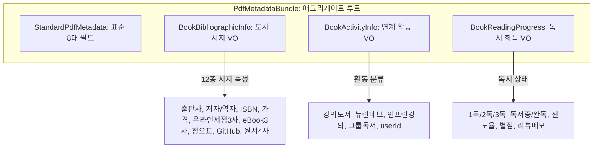

# [15-06] PDF 메타데이터 도메인 모델링 및 유니코드 인코딩 아키텍처 학습 가이드

> **문서 번호**: `15-06`  
> **작성일**: 2026-09-25  
> **대상 독자**: purePDFrend 개발팀 및 주니어/중급 백엔드·프론트엔드 엔지니어  
> **핵심 키워드**: ISO 32000-1, PDF Information Dictionary, UTF-16BE HexString, 불변 값 객체(VO), 헥사고날 포트

---

## 1. 개요 및 학습 목적

PDF 문서는 단순한 시각적 페이지의 묶음이 아니며, 그 자체로 문서의 신원(Identity), 라이선스, 출판 서지, 사용자의 학습 활동을 보존할 수 있는 강력한 메타데이터 컨테이너입니다.
본 가이드에서는 `purePDFrend`가 채택한 **도서 서지 정보, 활동 정보, 독서 진행 상태의 3대 도메인 모델링 원칙**과 **한글/유니코드 인코딩 결함(Mojibake) 방지 기술**을 체계적으로 설명합니다.

---

## 2. PDF 메타데이터 아키텍처 (ISO 32000-1)

### 2-1. Document Information Dictionary (`/Info`)
PDF 규격의 트레일러(Trailer)에 위치한 `/Info` 사전은 키-값 쌍의 딕셔너리 구조입니다.

```text
<<
  /Title (클린 아키텍처 실천 가이드)
  /Author (로버트 C. 마틴)
  /Subject (소프트웨어 아키텍처 및 디자인 패턴)
  /Keywords (아키텍처 DDD 클린코드)
  /Creator (purePDFrend v1.0)
  /Producer (purePDFrend Engine (pdf-lib))
  /CreationDate (D:20260925100000Z)
  /ModDate (D:20260925120000Z)
  /ISBN <FEFF003900370039002D00310031002D0036003900320031002D003000360031002D0034>
  /Publisher <FEFFD55CEBE5BBF8B514EC54>
  /PpdfBookMeta <FEFF007B0022007000750062... (UTF-16BE 직렬화 JSON)>
  /PpdfActivityMeta <FEFF007B002200750073... (활동 JSON)>
  /PpdfReadingMeta <FEFF007B002200750073... (회독/독서상태 JSON)>
>>
```

### 2-2. 유니코드 한글 손상 방지: `PDFHexString (UTF-16BE)`의 필수성
1. **문제점**:
   - `pdf-lib`의 기본 `PDFString.of()`는 기본적으로 WinAnsi(PDFDocEncoding, 8비트)로 처리되어, 0xFF를 초과하는 한글, 한자, 이모지 문자열이 인입되면 바이트가 절단되거나 외계어(`\[ø ´`)로 깨집니다.
2. **해결책**:
   - `PDFHexString.fromText(jsonString)`을 사용합니다.
   - 이는 문자열 앞에 유니코드 바이트 순서 표식(BOM: `0xFEFF`)을 자동으로 붙이고 2바이트 UTF-16BE 16진수 문자열로 패킹합니다.
   - 역직렬화 시 `decodeText()`를 호출하면 완벽한 원본 한글과 특수문자가 복원됩니다.

---

## 3. 3대 도메인 모델링 (DDD 설계 원칙)



### 3-1. 도서 서지 정보 (`BookBibliographicInfo`)
- **불변성 보장**: 생성자에서 배열(`authors`, `translators`)을 `Object.freeze`로 동결하여 외부 변조를 방지합니다.
- **다채널 URL 그룹화**: 온라인 서점(알라딘, 교보, Yes24), 전자책(리디북스, Yes24, 교보), 원서 링크(아마존, 교보, 알라딘, Yes24)를 인터페이스 단위로 구조화합니다.

### 3-2. 활동 정보 (`BookActivityInfo`)
- **활동 카테고리화**: `강의도서`, `뉴런데브`, `인프런강의`, `그룹독서` 등 다중 태그 지원.
- **사용자 격리(`userId`)**: 개별 사용자의 스터디 및 강의 컨텍스트와 매핑될 수 있는 확장 키 보유.

### 3-3. 독서 진행 상태 (`BookReadingProgress`)
- **회독 차수**: `readingRound` (1독, 2독, 3독 등)
- **과거 회독 누적 히스토리 (`roundHistory`)**: 회독 승급(`nextRound()`) 시 이전 회독의 시작/완독일, 최종 별점, 서평 메모가 유실되지 않고 `ReadingRoundRecord[]` 불변 배열로 영구 보존됩니다.
- **페이지 번호 경계 방어**: `0 <= currentPage <= totalPage` 범위를 초과하지 못하도록 자동 클램핑 방어 로직이 적용됩니다.
- **진행률 계산기**: 현재 페이지와 전체 페이지 비율을 기반으로 실시간 퍼센티지(0~100%) 동적 산출.

---

## 4. 후속턴 아키텍처 점검 및 적용된 디자인 패턴

### 4-1. 통합 파사드 패턴 (`PdfMetadataFacade`)
- **도입 배경**: 복잡한 메타데이터 하위 도메인(`PdfMetadataBundle`, `BookBibliographicInfo`, `BookActivityInfo`, `BookReadingProgress`, `PdfMetadataInjector`)을 UI 컴포넌트나 백엔드 서비스에서 쉽게 제어할 수 있도록 단일 진입점을 제공합니다.
- **주요 오케스트레이션 메서드**:
  - `inject(pdfDoc, bundle)` / `injectToBytes(bytes, bundle)`: 일관된 주입 API
  - `extract(pdfDoc)` / `extractFromBytes(bytes)`: 일관된 추출 API
  - `advanceReadingRound(bundle, userId, rating, reviewNotes)`: 회독 승급 및 과거 이력 누적 자동화
  - `updateReadingProgress(bundle, userId, currentPage, status)`: 실시간 진도 및 상태 동기화
  - `validate(bundle)`: 도메인 일관성 사전 점검

### 4-2. 번들 팩토리 & 빌더 패턴 (`PdfMetadataBundleFactory`)
- **도입 배경**: 메타데이터 번들 조립 시 도서 서지의 페이지 수와 독서 진도의 총 페이지 수 불일치를 방지하고, 출판사/저자 정보로부터 표준 메타데이터 제목 및 작성자를 지능적으로 자동 추론합니다.
- **특징**: Fluent API(메서드 체이닝)를 통해 속성을 유연하게 결합하고 불변 `PdfMetadataBundle` 객체를 안전하게 생산합니다.

### 4-3. 다중 사용자(`userId`) 격리 거버넌스
- 단일 PDF 파일 내부 또는 클라우드 DB 연동 환경에서 `jkoogit`, `jkok2j2m` 등 복수 사용자가 동일한 PDF 도서에 대해 각자의 회독 이력과 활동 내역을 독립적으로 보존하고 조회할 수 있는 구조를 확립했습니다.

---

## 5. 실전 체크리스트 및 TDD 검증 현황

- [x] 한글 문자열 주입 시 `PDFHexString.fromText()` 사용 여부 확인
- [x] 키워드 파싱 시 쉼표(`,`), 세미콜론(`;`), 공백(` `) 복합 분리 정규식 적용 여부
- [x] `pdf-lib`의 `context.trailerInfo.Info` 기반 공용 `PDFDict` 생성 헬퍼 적용 여부 (비공개 메서드 직접 호출 방지)
- [x] 도서 서지 정보 주입 시 외부 PDF 리더 호환용 표준 키(`/ISBN`, `/Publisher`) 이중 등록 여부
- [x] 회독 차수 승급(`nextRound()`) 시 `roundHistory` 누적 보존 검증 완료
- [x] ISBN-10 / ISBN-13 체크섬 유효성 검증 및 한국어 통화(`priceFormatted`) 포맷터 검증
- [x] 다중 사용자(`userId`)별 독립 독서/활동 분리 관리 검증
- [x] `PdfMetadataFacade` 및 `PdfMetadataBundleFactory` 상호운용성 검증
- [x] **11대 단위 테스트 100% PASS** 및 정적 린트(`tsc --noEmit`) 무결성 달성
