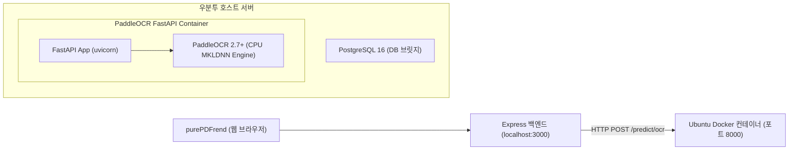

# 15-06. 우분투 서버 PaddleOCR (CPU 전용) 도커 컨테이너 배포 및 FastAPI 브릿지 연동 가이드

> **문서 ID**: `DOC-15-06`  
> **세션 ID**: `SESSION-20260923-008` (차수: `[0011]`)  
> **작성일자**: 2026-09-23  
> **대상**: 우분투 리눅스(GPU 부재 CPU 전용 서버) 환경에서 PaddleOCR를 컨테이너로 가동하여 purePDFrend와 연동하고자 하는 엔지니어

---

## 1. 개요 및 아키텍처

우분투 서버(PostgreSQL 구동 중인 단일 서버)에 그래픽카드(GPU)가 없는 환경에서도, PaddleOCR의 OpenVINO/MKLDNN CPU 가속 옵션을 활용하면 한글/영문/한자 스캔 도서의 OCR 처리를 빠르고 안정적으로 수행할 수 있습니다.



---

## 2. Dockerfile 및 프로젝트 구성

우분투 서버에 디렉터리를 생성하고 아래 3개 파일을 작성합니다.

### 2.1 `app.py` (FastAPI 래퍼 스크립트)

```python
import base64
import io
import time
from typing import Optional, List
from fastapi import FastAPI, HTTPException
from pydantic import BaseModel
from PIL import Image
import numpy as np
from paddleocr import PaddleOCR

app = FastAPI(title="PaddleOCR CPU Microservice", version="1.0.0")

# CPU 모드로 한글(korean) / 다국어 모델 초기화 (최초 1회 모델 다운로드)
ocr_korean = PaddleOCR(use_angle_cls=True, lang="korean", use_gpu=False, show_log=False)
ocr_ch = PaddleOCR(use_angle_cls=True, lang="ch", use_gpu=False, show_log=False)
ocr_en = PaddleOCR(use_angle_cls=True, lang="en", use_gpu=False, show_log=False)

class OcrRequest(BaseModel):
    image_base64: str
    lang: Optional[str] = "korean" # "korean" | "ch" | "en" | "japan"

class BoundingBox(BaseModel):
    id: int
    text: str
    confidence: float
    box: List[List[float]] # [[x1,y1], [x2,y2], [x3,y3], [x4,y4]]
    x: float
    y: float
    w: float
    h: float

class OcrResponse(BaseModel):
    success: bool
    language: str
    execution_time_ms: float
    total_boxes: int
    full_text: str
    boxes: List[BoundingBox]

@app.get("/health")
def health():
    return {"status": "ok", "mode": "cpu", "timestamp": time.time()}

@app.post("/predict/ocr", response_model=OcrResponse)
def predict_ocr(req: OcrRequest):
    t0 = time.time()
    try:
        # Base64 이미지 디코딩
        img_data = base64.b64decode(req.image_base64.split(",")[-1])
        pil_img = Image.open(io.BytesIO(img_data)).convert("RGB")
        img_np = np.array(pil_img)
        img_w, img_h = pil_img.size

        # 언어별 엔진 선택
        engine = ocr_korean
        if req.lang in ["ch", "chinese"]:
            engine = ocr_ch
        elif req.lang in ["en", "english"]:
            engine = ocr_en

        results = engine.ocr(img_np, cls=True)
        boxes = []
        full_text_list = []

        if results and results[0]:
            for idx, line in enumerate(results[0]):
                poly = line[0] # 4 points
                txt, conf = line[1]
                full_text_list.append(txt)

                xs = [p[0] for p in poly]
                ys = [p[1] for p in poly]
                min_x = min(xs)
                min_y = min(ys)
                max_x = max(xs)
                max_y = max(ys)

                # 0~100 % 백분율 좌표 정규화
                norm_x = (min_x / img_w) * 100.0
                norm_y = (min_y / img_h) * 100.0
                norm_w = ((max_x - min_x) / img_w) * 100.0
                norm_h = ((max_y - min_y) / img_h) * 100.0

                boxes.append(BoundingBox(
                    id=idx + 1,
                    text=txt,
                    confidence=round(float(conf), 4),
                    box=poly,
                    x=round(norm_x, 2),
                    y=round(norm_y, 2),
                    w=round(norm_w, 2),
                    h=round(norm_h, 2)
                ))

        duration_ms = round((time.time() - t0) * 1000, 2)
        return OcrResponse(
            success=True,
            language=req.lang or "korean",
            execution_time_ms=duration_ms,
            total_boxes=len(boxes),
            full_text="\n".join(full_text_list),
            boxes=boxes
        )
    except Exception as e:
        raise HTTPException(status_code=500, detail=str(e))
```

### 2.2 `Dockerfile`

```dockerfile
FROM python:3.10-slim

ENV DEBIAN_FRONTEND=noninteractive
ENV PYTHONUNBUFFERED=1

RUN apt-get update && apt-get install -y --no-install-recommends \
    libgomp1 \
    libgl1-mesa-glx \
    libglib2.0-0 \
    build-essential \
    curl \
    && rm -rf /var/lib/apt/lists/*

WORKDIR /app

# CPU 전용 PaddlePaddle 및 의존성 패키지 설치
RUN pip install --no-cache-dir --upgrade pip && \
    pip install --no-cache-dir paddlepaddle==2.6.2 -i https://pypi.tuna.tsinghua.edu.cn/simple && \
    pip install --no-cache-dir "paddleocr>=2.7.3" "fastapi>=0.109.0" "uvicorn[standard]>=0.27.0" "pillow>=10.0.0"

COPY app.py /app/app.py

EXPOSE 8000

CMD ["uvicorn", "app:app", "--host", "0.0.0.0", "--port", "8000", "--workers", "2"]
```

### 2.3 `docker-compose.yml`

```yaml
version: '3.8'

services:
  paddleocr-cpu:
    build: .
    container_name: purepdf-paddleocr-cpu
    restart: unless-stopped
    ports:
      - "8000:8000"
    environment:
      - OMP_NUM_THREADS=2
      - CPU_NUM=2
    healthcheck:
      test: ["CMD", "curl", "-f", "http://localhost:8000/health"]
      interval: 30s
      timeout: 5s
      retries: 3
```

---

## 3. 우분투 배포 및 기동 명령어

```bash
# 1. 빌드 및 백그라운드 실행
docker compose up -d --build

# 2. 헬스체크 확인
curl http://localhost:8000/health
# 응답: {"status":"ok","mode":"cpu","timestamp":1727100000.0}

# 3. purePDFrend 환경변수 또는 시스템 설정 패널에서 URL 등록
# http://<우분투서버IP>:8000
```

---

## 4. purePDFrend 연동 및 안전망 (Zero-Hang)

1. **지능형 폴백**: 우분투 서버가 기동 전이거나 응답하지 않는 경우, purePDFrend는 즉각 로컬 Tesseract.js 및 Gemini 2.5 Flash로 안전하게 폴백합니다.
2. **비용 0원**: 온프레미스 CPU 연산으로 외부 클라우드 API 호출 토큰 소비 없이 무제한 OCR 배치가 가능합니다.
