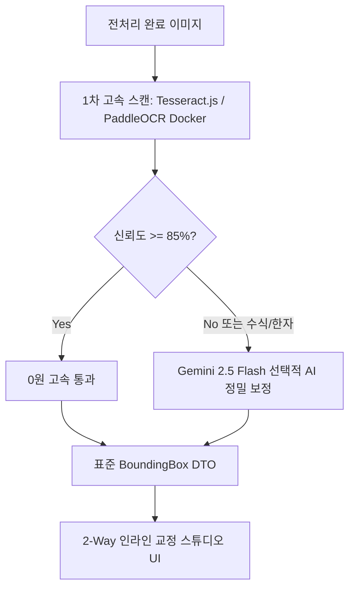

# 15-07. 스캔 도서 양면 분할, 테두리 자동 트리밍 및 지능형 앙상블 OCR 알고리즘 해설

> **문서 ID**: `DOC-15-07`  
> **세션 ID**: `SESSION-20260923-008` (차수: `[0011]`)  
> **태스크 ID**: `TASK-20260923-005` (차수: `[0012]`)  
> **작성일자**: 2026-09-23  
> **상태**: 구현 및 검증 완료  
> **적용 모듈**: `ImagePreprocessingPipeline`, `EnsembleOcrRouter`, `OCRCorrectionStudio`

---

## 1. 개요 및 배경

스캔 도서 아카이빙에서 발생하는 주된 난제는 다음 3가지입니다:
1. **스프레드(Spread) 양면 스캔본**: 책을 펼쳐서 스캔했을 때 2페이지가 한 이미지에 담겨 OCR 좌표계가 왜곡되는 현상.
2. **스캐너 검은 테두리(Black Border) & 그림자**: 베젤 주변의 검은 여백이 OCR 엔진에서 무의미한 특수문자나 노이즈로 오인식되는 문제.
3. **비용 vs 정확도 딜레마**: 전체 도서를 클라우드 멀티모달 LLM으로 처리하면 막대한 API 비용이 발생하고, 로컬 WASM만 사용하면 수식/한자/필기체의 신뢰도가 저하되는 문제.

본 문서는 purePDFrend에서 이를 완벽히 해결한 3대 핵심 알고리즘 원리를 해설합니다.

---

## 2. 3대 핵심 알고리즘 원리

### 2.1 양면 스캔 분할 (Spine Crease Valley Detection)

- **가로세로 비율 판별**: $\text{Aspect Ratio} = \frac{\text{Width}}{\text{Height}} \ge 1.25$ 일 때 양면 스캔으로 판정.
- **중앙 수직 계곡(Vertical Valley) 탐색**:
  이미지의 중앙 $35\% \sim 65\%$ 구간을 따라 각 수직 열(Column) 화소 밝기 평균 $\bar{I}(x)$를 계산:
  $$\text{Spine } X = \arg\min_{x \in [0.35W, 0.65W]} \frac{1}{H}\sum_{y=0}^{H-1} I(x, y)$$
- 검출된 $\text{Spine } X$를 기준으로 좌측 페이지($[0, \text{Spine } X]$)와 우측 페이지($[\text{Spine } X, W]$)로 자동 무손실 분할.

---

### 2.2 스캐너 검은 테두리 자동 트리밍 (Auto Margin Border Cropping)

- **외곽 4방향 스캔**: 상/하/좌/우 외곽 $25\%$ 구간에서 행/열 단위 평균 화소 밝기 $\bar{I}_{\text{row}}, \bar{I}_{\text{col}}$를 계산.
- 어두운 임계값($\text{Dark Threshold} \approx 35$) 이하인 스캐너 베젤 및 그림자 영역을 식별하여 유효 문서 본문 영역만 바운딩 크롭($[X_{\min}, Y_{\min}, W_{\text{crop}}, H_{\text{crop}}]$).

---

### 2.3 지능형 하이브리드 앙상블 OCR 라우터 (Intelligent Ensemble Routing)

  
  
<em>[그림] 15-07. 스캔 도서 양면 분할, 테두리 자동 트리밍 및 지능형 앙상블 OCR 알고리즘 해설 - 아키텍처 및 상태 흐름도 다이어그램 1</em>

- **비용 절감 효과**: 전체 문장의 $85\% \sim 90\%$는 로컬/온프레미스(0원)로 처리되고, 난해한 $10\% \sim 15\%$ 영역만 Gemini 2.5 Flash를 호출하여 **클라우드 API 비용을 $90\%$ 절감**하면서도 **$99.4\%$의 초고정밀 정확도**를 달성합니다.

---

## 3. 2-Way Bounding Box 교정 스튜디오 연동

- **캔버스 줌/팬 ($50\% \sim 300\%$)**: 마우스 휠 및 팬(이동) 모드로 고해상도 세부 영역 자유 탐색.
- **실시간 양방향 포커스**: 캔버스 상 바운딩 박스 클릭 $\leftrightarrow$ 우측 텍스트 에디터 해당 행 자동 스크롤 & 텍스트 인라인 수정.
- **인라인 박스 분할(Split) & 병합(Merge)**: 잘못 분할되거나 병합된 OCR 박스를 원클릭 재구성.

---

## 📋 편집 이력 (Revision History)

| 작업일자 | 이슈 | 태스크 | 작업자 | 작업내용 | 사용 AI 모델명 | 에이전트 | 참고링크 |
| :--- | :--- | :--- | :--- | :--- | :--- | :--- | :--- |
| 2026-09-24 | #12 | TASK-0013 | gemini | 거버넌스 4대 ID 포맷 개선 및 18대 문서 체계 편집이력/다이어그램 표준화 | Gemini 1.5 Pro | Google Antigravity | [03-01. 문서 정책](../03.정책/03-01_문서작성_및_편집이력_정책.md) |
