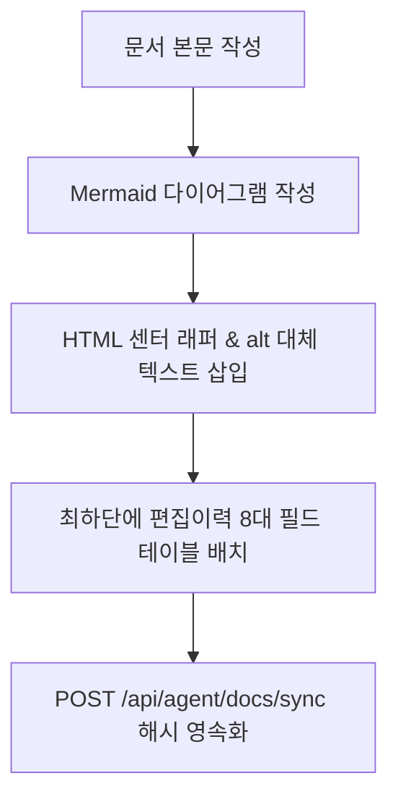

# 15-08. 마크다운 Mermaid 이미지화 및 하단 편집이력 거버넌스 가이드

## 1. 학습 개요

본 문서는 대규모 오픈소스 및 엔터프라이즈 문서 관리 시 마크다운의 렌더링 호환성을 극대화하기 위한 Mermaid 다이어그램 이미지 래퍼 패턴과 문서 가독성을 높이는 하단 편집이력 배치 거버넌스를 학습 및 교육용 자료로 정리합니다.

<div align="center">
  
  <p><em>[그림] 기술문서 작성 및 렌더링 무결성 거버넌스 파이프라인</em></p>
</div>



---

## 2. Mermaid 대체 텍스트 표준 패턴

Mermaid 지원 뷰어(예: GitHub, GitLab, VS Code)뿐만 아니라 일반 텍스트 뷰어나 웹 브라우저에서도 시각 자료의 의미를 전달하기 위해 아래 패턴을 의무화합니다:

```html
<div align="center">
  
  <p><em>[그림] {상세 다이어그램 설명}</em></p>
</div>
```

---

## 3. 하단 편집이력 표준 테이블 형식

문서 도입부의 불필요한 메타데이터 노출을 방지하여 독자가 본문에 즉시 집중할 수 있도록 편집이력은 반드시 문서의 맨 마지막에 배치합니다:

```markdown
## 📋 편집 이력 (Revision History)

| 작업일자 | 이슈 | 태스크 | 작업자 | 작업내용 | 사용 AI 모델명 | 에이전트 | 참고링크 |
| :--- | :--- | :--- | :--- | :--- | :--- | :--- | :--- |
| 2026-09-24 | #12 | TASK-0013 | gemini | [v1.0] 가이드 제정 | Gemini 1.5 Pro | Google Antigravity | [03-01. 문서 정책](../03.정책/03-01_문서작성_및_편집이력_정책.md) |
```

---

## 📋 편집 이력 (Revision History)

| 작업일자 | 이슈 | 태스크 | 작업자 | 작업내용 | 사용 AI 모델명 | 에이전트 | 참고링크 |
| :--- | :--- | :--- | :--- | :--- | :--- | :--- | :--- |
| 2026-09-24 | #12 | TASK-0013 | gemini | [v1.0] 최초 작성: Mermaid 다이어그램 이미지화 및 하단 편집이력 거버넌스 교육 자료 발행 | Gemini 1.5 Pro | Google Antigravity | [03-01. 문서 정책](../03.정책/03-01_문서작성_및_편집이력_정책.md) |
