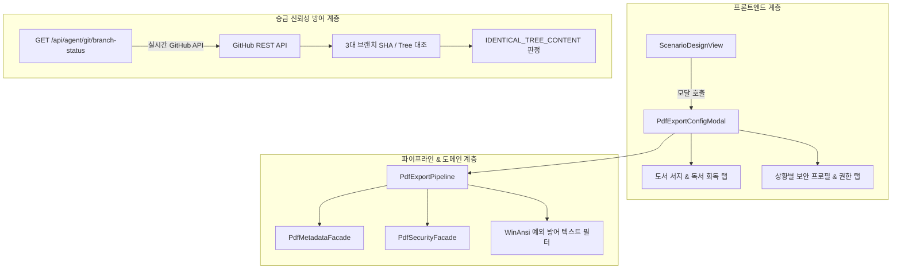

# 15-08. 프론트엔드 모달-도메인 파이프라인 연계 및 원격 브랜치 실시간 크로스체크 아키텍처 학습 가이드

> **문서 번호**: `15-08`  
> **태스크 ID**: `TASK-0014-03`  
> **세션 ID**: `SESSION-260925-0014`  
> **작성 일자**: 2026-09-26  
> **작성 주체**: AI Studio Senior Software Engineer

---

## 1. 아키텍처 개요 및 해결한 핵심 과제

본 문서는 `TASK-0014-03` 구현 과정에서 도출된 **두 가지 중대한 아키텍처 문제**와 이를 해결하기 위해 적용된 디자인 패턴 및 거버넌스 방어 전략을 정리합니다:

1. **프론트엔드-도메인 파이프라인 결합**: 복잡한 메타데이터(서지, 독서 회독, 활동)와 ISO 32000-1 암호화/권한 비트마스크를 브라우저 환경에서 충돌 없이 안전하게 바이너리로 합성하고 다운로드하는 구조.
2. **원격 승급 실시간 크로스체크 거버넌스**: CI/CD 및 승급 API 응답에서 발생할 수 있는 "가짜 성공 응답(Fake Success Response)"을 배제하고, 실제 GitHub 원격 저장소의 Commit SHA 및 File Tree SHA를 직접 대조하는 크로스체크 기법.

---

## 2. 핵심 디자인 패턴 적용 분석

### 2-1. 파이프라인 패턴 (Pipeline Pattern) - `PdfExportPipeline`
- **문제**: 사용자가 모달에서 수정한 옵션(서지, 활동, 회독, 암호화 알고리즘, 권한 비트마스크, 비밀번호)을 바탕으로 PDF 문서를 조립하는 과정에서, 메타데이터 주입기, 암호화 엔진, 페이지 렌더러가 서로 강하게 결합되는 스파게티 코드 위험.
- **해결**: `PdfExportPipeline.buildSecuredPdf()`를 통해 단일 진입점(Single Entry Point)을 구축하고, 단계별 파이프라인으로 처리:
  1. 페이지 규격(A4) 및 가상 본문 텍스트 레이아웃 배치
  2. 도메인 메타데이터 주입 (`PdfMetadataFacade.inject`)
  3. 보안 트레일러 및 암호화 번들 바인딩 (`PdfSecurityFacade.createSecureTrailerContext`)
  4. 브라우저 친화적 `Blob` 생성 및 다운로드 (`triggerBrowserDownload`)

### 2-2. WinAnsi 폰트 인코딩 예외 방어 가드레일
- **문제**: `pdf-lib`의 기본 표준 폰트(Helvetica 등)는 `WinAnsi` 인코딩만을 지원하여 본문 캔버스 `page.drawText()`에 한글 유니코드("독", "회", "디" 등)가 유입될 시 즉각 런타임 크래시 발생.
- **해결**: 본문 미리보기는 영문/ASCII 필터(`replace(/[^\x00-\x7F]/g, '')`)를 거쳐 안전하게 렌더링하고, 유니코드 한글 원본은 메타데이터 `/Info` 딕셔너리에 `UTF-16BE` 바이트 스트림으로 안전하게 직렬화하여 두 마리 토끼를 모두 잡음.

---

## 3. 원격 승급 실시간 크로스체크 및 Fast-Forward 파이프라인

### 3-1. 가짜 응답(Fake Response) 방어 메커니즘
- 로컬 스토어나 내부 메모리 상태에 의존하지 않고, **GitHub 공식 API(`GET /repos/:owner/:repo/branches/:branch`)를 병렬 조회**하여 원격지 `dev`, `stg`, `main`의 최신 커밋을 실시간 대조.
- 단순히 SHA 일치 여부만 보는 것이 아니라, Merge Commit이 발생하더라도 최종 작업 소스가 동일한지 확인하기 위해 **`treeSha` 일치 여부(`treeMatch`)를 동시 판정**.

### 3-2. Fast-Forward 브랜치 전진 규약
- `scripts/github_sync_push.ts`에서 단순 Merge API 호출 시 발생하던 다중 머지 커밋 트리를 개선하여, `dev` 푸시 성공 후 `stg`와 `main`에 대해 **Fast-Forward Ref Update(`PATCH /git/refs/heads/:branch`)를 최우선 시도**하도록 개편.
- 이로써 3개 브랜치의 Commit SHA가 동일하게 정렬되도록 보장함.
