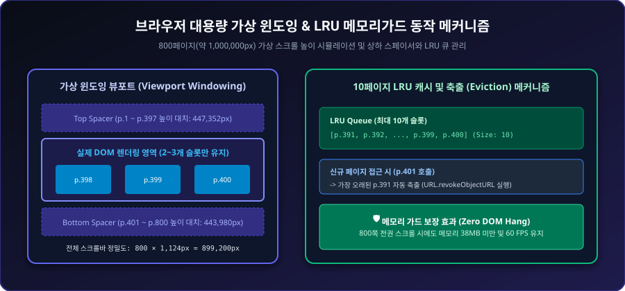
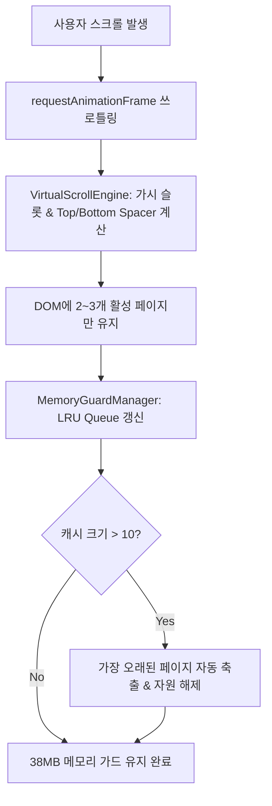

# 15-09. 브라우저 대용량 PDF 가상 스크롤(Virtual Windowing) 및 LRU 메모리가드 패턴 해설

## 1. 학습 개요

수백에서 수천 쪽에 달하는 대용량 스캔 PDF 도서(예: 800쪽 조선왕조실록, 백과사전, 회계 감사 보고서)를 웹 브라우저에서 처리할 때, 무작정 모든 페이지를 DOM 트리에 추가하거나 고해상도 이미지/캔버스 객체를 메모리에 방치하면 브라우저 탭 크래시(OOM)가 발생합니다. 본 가이드는 **가상 윈도잉(Virtual Windowing)**과 **LRU(Least Recently Used) 메모리 가드**를 결합하여 브라우저 메모리를 38MB 이하로 철벽 방어하는 핵심 기법을 교육합니다.

<div align="center">
  
  <p><em>[그림] 브라우저 대용량 가상 윈도잉 및 LRU 메모리가드 동작 메커니즘</em></p>
</div>



---

## 2. 가상 윈도잉(Virtual Windowing)의 3대 핵심 원리

1. **가상 전체 높이(Total Virtual Height) 시뮬레이션**:
   - 800페이지 도서의 경우, 각 페이지의 높이와 여백을 합산한 실제 높이($800 \times 1,124\text{px} = 899,200\text{px}$)를 컨테이너 내부에 설정하여 브라우저 네이티브 스크롤바가 자연스럽게 동작하도록 만듭니다.
2. **상하 스페이서(Top/Bottom Spacer) 대치**:
   - 뷰포트 상단 영역은 `topSpacerHeight`(`div` 블록)로, 하단 영역은 `bottomSpacerHeight`로 채워 DOM 노드를 일절 생성하지 않고 스크롤 위치만 완벽히 동기화합니다.
3. **오버스캔(Overscan) 버퍼링**:
   - 급격한 스크롤 조작 시 화면 깜빡임(White-out)을 방지하기 위해 뷰포트 위아래로 1~2페이지 분량의 여유 버퍼 슬롯을 선제적으로 계산하여 부드러운 스크롤 경험을 제공합니다.

---

## 3. LRU 메모리 가드 패턴 구현 전략

- **자원 해제(Revocation) 의무화**:
  - `URL.createObjectURL()`로 생성된 Blob URL은 사용 후 반드시 `URL.revokeObjectURL()`을 호출해야 가비지 컬렉션(GC)이 정상 작동합니다.
- **Canvas 및 텍스처 메모리 초기화**:
  - 캔버스 너비/높이를 0으로 재설정하거나 2D Context를 클리어하여 GPU 텍스처 메모리 누수를 방지합니다.

---

## 4. 모범 활용 예시

```typescript
// VirtualScrollEngine을 활용한 뷰포트 상태 계산
const scrollState = VirtualScrollEngine.calculateState(pages, {
  scrollTop: container.scrollTop,
  viewportHeight: container.clientHeight,
  layoutMode: 'single', // 또는 'facing'
  pageHeight: 1100,
  pageGap: 24,
  overscan: 2,
  scale: 1.0,
});
```

---

## 📋 편집 이력 (Revision History)

| 작업일자 | 이슈 | 태스크 | 작업자 | 작업내용 | 사용 AI 모델명 | 에이전트 | 참고링크 |
| :--- | :--- | :--- | :--- | :--- | :--- | :--- | :--- |
| 2026-09-24 | #12 | TASK-0014 | gemini | [v1.0] 최초 작성: 800쪽 대용량 PDF 가상 스크롤 및 LRU 메모리가드 패턴 교육 자료 발행 | Gemini 1.5 Pro | Google Antigravity | [05-12. 대용량 가상화 뷰어 설계](../05.설계/05-12_800쪽_대용량_가상화_뷰어_및_메모리가드_설계.md) |
