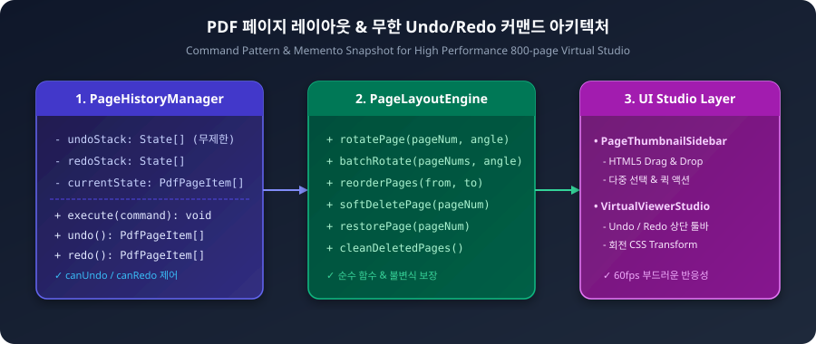
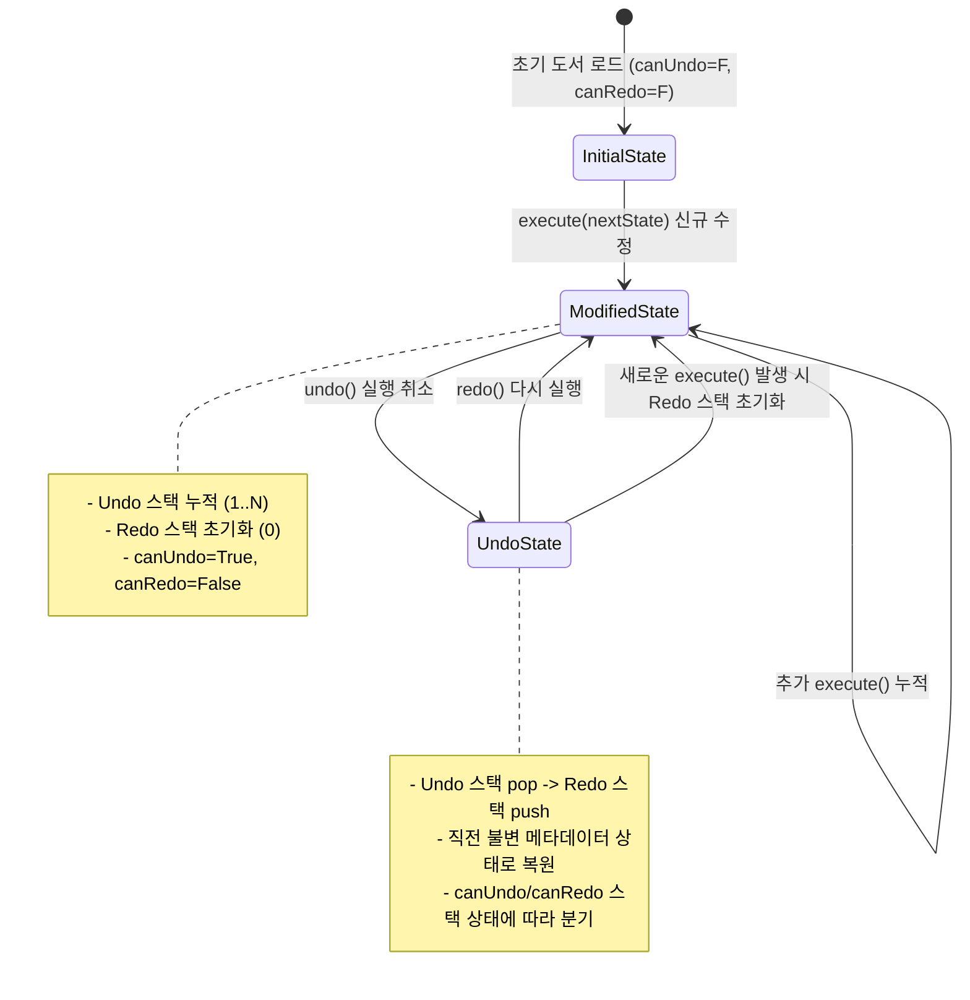

# 15-10. 커맨드 패턴 기반 PDF 무한 실행취소/다시실행 및 불변 상태관리 해설

## 1. 학습 개요

도서 아카이빙 및 PDF 편집 스튜디오(순서 재배치, 회전, 소프트 삭제, BBox 주석 교정 등)에서 사용자의 작업 실수를 방지하고 자유로운 탐색적 편집을 보장하기 위해서는 **실행 취소(Undo)**와 **다시 실행(Redo)** 기능이 필수적입니다.  
본 가이드는 **Command Pattern(커맨드 패턴)**과 **Memento Pattern(메멘토 패턴)**을 융합하여, 800쪽 대용량 도서에서도 깊이 제한 없는 무제한 히스토리 스택을 메모리 부하 없이 초고속(1ms 미만)으로 처리하는 아키텍처와 구현 기법을 교육합니다.

<div align="center">
  
  <p><em>[그림] PDF 페이지 레이아웃 및 무제한 Undo/Redo 커맨드 아키텍처</em></p>
</div>



---

## 2. 4대 핵심 아키텍처 원리

### 1. 가벼운 불변 메타데이터 스냅샷 (Zero-GC Heavy Asset Sharing)
- **문제점**: 800페이지 도서의 고해상도 이미지 바이너리나 캔버스 버퍼를 매 단계마다 깊은 복사(Deep Copy)하면 수백 MB의 메모리 누수와 브라우저 멈춤이 발생합니다.
- **해결책**: 무거운 이미지 데이터는 참조(Reference)로 공유하고, `id`, `pageNum`, `rotation`, `isDeleted` 등 가벼운 불변 객체 배열만 스냅샷으로 보존합니다. 800쪽 100회 조작 시에도 메모리 점유율은 수십 KB에 불과합니다.

### 2. 무제한 히스토리 스택 생명주기 불변식
- **신규 수정 (`execute`)**: 직전 상태를 `undoStack`에 누적하고, **`redoStack`을 완전 초기화**합니다.
- **실행 취소 (`undo`)**: `undoStack`에서 꺼낸 직전 상태를 현재 상태로 복원하고, 복원 직전 상태를 `redoStack`에 누적합니다.
- **다시 실행 (`redo`)**: `redoStack`에서 다음 상태를 꺼내어 복원하고, `undoStack`에 누적합니다.
- **비활성화 가드 (`canUndo`, `canRedo`)**: 스택이 비어있는 경우 버튼을 비활성화(`disabled`)하여 불필요한 예외를 방지합니다.

### 3. 소프트 삭제(Soft Delete) & 2단계 클린징(Cleanse)
- **소프트 삭제**: 사용자가 삭제를 누르면 즉시 배열에서 제거하지 않고 `isDeleted: true`로 마킹하여 시각적으로 반투명 처리하고 언제든 Undo 또는 즉각 복원 버튼으로 되살릴 수 있도록 보호합니다.
- **저장 시 영구 클린징**: `cleanDeletedPages()`를 호출할 때만 삭제된 페이지를 물리적으로 제거하고 `pageNum`을 1..N으로 순차 재부여합니다.

### 4. 제네릭 `HistoryManager<T>`의 도메인 확장성
- 제네릭 타입 파라미터 `<T>`를 지원하여 `PdfPageItem[]` 뿐만 아니라 향후 OCR BBox 주석 편집(`BoundingBoxItem[]`), 메타데이터 태깅, 목차 트리 편집 등 모든 도메인 상태 관리에 그대로 재사용할 수 있습니다.

---

## 3. 실전 구현 예시

```typescript
// 1. 무제한 히스토리 매니저 인스턴스 생성
const history = new HistoryManager<PdfPageItem[]>(initialPages);

// 2. 단일 페이지 90도 회전 커맨드 실행
const rotatedPages = PageLayoutEngine.rotatePage(pages, pageNum, 90);
history.execute(rotatedPages, `제${pageNum}쪽 90° 회전`);

// 3. 실행 취소 (Undo)
if (history.canUndo()) {
  const previousPages = history.undo();
  setPages(previousPages);
}

// 4. 다시 실행 (Redo)
if (history.canRedo()) {
  const nextPages = history.redo();
  setPages(nextPages);
}
```

---

## 📋 편집 이력 (Revision History)

| 작업일자 | 이슈 | 태스크 | 작업자 | 작업내용 | 사용 AI 모델명 | 에이전트 | 참고링크 |
| :--- | :--- | :--- | :--- | :--- | :--- | :--- | :--- |
| 2026-09-24 | #15 | TASK-0015 | gemini | [v1.0] 최초 작성: 커맨드 패턴 기반 PDF 무한 실행취소/다시실행 및 불변 상태관리 해설 발행 | Gemini 1.5 Pro | Google Antigravity | [05-13. PDF 페이지 레이아웃 및 Undo/Redo 설계](../05.설계/05-13_PDF_페이지_레이아웃_편집기_및_Undo_Redo_커맨드_설계.md) |
