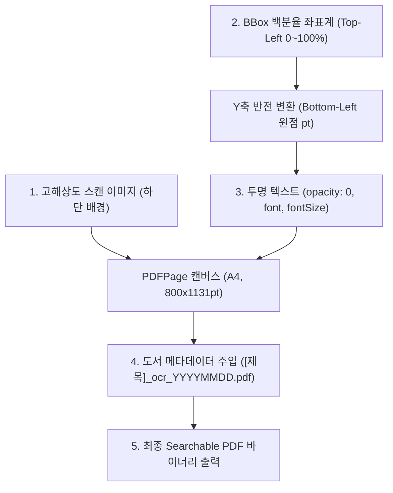

# 15-11. pdf-lib 기반 투명 텍스트 레이어 임베딩 및 Searchable PDF 생성 기법

## 1. 학습 개요

스캔 도서 아카이빙 솔루션에서 사용자가 가장 원하는 핵심 가치는 **"원본 스캔의 질감과 고화질 이미지를 그대로 보면서도, 일반 전자책처럼 텍스트를 드래그하여 복사하고 `Ctrl+F`로 검색할 수 있는가"**입니다.  
본 가이드는 순수 자바스크립트 라이브러리인 `pdf-lib`를 활용하여, 고화질 스캔 이미지 위에 OCR 바운딩 박스 텍스트를 눈에 보이지 않는 **투명 텍스트 레이어(`opacity: 0`)**로 정밀하게 오버레이하여 검색 가능한(Searchable) PDF를 생성하고 브라우저에서 원클릭으로 다운로드하는 기술 아키텍처를 교육합니다.

<div align="center">
  
  <p><em>[그림] Searchable PDF 내보내기 파이프라인 및 폰트 레지스트리 아키텍처</em></p>
</div>



---

## 2. 4대 핵심 구현 기법

### 1. 웹 BBox 좌표 ↔ PDF 포인트 좌표계 변환 (Y축 반전)
- **웹 좌표계**: 좌상단이 $(0, 0)$이며, $x, y, w, h$는 $0 \sim 100\%$ 백분율입니다.
- **PDF 좌표계**: 좌하단이 $(0, 0)$ 원점이며, 단위는 포인트(Point, $1\text{ pt} = \frac{1}{72}\text{ inch}$)입니다.
- **정밀 변환 수식**:
  $$X_{\text{pdf}} = \frac{x}{100} \times \text{PageWidth}$$
  $$Y_{\text{pdf}} = \text{PageHeight} - \left(\frac{y + h}{100} \times \text{PageHeight}\right)$$
  $$\text{FontSize} \approx \left(\frac{h}{100} \times \text{PageHeight}\right) \times 0.85$$

### 2. 투명 텍스트 레이어(`opacity: 0`) 임베딩
- `page.drawText()` 호출 시 `opacity: 0`과 `color: rgb(0, 0, 0)`를 지정합니다.
- 사용자의 눈에는 배경의 고화질 스캔 이미지만 보이지만, PDF 뷰어(Acrobat Reader, Chrome PDF Viewer 등)의 텍스트 파서 엔진에는 온전한 글자 객체로 인식되어 완벽한 텍스트 선택, 복사, 하이라이트, 검색이 가능해집니다.

### 3. 동적 폰트 레지스트리 (Font Registry)
- 기본 내장 표준 폰트(`Helvetica`, `Times Roman`, `Courier`) 외에도 관리 시스템에 등록된 커스텀 폰트(TTF/OTF 바이트)를 `FontRegistry`를 통해 동적으로 선택·임베딩할 수 있습니다.

### 4. 파일명 네이밍 거버넌스 및 대용량 비동기 청크 처리
- **표준 파일명**: `[도서제목]_ocr_YYYYMMDD.pdf` (특수문자 자동 정제).
- **소프트 삭제 페이지 배제**: `isDeleted: true` 상태의 페이지는 자동으로 걸러내어 활성 페이지만으로 구성된 완본을 생성합니다.
- **UI 프리징 방지**: 10페이지마다 `setTimeout(resolve, 0)`으로 메인 스레드에 제어권을 양보하고 `onProgress(current, total)` 콜백을 통해 부드러운 프로그레스 바를 제공합니다.

---

## 3. 실전 코드 예시

```typescript
// Searchable PDF 내보내기 호출 예시
const result = await SearchablePdfExportEngine.createSearchablePdf(pages, {
  bookTitle: '조선왕조실록 완본',
  author: '한국기록원',
  fontId: 'helvetica',
  onProgress: (current, total, message) => {
    console.log(`[${Math.round((current / total) * 100)}%] ${message}`);
  },
});

// 브라우저 파일 다운로드
SearchablePdfExportEngine.downloadBlob(result.pdfBytes, result.fileName);
```

---

## 📋 편집 이력 (Revision History)

| 작업일자 | 이슈 | 태스크 | 작업자 | 작업내용 | 사용 AI 모델명 | 에이전트 | 참고링크 |
| :--- | :--- | :--- | :--- | :--- | :--- | :--- | :--- |
| 2026-09-24 | #16 | TASK-0016 | gemini | [v1.0] 최초 작성: pdf-lib 기반 투명 텍스트 레이어 임베딩 및 Searchable PDF 생성 기법 해설 발행 | Gemini 1.5 Pro | Google Antigravity | [05-14. Searchable PDF 설계](../05.설계/05-14_투명_텍스트_레이어_결합_Searchable_PDF_내보내기_엔진_설계.md) |
