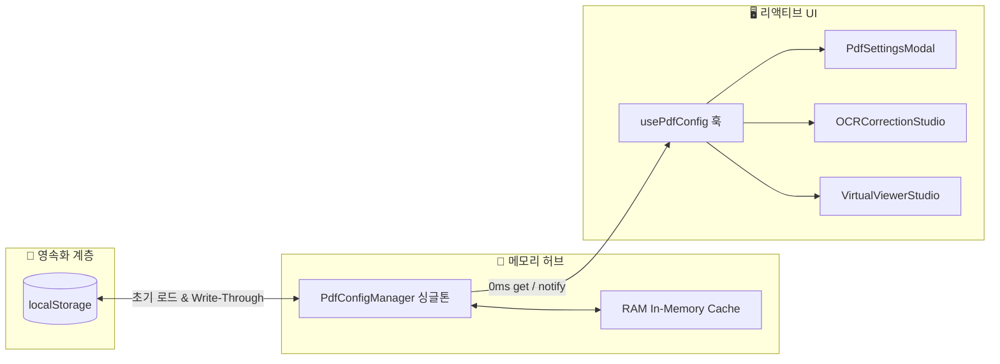

# 🧠 In-Memory Write-Through 설정 레지스트리 및 2-Way BBox 인라인 교정 패턴 해설 (15-12)

> **문서 식별자**: `DOC-15-12-INMEMORY-CONFIG-AND-2WAY-BBOX`  
> **최초 작성일**: `2026-09-24`  
> **최종 수정일**: `2026-09-24`  
> **작성자**: AI Agent (Session-0012 / Task-0017)  
> **상태**: `APPROVED` (학습 문서 승인 완료)

---

## 1. 아키텍처 개요 및 배경

스캔 도서의 OCR 결과(바운딩 박스 BBox 및 인식 텍스트)를 교정하고 대용량 PDF를 조작할 때, 시스템 옵션을 매 렌더링이나 커맨드마다 `localStorage`나 데이터베이스 I/O로 조회하면 **UI 스레드 병목 및 지연(Lag)**이 발생합니다.

이를 해결하기 위해 purePDFrend 스튜디오는 **In-Memory Write-Through Singleton Registry**와 **옵저버 패턴(Observer Pattern) + React 18 useSyncExternalStore**를 결합하여 **0ms Fast Read 및 실시간 무결성 동기화**를 달성했습니다.



---

## 2. 핵심 디자인 패턴 분석

### 2.1 In-Memory Write-Through Registry 패턴
1. **0ms 무지연 읽기 (Fast Read)**: `getConfig()` 호출 시 메모리에 상주하는 불변 스냅샷(`Object.freeze`)을 0ms로 반환하여 I/O 비용을 원천 제거합니다.
2. **라이트스루 (Write-Through)**: `updateConfig()` 호출 시 메모리 상태를 즉각 갱신하고, 동시에 `localStorage`에 영속화하며 등록된 모든 옵저버 리스너에 통지합니다.

```typescript
public updateConfig(partial: Partial<PdfSystemConfig>): Readonly<PdfSystemConfig> {
  this.inMemoryConfig = {
    ...this.inMemoryConfig,
    ...partial,
  };
  this.persistToStorage();
  this.notifyListeners();
  return this.getConfig();
}
```

### 2.2 2-Way 양방향 실시간 포커스 및 디바운스 LiveSync
- **2-Way 동기화**: 캔버스 BBox 마우스 클릭 시 에디터 행(`scrollIntoView({ behavior: 'smooth' })`)으로 스크롤되며, 에디터 행 포커스 시 캔버스 BBox에 펄스 하이라이트 링이 활성화됩니다.
- **Undo 스택 오염 방어**: `liveSyncCorrection: true` 상태에서 타이핑 시 뷰어 Undo 스택이 1글자마다 누적되는 현상을 막기 위해, 교정기 내부는 `HistoryManager<BoundingBoxItem[]>`로 미세 단어 관리를 수행하고, 뷰어에는 **500ms 디바운스된 페이지 단위 스냅샷**으로만 전달합니다.

### 2.3 4px 스냅 가이드 및 Shift 바이패스 (Bypass)
- 마우스 드래그 및 리사이즈 시 0.5% 단위로 그리드 스냅(`Math.round(val / 0.5) * 0.5`)을 적용하여 정렬을 돕고, `Shift` 키를 누르면 1px 단위의 초미세 조정을 즉시 허용합니다.

---

## 3. 원클릭 프리셋 프로파일 (Preset Strategy)

| 모드 | 목적 | 핵심 파라미터 |
| :--- | :--- | :--- |
| **🎯 정밀 교정** | 정확도 및 정밀 피드백 극대화 | `liveSync: true`, `enableBBoxSnap: true`, `showConfidenceBadges: true`, `dpi: 1.5` |
| **🚀 초고속 처리** | 빠른 대량 변환 및 경량화 | `liveSync: false`, `enableBBoxSnap: false`, `dpi: 1.0`, `showConfidenceBadges: false` |
| **📖 대용량 메모리 세이프** | 800쪽 이상 도서 OOM 방어 | `lruCacheSize: 5`, `maxHistoryDepth: 50`, `autoCleanOnSave: true` |

---

## 4. 편집 이력

| 버전 | 일자 | 변경 내용 | 작성자 |
| :--- | :--- | :--- | :--- |
| `v1.0.0` | `2026-09-24` | In-Memory Write-Through 설정 레지스트리 및 2-Way BBox 교정기 디자인 패턴 기술 해설 신규 작성 | AI Agent |
